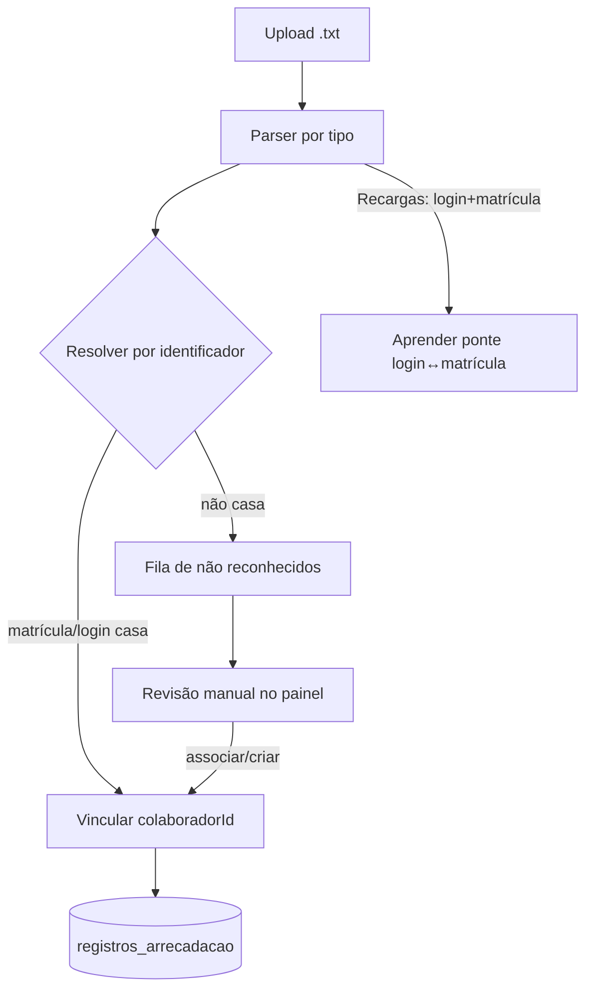

# Documento de Design — Cadastro Unificado de Colaboradores

## Visão Geral

Introduz uma entidade canônica **Colaborador** (com **matrícula** como registro) e uma tabela de **identificadores** que mapeia os códigos usados nos arquivos (`login`/`cod_operador` e `matrícula`) para o mesmo colaborador. A partir disso:

- A **escala** (turno, horários, folga) e as **faltas** passam a referenciar `colaboradorId`.
- Os **movimentos de arrecadação** são **vinculados por identificador** (não mais por nome).
- Habilita-se o **perfil completo por colaborador** e um **painel de cadastro/edição** manual.

Mantém-se a regra: **apenas fiscais/gestores acessam o app**.

### Princípios

1. **Identidade canônica única**: tudo cuelga de `Colaborador`. Nome vira atributo de exibição, não chave.
2. **Resolução por identificador, com nome só para auditoria**: cada movimento guarda o código e o nome brutos, mas a atribuição é por `MATRICULA`/`LOGIN`.
3. **Aprendizado automático pela ponte de Recargas**: o arquivo de Recargas (login + matrícula) ensina o vínculo sem trabalho manual.
4. **Nada quebra**: migração incremental; telas atuais seguem funcionando; sem mudar rotas/navegação.
5. **Sem vinculação silenciosa**: o que não casa vai para a fila de revisão.

## Modelo de Dados (Prisma)

```prisma
enum FuncaoColaborador {
  OPERADOR
  FISCAL
  SUPERVISOR
  GESTOR
}

enum TurnoColaborador {
  ABERTURA
  INTERMEDIARIO
  FECHAMENTO
  APOIO
}

enum TipoIdentificador {
  MATRICULA
  LOGIN
}

model Colaborador {
  id        String            @id @default(uuid())
  matricula String            @unique
  nome      String
  funcao    FuncaoColaborador
  genero    String?
  ativo     Boolean           @default(true)

  // Escala (antes em OperadorTurno) — opcional para fiscais.
  turno          TurnoColaborador?
  entradaSemana  String?
  saidaSemana    String?
  entradaFds     String?
  saidaFds       String?
  folgaDiaSemana Int?

  // Vínculo com o login do app (apenas fiscais/gestores).
  usuarioId String?  @unique
  usuario   Usuario? @relation(fields: [usuarioId], references: [id])

  identificadores ColaboradorIdentificador[]
  movimentos      RegistroArrecadacao[]
  autorizacoes    RegistroArrecadacao[] @relation("FiscalAutorizou")

  criadoEm   DateTime @default(now())
  atualizadoEm DateTime @updatedAt

  @@map("colaboradores")
}

model ColaboradorIdentificador {
  id            String            @id @default(uuid())
  colaboradorId String
  tipo          TipoIdentificador
  // Valor normalizado (login em minúsculas / matrícula sem espaços).
  valor         String

  colaborador Colaborador @relation(fields: [colaboradorId], references: [id], onDelete: Cascade)

  @@unique([tipo, valor]) // um código aponta para no máximo um colaborador
  @@index([colaboradorId])
  @@map("colaborador_identificadores")
}
```

**Mudanças em modelos existentes (aditivas, nullable para compatibilidade):**

- `RegistroArrecadacao`: adicionar `colaboradorId String?` (operador/fiscal dono do movimento) e `autorizadoPorId String?` (fiscal que autorizou, em cupom). Manter `nome` e `matricula` brutos para auditoria/transição.
- `Ausencia`, `EscalaEntry`, `RegistroPontoFiscal`: adicionar `colaboradorId String?` e migrar gradualmente o `pessoaId`/`funcionarioId` para apontar ao colaborador.
- `OperadorTurno`, `Operador`, `Fiscal`: **mantidos** durante a transição; servem de origem para a migração e seguem alimentando as telas atuais até a virada completa.

## Resolução de Identificadores

Função pura `resolverColaborador(...)` (testável):

```
entrada: { matricula?, login?, nomeBruto }
1. se matricula informada e existe identificador MATRICULA -> colaborador
2. senão, se login informado e existe identificador LOGIN -> colaborador
3. senão -> não resolvido (vai para fila de revisão)
```

Ponte automática (no import de Recargas), `aprenderVinculo(login, matricula)`:
- resolve o colaborador pela matrícula (ou cria identificador LOGIN no colaborador da matrícula);
- se já houver um LOGIN apontando para outro colaborador, **não sobrescreve**: registra conflito para revisão.

## Parser por arquivo (ajustes)

O parser atual captura `matricula` = **primeira** coluna `login|matr|cod`, o que mistura tipos. O novo parser distingue, por arquivo, **código de operador** vs **matrícula** vs **matrícula de fiscal**:

| Arquivo | Operador | Fiscal | Extra |
| --- | --- | --- | --- |
| Troco Solidário | `LOGIN_USUARIO` → login | — | — |
| Recargas | `MATRICULA` (atribui) + `LOGIN` (ponte) | — | — |
| Cancelamento de Itens | `COD_OPERADOR` → login | — | quantidade de itens |
| Cancelamento de Cupom | `MATRICULA_OPERADOR` → matrícula | `MATRICULA_USO_AUTORIZACAO` → matrícula | motivo |
| Devoluções | — | `USUARIO_LANÇAMENTO` (matrícula) | (ignora cliente/NF) |

Detalhes:
- Preferir `matr` sobre `login` quando o arquivo tem ambos e o destino é a matrícula (corrige o comportamento atual em Recargas/Cupom).
- Em Devoluções, extrair a matrícula de `"243183 - Fulano"` e atribuir ao **fiscal**.
- Cada `RegistroArrecadacao` guarda: `nome` bruto, `matricula`/código bruto, e após resolução, `colaboradorId` (+ `autorizadoPorId` em cupom).

## Fluxo de Importação (atualizado)



## Telas (mobile)

1. **Colaboradores** (seção principal, gestor): lista de TODOS os colaboradores (operadores e fiscais), com busca, filtros (função/turno/ativo). Abre cadastro/edição e o perfil de cada um. Reaproveita o padrão de `OperadoresScreen`. Fluxo: cadastra-se os operadores um a um e todos passam a aparecer aqui, ao lado dos fiscais.
2. **Cadastro/Edição de Colaborador**: formulário com matrícula, login, nome, gênero, turno, horários Seg–Qui / Sex–Sáb, dia de folga; ações salvar/inativar.
3. **Perfil do Colaborador**: cabeçalho (nome, matrícula, função, turno) + abas/seções:
   - **Operador**: troco, recargas, cancel. itens (com qtd), cancel. cupom (com motivos), cada um com total/meta/tendência; faltas (analítica existente); escala.
   - **Fiscal**: cupons autorizados, devoluções lançadas (qtd/valor); jornada/ponto existentes; faltas; escala.
4. **Fila de não reconhecidos** (gestor): lista de movimentos sem vínculo, com ação de associar a um colaborador ou criar novo.

## API (REST) — esboço

- `POST /colaboradores` — cadastrar.
- `GET /colaboradores` — listar (busca/filtros).
- `GET /colaboradores/:id` — detalhe.
- `PATCH /colaboradores/:id` — editar.
- `POST /colaboradores/:id/inativar` / `.../reativar`.
- `GET /colaboradores/:id/perfil?inicio&fim` — estatísticas completas por período.
- `GET /arrecadacao/nao-reconhecidos` — fila de revisão.
- `POST /arrecadacao/nao-reconhecidos/:id/associar` — vincular a colaborador.

Autorização reaproveita a funcionalidade de gestão de operadores existente.

## Migração (faseada, sem quebrar)

1. **Schema**: criar `Colaborador` + `ColaboradorIdentificador`; adicionar colunas `colaboradorId`/`autorizadoPorId` nullable nos modelos de movimento.
2. **Backfill**: criar colaboradores a partir de `OperadorTurno` (operadores, com turno/horários/folga) e `Fiscal` (fiscais, com `usuarioId`); criar identificadores `MATRICULA` conhecidos.
3. **Aprender pontes**: rodar uma rotina que lê os `RegistroArrecadacao` de Recargas históricos para popular os identificadores `LOGIN ↔ MATRICULA`.
4. **Religar histórico**: resolver `colaboradorId` dos movimentos antigos por identificador; não resolvidos vão para a fila.
5. **Telas**: introduzir lista/cadastro/perfil de colaboradores; migrar `OperadoresScreen` para ler de `Colaborador` quando estável.
6. **Virada**: depois de validado, depreciar gradualmente `Operador`/`OperadorTurno`.

## Estratégia de Testes

- **Domínio puro** (fast-check, ≥100 iterações): `resolverColaborador`, `aprenderVinculo` (idempotência e não-sobrescrita), normalização de identificadores, parser por tipo de arquivo (operador vs fiscal vs autorizador).
- **Serviço**: unicidade de matrícula/login; importação que vincula corretamente e enche a fila quando não casa.
- **Compatibilidade**: testes garantindo que telas/fluxos atuais seguem funcionando durante a transição.
