# Documento de Design

## Visão Geral

O **Aplicativo de Gestão de Frente de Caixa — Stok Center** é um aplicativo móvel (iOS e Android) com backend dedicado, escrito integralmente em Português do Brasil, destinado ao gerente e aos fiscais de frente de caixa do supermercado **Stok Center**, um supermercado de grande porte (38 PDVs). O sistema centraliza sete módulos funcionais: controle de importações de arquivos diários, indicadores e metas (KPIs), controle de insumos, monitoramento de fiscais em tempo real com escala, checklists de abertura/fechamento, cadastro de operadores e ausências, e acessos/perfis com notificações.

### Princípios de Design

1. **Sem integração em tempo real com o PDV**: Os dados operacionais (cancelamentos, troco solidário, recargas, devoluções) provêm dos sistemas AcruxPDV e Consinco exclusivamente por **importação manual de arquivos**. O backend nunca consulta o PDV diretamente.
2. **Painel de Vendas como base dos percentuais**: Os indicadores percentuais (cancelamento, devoluções) são sempre calculados sobre o total de vendas informado manualmente no Painel de Vendas. Sem vendas registradas, não há denominador para o percentual.
3. **Vinculação por nome**: Os registros importados são associados a operadores/fiscais cadastrados por **correspondência de nome**. Nomes não reconhecidos ficam em uma fila de revisão e não geram registros vinculados silenciosamente.
4. **Tempo real onde importa, offline onde possível**: O painel de fiscais e os status precisam de atualização em tempo real (WebSocket). Telas de consulta (indicadores, históricos, escala) toleram cache local e operação offline com sincronização posterior.
5. **Notificações com duplo canal e alvo dirigido**: Toda notificação é entregue por *push* e *in-app*. Alertas de checklist atingem os fiscais online no momento **e sempre** o login gerencial.

### Decisões Tecnológicas e Justificativas

| Decisão | Escolha | Justificativa |
| --- | --- | --- |
| App móvel | **React Native + Expo (TypeScript)** | Equipe pequena de loja; uma base de código para iOS/Android; Expo simplifica build, OTA updates, push (Expo Notifications/FCM/APNs), câmera e leitura de código de barras (`expo-camera`/`expo-barcode-scanner`). |
| Backend | **NestJS (Node.js + TypeScript)** | Mesma linguagem do app reduz custo cognitivo da equipe; modular por design (um módulo Nest por módulo funcional); suporte nativo a WebSocket (Gateway), agendamento (`@nestjs/schedule`) e validação. |
| Banco de dados | **PostgreSQL** | Dados relacionais (operadores, registros, lotes, escalas); transações para recálculos de acumulados; agregações para rankings e relatórios. |
| ORM | **Prisma** | Tipagem forte alinhada ao TypeScript; migrações versionadas. |
| Tempo real | **WebSocket (Socket.IO via NestJS Gateway)** | Atualização do painel de fiscais e do status online. |
| Cache/offline no app | **SQLite local (WatermelonDB ou expo-sqlite)** | Leitura offline de indicadores/escala/históricos e fila de ações pendentes. |
| Push | **Expo Push / FCM / APNs** | Entrega de notificações push multiplataforma. |
| Agendamento | **Cron jobs no backend (`@nestjs/schedule`)** | Disparo dos alertas de checklist (08:55, 13:55) e de arquivos pendentes (fim do dia configurável). |
| Parsing de arquivos | **Biblioteca de CSV/XLSX no backend** (ex.: `papaparse`/`xlsx`) | Validação de colunas e leitura linha a linha dos quatro arquivos. |
| Armazenamento de imagens | **Object storage (S3-compatível)** | Imagens dos checklists de abertura/fechamento. |

> **Nota de escopo:** O módulo "Solicitações com Aprovação" foi intencionalmente removido do produto e **não** faz parte deste design.

## Arquitetura

### Visão de Alto Nível

```mermaid
graph TD
    subgraph Mobile["App Móvel (React Native + Expo)"]
        UI[Telas por Módulo]
        LocalDB[(SQLite local / cache offline)]
        PushClient[Cliente de Push + In-App]
        WSClient[Cliente WebSocket]
    end

    subgraph Backend["Backend (NestJS)"]
        API[API REST]
        WSGW[WebSocket Gateway]
        Sched[Agendador / Cron]
        Auth[Autenticação e Autorização]
        Notif[Serviço de Notificações]
        Import[Serviço de Importação/Parsing]
    end

    DB[(PostgreSQL)]
    OS[(Object Storage - imagens)]
    PushSvc[Serviço de Push - FCM/APNs]

    UI --> API
    WSClient <--> WSGW
    PushClient <-- push --- PushSvc
    API --> DB
    Import --> DB
    WSGW --> DB
    Sched --> Notif
    Notif --> PushSvc
    Notif --> DB
    API --> OS
    API --> Auth
```

### Organização por Módulos (Backend)

Cada módulo funcional do requisito corresponde a um módulo NestJS isolado, com controller, service e repositório próprios:

- `ImportacoesModule` (Modulo_Importacoes) — Requisitos 1.1–1.4
- `IndicadoresModule` (Modulo_Indicadores) — Requisitos 2.1–2.6
- `InsumosModule` (Modulo_Insumos) — Requisitos 3.1–3.3
- `FiscaisModule` (Modulo_Fiscais) — Requisitos 4.1–4.3
- `ChecklistModule` (Modulo_Checklist) — Requisitos 5.1–5.3
- `OperadoresModule` (Modulo_Operadores) — Requisitos 6.1–6.3
- `AcessosModule` (Modulo_Acessos) — Requisitos 7.1–7.3
- `NotificacoesService` (transversal, usado por todos os módulos) — Requisito 7.3

### Camadas

1. **Camada de apresentação (app)**: Telas por módulo, navegação por perfil (gerente/fiscal), leitura de código de barras e câmera.
2. **Camada de API (backend)**: Controllers REST + WebSocket Gateway. Aplica autorização por perfil.
3. **Camada de domínio (backend)**: Serviços com a lógica de negócio pura e testável (cálculo de indicadores, status de cor, ciclo de lote APAE, saldo de estoque, classificação de escala, matching de nomes). É aqui que residem as propriedades de correção.
4. **Camada de persistência (backend)**: Repositórios Prisma + PostgreSQL.

## Componentes e Interfaces

### Modulo_Importacoes

**Responsabilidade:** Importar e validar os quatro arquivos diários, vincular registros por nome, manter status do dia, histórico e alertas de pendência.

**Interfaces principais:**

```typescript
type TipoArquivo = 'CANCELAMENTO_ITENS' | 'TROCO_SOLIDARIO' | 'RECARGAS_CELULAR' | 'DEVOLUCOES';

interface LinhaImportada {
  data: Date;
  nome: string;       // nome do operador (ou fiscal, para DEVOLUCOES)
  valor: number;      // em reais
}

interface ResultadoValidacao {
  valido: boolean;
  colunasAusentes: string[];        // ex.: ['valor']
  mensagem?: string;
}

interface ResultadoImportacao {
  tipo: TipoArquivo;
  dataReferencia: Date;
  registrosVinculados: RegistroOperacional[];
  nomesNaoReconhecidos: string[];   // fila de revisão (Req 1.1.8)
  importadoPor: string;             // usuário
  importadoEm: Date;
}

interface ImportacoesService {
  validarColunas(tipo: TipoArquivo, cabecalho: string[]): ResultadoValidacao;     // Req 1.1.6
  importar(tipo: TipoArquivo, linhas: LinhaImportada[], usuario: Usuario): ResultadoImportacao;
  vincularPorNome(nome: string): Operador | Fiscal | null;                        // Req 1.1.7, 1.1.8
  statusDoDia(data: Date): Record<TipoArquivo, 'importado' | 'pendente'>;         // Req 1.2
  historico(intervalo?: IntervaloDatas): RegistroImportacao[];                    // Req 1.3
  verificarPendentesFimDoDia(): TipoArquivo[];                                    // Req 1.4 (cron)
}
```

### Modulo_Indicadores

**Responsabilidade:** Painel de Vendas (base dos percentuais), cálculo dos cinco indicadores, status de cor por meta, rankings e ciclo de lotes de Sacolas APAE.

```typescript
type StatusCor = 'VERDE' | 'AMARELO' | 'VERMELHO';
type Periodo = 'DIA' | 'SEMANA' | 'MES';

interface PainelVendas {
  registrarVenda(data: Date, valor: number): void;          // Req 2.1.1, 2.1.4
  acumulado(data: Date, periodo: Periodo): number;          // Req 2.1.2, 2.1.3
  alterarVenda(data: Date, novoValor: number): void;        // Req 2.1.5 (recalcula acumulados)
}

interface ConfigIndicador {
  meta: number;
  limiteAmarelo: number;
  sentido: 'MENOR_MELHOR' | 'MAIOR_MELHOR';  // cancelamento/devoluções vs troco/recargas
}

interface IndicadoresService {
  percentual(totalIndicador: number, totalVendas: number): number;          // Req 2.2.1, 2.3.1
  statusCor(valorAtual: number, config: ConfigIndicador): StatusCor;        // Req 2.2.3-5, 2.3.3-5, 2.4.3-5, 2.5.3-5
  rankingOperadores(tipo: TipoArquivo, periodo: IntervaloDatas): RankingItem[]; // Req 2.2.6, 2.4.6, 2.5.6
  rankingFiscais(periodo: IntervaloDatas): RankingItem[];                   // Req 2.3.6
}

interface LoteApaeService {
  registrarLoteInicial(quantidadeInicial: number): LoteApae;               // Req 2.6.1
  atualizarSaldo(lote: LoteApae, saldoAtual: number): LoteApae;            // Req 2.6.2, 2.6.3, 2.6.4
  reiniciarLote(lote: LoteApae): { encerrado: LoteApae; novo: LoteApae };  // Req 2.6.5, 2.6.6
  historicoLotes(): LoteApae[];                                            // Req 2.6.7
}
```

**Regras de cor por sentido:**

- Indicadores "menor é melhor" (Cancelamento, Devoluções): VERDE se `valor ≤ meta`; AMARELO se `meta < valor ≤ limiteAmarelo`; VERMELHO se `valor > limiteAmarelo`.
- Indicadores "maior é melhor" (Troco Solidário, Recargas): VERDE se `valor ≥ meta`; AMARELO se `limiteAmarelo ≤ valor < meta`; VERMELHO se `valor < limiteAmarelo`.

### Modulo_Insumos

**Responsabilidade:** Controle de sacolas por fardo (leitura de código de barras), bobinas por PDV, panos e demais insumos, com saldo em tempo real e alerta de estoque baixo.

```typescript
interface RetiradaFardo {
  codigoBarras: string;
  responsavel: Usuario;
  dataHora: Date;
  destino: string;
}

interface InsumosService {
  registrarRetiradaFardo(retirada: RetiradaFardo): SaldoEstoque;     // Req 3.1.1, 3.1.2
  resolverFardo(codigoBarras: string): Fardo | null;                 // Req 3.1.3
  saldoSacolas(): number;                                            // Req 3.1.4
  registrarConsumoBobina(pdvId: string, qtd: number): SaldoEstoque;  // Req 3.2.2
  registrarConsumoInsumo(insumoId: string, qtd: number): SaldoEstoque; // Req 3.3.2
  cadastrarInsumo(nome: string, limiteMinimo: number): Insumo;       // Req 3.3.4
  verificarEstoqueBaixo(insumoId: string): boolean;                  // Req 3.1.5, 3.2.3, 3.3.3
  historicoConsumo(insumoId: string): MovimentoEstoque[];            // Req 3.1.6, 3.2.4
}
```

### Modulo_Fiscais

**Responsabilidade:** Painel em tempo real de status dos fiscais, check-in/check-out e escala de trabalho com regras por dia da semana, intervalos variáveis, folga e horários especiais individuais.

```typescript
type StatusFiscal = 'DISPONIVEL' | 'EM_INTERVALO' | 'EM_ATENDIMENTO';

interface FiscaisService {
  alterarStatus(fiscalId: string, status: StatusFiscal, em: Date): void;  // Req 4.1.1-3 (emite WS)
  checkIn(fiscalId: string, em: Date): SessaoFiscal;                      // Req 4.2.1, 4.2.3
  checkOut(fiscalId: string, em: Date): SessaoFiscal;                     // Req 4.2.2
  historicoSessoes(fiscalId: string): SessaoFiscal[];                     // Req 4.2.4
}

interface EscalaService {
  cadastrarEscala(entry: EscalaEntry): void;             // Req 4.3.1-4
  definirHorarioEspecial(funcId: string, e: EscalaEntry): void; // Req 4.3.5 (prevalece)
  escalaConsolidada(diaSemana: number): EscalaConsolidada[];    // Req 4.3.6
  resolverEscalaEfetiva(funcId: string, diaSemana: number): EscalaEntry | 'FOLGA';
}
```

### Modulo_Checklist

**Responsabilidade:** Checklists diários de abertura e fechamento por upload de imagem, janelas de execução e alertas de pendência.

```typescript
type TipoChecklist = 'ABERTURA' | 'FECHAMENTO';
type StatusChecklist = 'PENDENTE' | 'FEITO';

interface ChecklistService {
  enviarImagem(tipo: TipoChecklist, data: Date, arquivo: Arquivo, usuario: Usuario): Checklist; // Req 5.1.2-4
  validarImagem(arquivo: Arquivo): boolean;                  // Req 5.1.4
  status(tipo: TipoChecklist, data: Date): StatusChecklist;  // Req 5.1.5
  janela(tipo: TipoChecklist): JanelaExecucao;               // Req 5.2 (08:15-09:15 / 13:15-14:15)
  verificarAlerta(tipo: TipoChecklist, agora: Date): boolean;// Req 5.3.1, 5.3.2 (08:55 / 13:55)
}
```

### Modulo_Operadores

**Responsabilidade:** Cadastro de operadores por nome (com unicidade), registro/remoção de ausências, relatório de ausências por pessoa e classificação/contagem de operadores por turno conforme o horário de entrada da escala.

```typescript
type Turno = 'ABERTURA' | 'INTERMEDIARIO' | 'FECHAMENTO';

interface ContagemTurno {
  abertura: number;
  intermediario: number;
  fechamento: number;
  total: number;
}

interface OperadoresService {
  cadastrar(nome: string): Operador;                       // Req 6.1.1-3 (unicidade)
  editarNome(id: string, nome: string): Operador;          // Req 6.1.4
  listar(): Operador[];                                    // Req 6.1.5
  registrarAusencia(pessoaId: string, data: Date): Ausencia; // Req 6.2.1-3 (unicidade por dia)
  removerAusencia(ausenciaId: string): void;               // Req 6.2.4
  relatorioAusencias(periodo: IntervaloDatas): RelatorioAusencia[]; // Req 6.3 (ordenado desc)
  classificarTurnoOperador(entrada: Time): Turno;          // Req 6.6.1-4 (abertura < 10:00; intermediário 10:00–12:59; fechamento ≥ 13:00)
  contagemPorTurno(dia: EscalaConsolidada[] /* ou dia/escala selecionado */): ContagemTurno; // Req 6.6.5-7 (apenas operadores trabalhando; exclui folga/férias/desligados)
}
```

**Regras de classificação de turno (Req 6.6.2–6.6.4):**

- `classificarTurnoOperador` deriva o turno do **horário de entrada** da escala do operador naquele dia: `ABERTURA` se `entrada < 10:00`; `INTERMEDIARIO` se `10:00 ≤ entrada < 13:00`; `FECHAMENTO` se `entrada ≥ 13:00`. A partição é total e exclusiva (todo horário cai em exatamente um turno).
- `contagemPorTurno` considera **apenas** operadores que estão trabalhando no dia/escala selecionado, excluindo os que estão em **folga**, **férias** ou **desligados** (Req 6.6.7), e retorna a contagem por turno mais o total de operadores trabalhando.

### Modulo_Acessos

**Responsabilidade:** Autenticação por login **individual e exclusivo** (cada usuário — fiscal ou gerente — possui o seu próprio login/username, único e não compartilhado), perfis gerente/fiscal e autorização, além do serviço transversal de notificações (push + in-app).

```typescript
type Perfil = 'GERENTE' | 'FISCAL';

interface AcessosService {
  autenticar(login: string, senha: string): { token: string; perfil: Perfil } | null; // Req 7.1 (cada usuário autentica com o seu próprio login individual)
  autorizar(perfil: Perfil, funcionalidade: string): boolean;  // Req 7.2
  loginDisponivel(login: string): boolean;                     // Req 7.1.4, 7.1.6 (garante unicidade: nenhum login compartilhado)
}

interface NotificacoesService {
  enviar(destinatarios: Usuario[], notificacao: Notificacao): void; // Req 7.3.1-2 (push + in-app)
  fiscaisOnline(): Usuario[];                                       // alvo de alertas de checklist
  loginGerencial(): Usuario;                                        // alvo sempre presente
  historico(usuarioId: string): Notificacao[];                      // Req 7.3.3
}
```

> **Login individual e exclusivo (Req 7.1.4–7.1.6):** Cada usuário (`Usuario`) possui um `login` único; o Sistema nunca permite que o mesmo login seja compartilhado entre dois ou mais usuários, e a autenticação ocorre sempre pelas credenciais exclusivas do próprio usuário.

## Modelos de Dados

```mermaid
erDiagram
    USUARIO ||--o{ NOTIFICACAO : recebe
    USUARIO {
        uuid id
        string login "unico"
        string senhaHash
        enum perfil "GERENTE | FISCAL"
        boolean online
    }
    OPERADOR {
        uuid id
        string nome "unico"
    }
    FISCAL {
        uuid id
        string nome "unico"
        uuid usuarioId
    }
    REGISTRO_OPERACIONAL {
        uuid id
        enum tipo "CANCELAMENTO | TROCO | RECARGA | DEVOLUCAO"
        date data
        uuid pessoaId
        decimal valor
        uuid importacaoId
    }
    REGISTRO_IMPORTACAO {
        uuid id
        enum tipo
        date dataReferencia
        datetime importadoEm
        uuid importadoPor
        json nomesNaoReconhecidos
    }
    VENDA_DIARIA {
        uuid id
        date data
        decimal valor
    }
    LOTE_APAE {
        uuid id
        int quantidadeInicial
        int saldoAtual
        int quantidadeVendida
        date dataInicio
        date dataEncerramento
        enum status "ABERTO | ENCERRADO"
    }
    INSUMO {
        uuid id
        string nome
        enum categoria "SACOLA | BOBINA | PANO | OUTRO"
        int saldo
        int limiteMinimo
    }
    FARDO {
        uuid id
        string codigoBarras "unico"
        int quantidadeSacolas
    }
    MOVIMENTO_ESTOQUE {
        uuid id
        uuid insumoId
        int delta
        uuid responsavelId
        datetime dataHora
        string destino
        uuid pdvId
    }
    SESSAO_FISCAL {
        uuid id
        uuid fiscalId
        datetime checkIn
        datetime checkOut
        enum statusAtual
        datetime statusDefinidoEm
    }
    ESCALA_ENTRY {
        uuid id
        uuid funcionarioId
        int diaSemana "0-6"
        time entrada
        time saida
        int intervaloMin
        boolean folga
        boolean especial
    }
    CHECKLIST {
        uuid id
        enum tipo "ABERTURA | FECHAMENTO"
        date data
        enum status "PENDENTE | FEITO"
        string imagemUrl
        uuid enviadoPor
        datetime enviadoEm
    }
    AUSENCIA {
        uuid id
        uuid pessoaId
        date data
    }
    OPERADOR ||--o{ REGISTRO_OPERACIONAL : possui
    FISCAL ||--o{ REGISTRO_OPERACIONAL : possui
    REGISTRO_IMPORTACAO ||--o{ REGISTRO_OPERACIONAL : gera
    INSUMO ||--o{ MOVIMENTO_ESTOQUE : movimenta
    FISCAL ||--o{ SESSAO_FISCAL : registra
    USUARIO ||--o{ ESCALA_ENTRY : possui
    USUARIO ||--o{ AUSENCIA : possui
```



### Notas sobre os modelos

- **VENDA_DIARIA** é a única fonte do denominador dos percentuais. Acumulados de semana/mês são derivados por agregação de `data` (não armazenados de forma duplicada), garantindo recálculo consistente após alteração (Req 2.1.5).
- **REGISTRO_OPERACIONAL** unifica os quatro tipos importados; `pessoaId` aponta para operador (cancelamento/troco/recarga) ou fiscal (devolução).
- **LOTE_APAE**: `quantidadeVendida` é sempre `quantidadeInicial - saldoAtual` enquanto aberto; ao encerrar, os valores são congelados no histórico.
- **MOVIMENTO_ESTOQUE** usa `delta` (negativo para consumo/retirada) permitindo derivar o saldo como soma dos deltas e reconstruir histórico.
- **ESCALA_ENTRY** com `especial = true` prevalece sobre a regra geral do turno na resolução da escala efetiva (Req 4.3.5).
- **USUARIO.login** possui **restrição de unicidade** (índice único): não existem dois usuários distintos com o mesmo login, e nenhum login é compartilhado (Req 7.1.4, 7.1.6). A autenticação usa sempre o login individual e as credenciais exclusivas do próprio usuário.
- **Seeding de fiscais/gerentes (Req 6.4):** o cadastro inicial cria, para cada fiscal e cada gerente, **um `Usuario` com login individual** (login único por pessoa), vinculado ao respectivo registro de `Fiscal`/gerente. Nenhum login é reutilizado entre pessoas distintas.
- **Classificação de turno (Req 6.6):** o turno de um operador para um dia é **derivado do horário de entrada** (`ESCALA_ENTRY.entrada`) da escala daquele dia (não é um campo persistido de forma independente): abertura se `entrada < 10:00`, intermediário se `10:00 ≤ entrada < 13:00`, fechamento se `entrada ≥ 13:00`. A contagem por turno considera apenas operadores trabalhando no dia, excluindo folga (`folga = true`), férias e desligados. Essa lógica reside na camada de domínio.


## Propriedades de Correção

*Uma propriedade é uma característica ou comportamento que deve ser verdadeiro em todas as execuções válidas do sistema — essencialmente, uma afirmação formal sobre o que o sistema deve fazer. As propriedades servem de ponte entre as especificações legíveis por humanos e as garantias de correção verificáveis por máquina.*

As propriedades a seguir derivam da análise de prework das acceptance criteria. Critérios puramente declarativos, de CRUD simples ou de interface (exibição, cadastro, janelas fixas) foram classificados como não adequados a testes de propriedade e serão cobertos por testes de exemplo/integração (ver Estratégia de Testes). Propriedades redundantes foram consolidadas.

### Propriedade 1: Validação de colunas rejeita arquivo incompleto

*Para qualquer* conjunto de cabeçalhos de arquivo, a validação retorna válido se e somente se todas as colunas obrigatórias (data, nome, valor) estiverem presentes; quando inválido, a coluna ausente é reportada.

**Validates: Requirements 1.1.6**

### Propriedade 2: Particionamento por nome (vinculado ou não reconhecido)

*Para qualquer* conjunto de operadores/fiscais cadastrados e qualquer conjunto de linhas importadas, cada linha é vinculada a uma pessoa cadastrada cujo nome corresponde, ou tem seu nome listado em "não reconhecidos" — nunca ambos e nunca nenhum.

**Validates: Requirements 1.1.7, 1.1.8**

### Propriedade 3: Status do dia e pendentes refletem as importações

*Para qualquer* conjunto de importações realizadas em um dia, cada tipo de arquivo apresenta status "importado" se e somente se houve importação bem-sucedida daquele tipo, e o conjunto de pendentes (alerta de fim do dia) é exatamente o complemento dos tipos importados.

**Validates: Requirements 1.2.1, 1.2.2, 1.2.3, 1.4.1**

### Propriedade 4: Histórico ordenado e filtrado por intervalo

*Para qualquer* conjunto de registros de importação, a listagem do histórico está ordenada da importação mais recente para a mais antiga, e a consulta por intervalo retorna exatamente os registros cuja data de referência está dentro do intervalo.

**Validates: Requirements 1.3.2, 1.3.3**

### Propriedade 5: Acumulados de vendas consistentes com recálculo

*Para qualquer* sequência de lançamentos e alterações de vendas diárias, os acumulados de dia, semana e mês são iguais à soma dos valores das vendas dentro de cada período recalculada do zero.

**Validates: Requirements 2.1.2, 2.1.3, 2.1.5**

### Propriedade 6: Valor de vendas negativo é rejeitado

*Para qualquer* valor de venda menor que zero, o lançamento é rejeitado e o estado dos acumulados permanece inalterado; valores maiores ou iguais a zero são aceitos.

**Validates: Requirements 2.1.4**

### Propriedade 7: Cálculo do indicador percentual

*Para quaisquer* total de indicador e total de vendas maior que zero, o indicador percentual é igual a (total do indicador ÷ total de vendas) × 100.

**Validates: Requirements 2.2.1, 2.3.1**

### Propriedade 8: Classificação de cor "menor é melhor"

*Para qualquer* valor atual e configuração de meta/limite dos indicadores em que menor é melhor (Cancelamento, Devoluções), exatamente uma cor é atribuída: VERDE se valor ≤ meta; AMARELO se meta < valor ≤ limite amarelo; VERMELHO se valor > limite amarelo.

**Validates: Requirements 2.2.3, 2.2.4, 2.2.5, 2.3.3, 2.3.4, 2.3.5**

### Propriedade 9: Classificação de cor "maior é melhor"

*Para qualquer* valor atual e configuração de meta/limite dos indicadores em que maior é melhor (Troco Solidário, Recargas), exatamente uma cor é atribuída: VERDE se valor ≥ meta; AMARELO se limite amarelo ≤ valor < meta; VERMELHO se valor < limite amarelo.

**Validates: Requirements 2.4.3, 2.4.4, 2.4.5, 2.5.3, 2.5.4, 2.5.5**

### Propriedade 10: Ranking ordenado e completo

*Para qualquer* conjunto de totais por pessoa, o ranking está ordenado de forma decrescente pelo valor e é uma permutação exata das entradas de entrada (nenhuma pessoa perdida ou duplicada).

**Validates: Requirements 2.2.6, 2.3.6, 2.4.6, 2.5.6**

### Propriedade 11: Quantidade vendida e percentual do lote APAE

*Para qualquer* atualização válida de saldo de um lote de Sacolas APAE, a quantidade vendida acumulada é igual a (quantidade inicial − saldo atual) e o percentual vendido é igual a (quantidade vendida ÷ quantidade inicial), sempre dentro do intervalo [0, 1].

**Validates: Requirements 2.6.2, 2.6.3**

### Propriedade 12: Atualização inválida de lote é rejeitada

*Para qualquer* atualização em que o saldo atual informado é maior que o saldo anterior, a atualização é rejeitada e o lote permanece inalterado.

**Validates: Requirements 2.6.4**

### Propriedade 13: Reinício de lote zera vendida e preserva histórico

*Para qualquer* lote que atinge saldo zero e é reinicializado, o lote encerrado preserva a quantidade inicial, a quantidade total vendida e as datas de início e encerramento, e o novo lote inicia com quantidade vendida igual a zero.

**Validates: Requirements 2.6.5, 2.6.6**

### Propriedade 14: Saldo de estoque igual à soma dos movimentos

*Para qualquer* sequência de movimentos de estoque (retiradas de fardo, consumo de bobinas, consumo de insumos), o saldo exibido em tempo real é igual ao saldo inicial somado a todos os deltas registrados, e cada retirada de fardo reduz o saldo exatamente pela quantidade de sacolas do fardo.

**Validates: Requirements 3.1.2, 3.1.4, 3.2.1, 3.2.2, 3.3.1, 3.3.2**

### Propriedade 15: Fardo não reconhecido não altera estoque

*Para qualquer* código de barras que não corresponda a um fardo cadastrado, o registro é rejeitado com mensagem de fardo não reconhecido e o saldo de estoque permanece inalterado.

**Validates: Requirements 3.1.3**

### Propriedade 16: Alerta de estoque baixo na fronteira do limite

*Para qualquer* insumo, o alerta de estoque baixo é emitido se e somente se o saldo for menor ou igual ao limite mínimo configurado.

**Validates: Requirements 3.1.5, 3.2.3, 3.3.3**

### Propriedade 17: Status do fiscal reflete a última alteração

*Para qualquer* sequência de alterações de status de um fiscal, o status exibido no painel é igual ao último status definido e pertence ao conjunto {disponível, em intervalo, em atendimento}.

**Validates: Requirements 4.1.1, 4.1.2**

### Propriedade 18: Transições de check-in e check-out

*Para qualquer* fiscal, após um check-in o status passa a "disponível" e a sessão fica ativa; após um check-out a sessão é marcada como fora de serviço com horário de saída registrado.

**Validates: Requirements 4.2.1, 4.2.2**

### Propriedade 19: Check-in duplicado é rejeitado

*Para qualquer* fiscal com check-in ativo, uma nova tentativa de check-in é rejeitada e a sessão ativa original permanece inalterada.

**Validates: Requirements 4.2.3**

### Propriedade 20: Horário especial prevalece sobre a regra geral

*Para qualquer* funcionário e dia da semana, quando existe um horário especial individual cadastrado para aquele dia, a escala efetiva resolvida é o horário especial; caso contrário, é a regra geral do turno (ou folga).

**Validates: Requirements 4.3.5**

### Propriedade 21: Status do checklist reflete o envio de imagem

*Para qualquer* checklist do dia, o status é "Feito" se e somente se uma imagem válida foi enviada; enquanto nenhuma imagem válida for enviada, o status é "pendente".

**Validates: Requirements 5.1.2, 5.1.5**

### Propriedade 22: Arquivo não-imagem é rejeitado

*Para qualquer* arquivo enviado a um checklist, o envio é aceito se e somente se o arquivo for de um tipo de imagem; caso contrário é rejeitado e o status permanece inalterado.

**Validates: Requirements 5.1.4**

### Propriedade 23: Disparo do alerta de checklist no horário-limite

*Para qualquer* horário e status de checklist, o alerta de pendência é disparado se e somente se o horário-limite (08:55 para abertura, 13:55 para fechamento) foi atingido e o checklist correspondente ainda está "pendente".

**Validates: Requirements 5.3.1, 5.3.2**

### Propriedade 24: Destinatários do alerta de checklist

*Para qualquer* conjunto de fiscais online no momento do disparo, os destinatários do alerta de checklist são exatamente a união dos fiscais online com o login gerencial, e o login gerencial está sempre presente independentemente de estar online.

**Validates: Requirements 5.3.3, 5.3.4**

### Propriedade 25: Unicidade de nome de operador

*Para qualquer* sequência de cadastros de operadores, uma tentativa de cadastrar nome idêntico a um já existente é rejeitada, e a lista de operadores nunca contém nomes duplicados.

**Validates: Requirements 6.1.3**

### Propriedade 26: Unicidade de ausência por pessoa e dia

*Para qualquer* sequência de registros de ausência, uma segunda ausência para a mesma pessoa na mesma data é rejeitada, de modo que existe no máximo uma ausência por par (pessoa, data).

**Validates: Requirements 6.2.3**

### Propriedade 27: Relatório de ausências filtrado e ordenado

*Para qualquer* conjunto de ausências e período selecionado, o relatório conta para cada pessoa apenas as ausências cuja data está dentro do período e apresenta o resultado ordenado de forma decrescente pela quantidade de ausências.

**Validates: Requirements 6.3.1, 6.3.2, 6.3.3**

### Propriedade 28: Autenticação concede ou nega conforme credenciais

*Para qualquer* par de credenciais, o acesso é concedido com o perfil associado se e somente se as credenciais corresponderem a um usuário cadastrado; credenciais inválidas resultam em negação.

**Validates: Requirements 7.1.2, 7.1.3**

### Propriedade 29: Autorização por perfil

*Para qualquer* funcionalidade, um usuário com perfil de gerente é sempre autorizado; um usuário com perfil de fiscal é autorizado se e somente se a funcionalidade pertencer ao conjunto de funcionalidades operacionais permitidas ao fiscal.

**Validates: Requirements 7.2.2, 7.2.3, 7.2.4**

### Propriedade 30: Notificação entregue pelos dois canais

*Para qualquer* notificação gerada, cada usuário destinatário recebe a entrega tanto por notificação push quanto por notificação dentro do aplicativo.

**Validates: Requirements 7.3.2**

### Propriedade 31: Unicidade e exclusividade de login

*Para qualquer* conjunto de usuários, não existem dois usuários distintos com o mesmo login (o login é único), e cada usuário autentica apenas com o seu próprio login.

**Validates: Requirements 7.1.4, 7.1.6**

### Propriedade 32: Classificação de operador por turno conforme horário de entrada

*Para qualquer* horário de entrada, a classificação é exatamente ABERTURA se entrada < 10:00, INTERMEDIARIO se 10:00 ≤ entrada < 13:00, e FECHAMENTO se entrada ≥ 13:00 (partição total e exclusiva).

**Validates: Requirements 6.6.1, 6.6.2, 6.6.3, 6.6.4**

### Propriedade 33: Contagem por turno consistente com o total

*Para qualquer* conjunto de operadores trabalhando em um dia, a soma das contagens por turno (abertura + intermediário + fechamento) é igual ao total de operadores trabalhando, e operadores em folga/férias/desligados não são contados.

**Validates: Requirements 6.6.5, 6.6.6, 6.6.7**

## Tratamento de Erros

### Estratégia Geral

- **Validação na borda da API**: DTOs validados (ex.: `class-validator` no NestJS) antes de chegar ao domínio; mensagens de erro em Português, descritivas e acionáveis.
- **Erros de domínio tipados**: O domínio lança exceções específicas (`ColunaAusenteError`, `NomeNaoReconhecidoError`, `SaldoInvalidoError`, `CheckInAtivoError`, `NomeDuplicadoError`, `AusenciaDuplicadaError`, `FardoNaoReconhecidoError`, `ArquivoNaoImagemError`, `CredenciaisInvalidasError`, `PermissaoInsuficienteError`) que são mapeadas para respostas HTTP apropriadas.
- **Operações atômicas**: Recálculos de acumulados (Req 2.1.5) e atualização de saldo de estoque ocorrem em transação; em caso de falha, nenhum estado parcial é persistido (consistente com as propriedades de "estado inalterado em rejeição").

### Tratamento por Módulo

| Situação | Tratamento | Requisito |
| --- | --- | --- |
| Arquivo sem colunas esperadas | Rejeição + mensagem indicando a coluna ausente | 1.1.6 |
| Nome não cadastrado no arquivo | Adicionado à fila de revisão; demais linhas processadas | 1.1.8 |
| Venda negativa | Rejeição + solicitar valor ≥ 0 | 2.1.4 |
| Saldo APAE atual > anterior | Rejeição + mensagem; lote inalterado | 2.6.4 |
| Código de barras desconhecido | Mensagem "fardo não reconhecido"; estoque inalterado | 3.1.3 |
| Estoque ≤ limite mínimo | Alerta de estoque baixo (notificação) | 3.1.5, 3.2.3, 3.3.3 |
| Check-in com sessão ativa | Mensagem "já existe check-in ativo" | 4.2.3 |
| Arquivo de checklist não-imagem | Rejeição + "apenas imagens são aceitas" | 5.1.4 |
| Nome de operador duplicado | Mensagem "nome já existe" | 6.1.3 |
| Ausência duplicada (pessoa+data) | Mensagem "ausência já registrada para a data" | 6.2.3 |
| Credenciais inválidas | Negação + mensagem de credenciais inválidas | 7.1.3 |
| Fiscal acessa função de gerente | Negação + "permissão insuficiente" | 7.2.4 |

### Resiliência Offline e Notificações

- Ações executadas offline (ex.: leitura de fardo, alteração de status) ficam em fila local e são sincronizadas ao reconectar; conflitos de status seguem "última alteração vence" (consistente com a Propriedade 17).
- Falha no envio de push não impede a notificação in-app; o serviço registra a notificação no histórico (Req 7.3.3) e tenta reenviar o push.

## Estratégia de Testes

### Abordagem Dupla

O sistema combina **testes baseados em propriedades** (lógica de domínio universal) com **testes de exemplo/unitários e de integração** (casos concretos, CRUD, UI e infraestrutura).

### Testes Baseados em Propriedades (PBT)

PBT é aplicável a este produto porque a maior parte da lógica de negócio é composta de funções de domínio puras (cálculo de indicadores, classificação de cor, ciclo de lote APAE, saldo de estoque, matching de nomes, resolução de escala, contagem/ordenação de relatórios).

- **Biblioteca**: usar **fast-check** (TypeScript), integrada ao runner de testes (ex.: Jest/Vitest). Não implementar PBT do zero.
- **Iterações**: cada teste de propriedade deve executar no mínimo **100 iterações**.
- **Rastreabilidade**: cada teste implementa **uma única** propriedade do design e é anotado com um comentário no formato:
  `// Feature: gestao-frente-de-caixa, Property {número}: {texto da propriedade}`
- **Cobertura**: as 33 propriedades acima (Propriedades 1–33) devem ter um teste de propriedade correspondente.
- **Geradores e casos de borda**: os geradores devem cobrir explicitamente bordas como vendas = 0 (denominador), valores exatamente na meta/limite (fronteiras de cor), saldo de lote chegando a zero, nomes com acentuação/maiúsculas-minúsculas e datas em fronteiras de semana/mês.

### Testes de Exemplo / Unitários

Focados em comportamentos concretos e critérios não amenáveis a PBT:

- Registro de campos por tipo de arquivo (Req 1.1.2–1.1.5).
- Configuração do horário de fim do dia (Req 1.4.2) e janelas fixas dos checklists (Req 5.2).
- Telas de exibição (painel de vendas, saldos, escala consolidada, históricos) — testes de componente/snapshot no app (Req 2.1.3, 3.x exibição, 4.1.3, 4.3.6).
- Fluxos de CRUD: cadastro/edição de operadores, cadastro de insumos, cadastro de escala, registro/remoção de ausências (Req 6.1.1–6.1.5, 3.3.4, 4.3.1–4.3.4, 6.2.1–6.2.4).
- Histórico de notificações por usuário (Req 7.3.3).

### Testes de Integração

- **Importação ponta a ponta**: upload real de arquivos CSV/XLSX de exemplo dos quatro tipos, validando parsing, vinculação e persistência (1–3 exemplos representativos por tipo).
- **WebSocket do painel de fiscais**: verificar propagação em tempo real de alteração de status a clientes conectados (Req 4.1.2).
- **Agendamento de alertas**: com relógio injetável, validar disparo dos cron jobs de checklist (08:55/13:55) e de arquivos pendentes no fim do dia.
- **Entrega de notificações**: com mocks do provedor de push, verificar duplo canal e alvo (online + gerencial) — complementar à Propriedade 24 e 30.
- **Upload de imagem de checklist**: armazenamento em object storage e marcação "Feito".

### Testes de UI (App)

- Leitura de código de barras de fardo (`expo-barcode-scanner`) com mocks de câmera.
- Navegação condicionada por perfil (gerente vê tudo; fiscal vê apenas o operacional) — complementar à Propriedade 29.
- Operação offline e sincronização posterior das ações enfileiradas.
