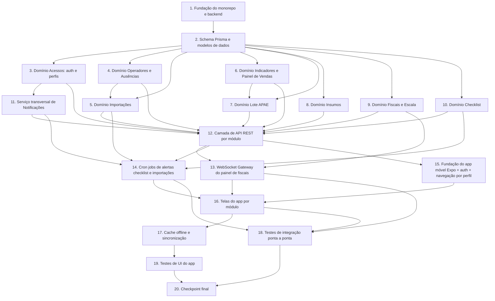

# Plano de Implementação: Gestão de Frente de Caixa

## Visão Geral

Este plano converte o design em uma sequência incremental de tarefas de codificação orientada a testes. A construção segue a ordem: fundação do projeto (monorepo, Prisma/PostgreSQL, schema), depois a lógica de domínio pura de cada módulo com seus testes de propriedade (fast-check), depois a camada de API/controllers, depois tempo real/notificações/cron, depois as telas do app móvel (React Native + Expo) e, por fim, os testes de integração e de UI. Cada tarefa constrói sobre as anteriores e termina integrando o que foi feito, evitando código órfão.

**Convenções de teste (conforme a Estratégia de Testes do design):**
- Testes de propriedade usam **fast-check** com no mínimo **100 iterações** por propriedade.
- Cada teste de propriedade implementa **uma única** propriedade do design e é anotado com:
  `// Feature: gestao-frente-de-caixa, Property {N}: {texto da propriedade}`
- Subtarefas marcadas com `*` são opcionais (testes) e podem ser puladas para um MVP mais rápido. Tarefas de implementação principal nunca são opcionais.
- O módulo "Solicitações com Aprovação" foi removido do produto e **não** faz parte deste plano.

## Grafo de Dependências de Tarefas

## Tarefas

- [x] 1. Estabelecer fundação do monorepo e do backend NestJS
  - Criar a estrutura de pastas do monorepo (`backend/` NestJS + `mobile/` Expo) com workspaces
  - Configurar TypeScript, ESLint, Prettier e o runner de testes (Jest ou Vitest) no backend
  - Adicionar e configurar **fast-check** como dependência de desenvolvimento para os testes de propriedade
  - Criar o bootstrap do NestJS com `AppModule`, configuração de ambiente e validação global de DTOs (`class-validator`)
  - _Requisitos: base para todos os módulos_

- [x] 2. Definir o schema Prisma e os modelos de dados
  - [x] 2.1 Modelar entidades no `schema.prisma`
    - Definir os modelos: `Usuario`, `Operador`, `Fiscal`, `RegistroOperacional`, `RegistroImportacao`, `VendaDiaria`, `LoteApae`, `Insumo`, `Fardo`, `MovimentoEstoque`, `SessaoFiscal`, `EscalaEntry`, `Checklist`, `Ausencia`, `Notificacao`
    - Aplicar enums (`Perfil`, `TipoArquivo`/tipo de registro, categoria de insumo, status de lote, status de checklist, status de fiscal) e índices de unicidade (nome de operador, código de barras de fardo)
    - Gerar a migração inicial e o Prisma Client
    - _Requisitos: 1.1, 1.3, 2.1, 2.6, 3.1, 3.2, 3.3, 4.2, 4.3, 5.1, 6.1, 6.2, 7.1, 7.3_
  - [x] 2.2 Criar o módulo de acesso ao banco (PrismaService) e seed básico
    - Implementar `PrismaModule`/`PrismaService` e dados de seed mínimos (usuário gerente, perfis)
    - No seed, criar para **cada fiscal e cada gerente um `Usuario` com login individual e único** (login não compartilhado), vinculado ao respectivo registro de pessoa (`Fiscal`/gerente)
    - _Requisitos: base de persistência para todos os módulos; 6.4.11, 7.1.4, 7.1.5, 7.1.6_

- [x] 3. Implementar domínio do Módulo Acessos (autenticação e perfis)
  - [x] 3.1 Implementar `AcessosService` com `autenticar` e `autorizar`
    - Implementar hash/verificação de senha e emissão de token; definir o conjunto de funcionalidades permitidas ao perfil fiscal e acesso total ao gerente
    - Garantir **login individual e exclusivo** por usuário: implementar `loginDisponivel` e aplicar restrição de unicidade de `login` (nenhum login compartilhado entre usuários), e fazer a autenticação ocorrer sempre pelo login individual do próprio usuário
    - Lançar `CredenciaisInvalidasError` e `PermissaoInsuficienteError`
    - _Requisitos: 7.1.1, 7.1.2, 7.1.3, 7.1.4, 7.1.5, 7.1.6, 7.2.1, 7.2.2, 7.2.3, 7.2.4_
  - [x]* 3.2 Escrever teste de propriedade para autenticação
    - **Property 28: Autenticação concede ou nega conforme credenciais**
    - **Validates: Requirements 7.1.2, 7.1.3**
  - [x]* 3.3 Escrever teste de propriedade para autorização por perfil
    - **Property 29: Autorização por perfil**
    - **Validates: Requirements 7.2.2, 7.2.3, 7.2.4**
  - [x]* 3.4 Escrever teste de propriedade para unicidade e exclusividade de login
    - **Property 31: Unicidade e exclusividade de login**
    - **Validates: Requirements 7.1.4, 7.1.6**

- [x] 4. Implementar domínio do Módulo Operadores e Ausências
  - [x] 4.1 Implementar `OperadoresService` (cadastro, edição, listagem com unicidade de nome)
    - Lançar `NomeDuplicadoError` em nome idêntico já cadastrado
    - _Requisitos: 6.1.1, 6.1.2, 6.1.3, 6.1.4, 6.1.5_
  - [x]* 4.2 Escrever teste de propriedade para unicidade de nome de operador
    - **Property 25: Unicidade de nome de operador**
    - **Validates: Requirements 6.1.3**
  - [x] 4.3 Implementar registro/remoção de ausências e relatório por pessoa
    - Garantir no máximo uma ausência por par (pessoa, data), lançando `AusenciaDuplicadaError`; gerar relatório filtrado por período e ordenado de forma decrescente
    - _Requisitos: 6.2.1, 6.2.2, 6.2.3, 6.2.4, 6.3.1, 6.3.2, 6.3.3_
  - [x]* 4.4 Escrever teste de propriedade para unicidade de ausência
    - **Property 26: Unicidade de ausência por pessoa e dia**
    - **Validates: Requirements 6.2.3**
  - [x]* 4.5 Escrever teste de propriedade para o relatório de ausências
    - **Property 27: Relatório de ausências filtrado e ordenado**
    - **Validates: Requirements 6.3.1, 6.3.2, 6.3.3**
  - [x]* 4.6 Escrever testes de exemplo para CRUD de operadores e ausências
    - Cobrir cadastro/edição/listagem e registro/remoção em casos concretos
    - _Requisitos: 6.1.1, 6.1.4, 6.1.5, 6.2.1, 6.2.4_
  - [x] 4.7 Implementar classificação e contagem de operadores por turno
    - Implementar `classificarTurnoOperador(entrada)` derivando o turno do horário de entrada da escala (abertura se `entrada < 10:00`; intermediário se `10:00 ≤ entrada < 13:00`; fechamento se `entrada ≥ 13:00`), com partição total e exclusiva
    - Implementar `contagemPorTurno`, considerando apenas operadores trabalhando no dia/escala selecionado (excluindo folga, férias e desligados) e retornando a contagem por turno (abertura, intermediário, fechamento) mais o total de operadores trabalhando
    - _Requisitos: 6.6.1, 6.6.2, 6.6.3, 6.6.4, 6.6.5, 6.6.6, 6.6.7_
  - [x]* 4.8 Escrever teste de propriedade para classificação de operador por turno
    - **Property 32: Classificação de operador por turno conforme horário de entrada**
    - **Validates: Requirements 6.6.1, 6.6.2, 6.6.3, 6.6.4**
  - [x]* 4.9 Escrever teste de propriedade para contagem por turno
    - **Property 33: Contagem por turno consistente com o total**
    - **Validates: Requirements 6.6.5, 6.6.6, 6.6.7**

- [x] 5. Implementar domínio do Módulo Importações
  - [x] 5.1 Implementar validação de colunas e parsing de CSV/XLSX
    - Implementar `validarColunas` para os quatro tipos de arquivo, reportando a coluna ausente; integrar biblioteca de parsing (`papaparse`/`xlsx`) lendo linha a linha
    - Lançar `ColunaAusenteError` quando faltar coluna obrigatória
    - _Requisitos: 1.1.1, 1.1.2, 1.1.3, 1.1.4, 1.1.5, 1.1.6_
  - [x]* 5.2 Escrever teste de propriedade para validação de colunas
    - **Property 1: Validação de colunas rejeita arquivo incompleto**
    - **Validates: Requirements 1.1.6**
  - [x] 5.3 Implementar vinculação por nome e fila de não reconhecidos
    - Implementar `vincularPorNome` e `importar`, particionando cada linha entre vinculada a operador/fiscal cadastrado ou listada em "não reconhecidos"
    - _Requisitos: 1.1.7, 1.1.8_
  - [x]* 5.4 Escrever teste de propriedade para particionamento por nome
    - **Property 2: Particionamento por nome (vinculado ou não reconhecido)**
    - **Validates: Requirements 1.1.7, 1.1.8**
  - [x] 5.5 Implementar status diário por arquivo, pendentes e histórico
    - Implementar `statusDoDia`, `verificarPendentesFimDoDia` (complemento dos importados) e `historico` ordenado do mais recente ao mais antigo com filtro por intervalo de data de referência; persistir `RegistroImportacao` (tipo, data referência, importado em, importado por, nomes não reconhecidos)
    - _Requisitos: 1.2.1, 1.2.2, 1.2.3, 1.3.1, 1.3.2, 1.3.3, 1.4.1_
  - [x]* 5.6 Escrever teste de propriedade para status do dia e pendentes
    - **Property 3: Status do dia e pendentes refletem as importações**
    - **Validates: Requirements 1.2.1, 1.2.2, 1.2.3, 1.4.1**
  - [x]* 5.7 Escrever teste de propriedade para histórico ordenado e filtrado
    - **Property 4: Histórico ordenado e filtrado por intervalo**
    - **Validates: Requirements 1.3.2, 1.3.3**
  - [x]* 5.8 Escrever testes de exemplo de registro de campos por tipo de arquivo
    - Verificar o registro de data/nome/valor por tipo e a configuração do horário de fim do dia
    - _Requisitos: 1.1.2, 1.1.3, 1.1.4, 1.1.5, 1.4.2_

- [x] 6. Implementar domínio do Painel de Vendas e Indicadores
  - [x] 6.1 Implementar `PainelVendas` (registrar, alterar, acumulados dia/semana/mês)
    - Acumular por agregação de `VendaDiaria` recalculada do zero; rejeitar valores negativos lançando `ValorVendaInvalidoError`
    - _Requisitos: 2.1.1, 2.1.2, 2.1.3, 2.1.4, 2.1.5_
  - [x]* 6.2 Escrever teste de propriedade para acumulados de vendas
    - **Property 5: Acumulados de vendas consistentes com recálculo**
    - **Validates: Requirements 2.1.2, 2.1.3, 2.1.5**
  - [x]* 6.3 Escrever teste de propriedade para rejeição de venda negativa
    - **Property 6: Valor de vendas negativo é rejeitado**
    - **Validates: Requirements 2.1.4**
  - [x] 6.4 Implementar cálculo de percentual e classificação de cor
    - Implementar `percentual` (sobre total de vendas > 0) e `statusCor` para os dois sentidos (menor é melhor: Cancelamento/Devoluções; maior é melhor: Troco/Recargas) com metas configuráveis (0,75% / 0,05% / R$2.000 / R$2.000)
    - _Requisitos: 2.2.1, 2.2.2, 2.2.3, 2.2.4, 2.2.5, 2.3.1, 2.3.2, 2.3.3, 2.3.4, 2.3.5, 2.4.2, 2.4.3, 2.4.4, 2.4.5, 2.5.2, 2.5.3, 2.5.4, 2.5.5_
  - [x]* 6.5 Escrever teste de propriedade para o cálculo do indicador percentual
    - **Property 7: Cálculo do indicador percentual**
    - **Validates: Requirements 2.2.1, 2.3.1**
  - [x]* 6.6 Escrever teste de propriedade para classificação de cor "menor é melhor"
    - **Property 8: Classificação de cor "menor é melhor"**
    - **Validates: Requirements 2.2.3, 2.2.4, 2.2.5, 2.3.3, 2.3.4, 2.3.5**
  - [x]* 6.7 Escrever teste de propriedade para classificação de cor "maior é melhor"
    - **Property 9: Classificação de cor "maior é melhor"**
    - **Validates: Requirements 2.4.3, 2.4.4, 2.4.5, 2.5.3, 2.5.4, 2.5.5**
  - [x] 6.8 Implementar rankings de operadores e fiscais
    - Implementar `rankingOperadores` e `rankingFiscais` ordenados de forma decrescente, preservando todas as pessoas como permutação exata da entrada
    - _Requisitos: 2.2.6, 2.3.6, 2.4.6, 2.5.6_
  - [x]* 6.9 Escrever teste de propriedade para ranking ordenado e completo
    - **Property 10: Ranking ordenado e completo**
    - **Validates: Requirements 2.2.6, 2.3.6, 2.4.6, 2.5.6**

- [x] 7. Implementar domínio do Lote de Sacolas APAE
  - [x] 7.1 Implementar `LoteApaeService` (registrar lote, atualizar saldo, reiniciar, histórico)
    - Calcular quantidade vendida (`inicial - saldoAtual`) e percentual vendido em [0,1]; rejeitar saldo atual maior que o anterior (`SaldoInvalidoError`); ao reiniciar, encerrar o lote preservando histórico e iniciar novo com vendida zerada
    - _Requisitos: 2.6.1, 2.6.2, 2.6.3, 2.6.4, 2.6.5, 2.6.6, 2.6.7_
  - [x]* 7.2 Escrever teste de propriedade para quantidade vendida e percentual do lote
    - **Property 11: Quantidade vendida e percentual do lote APAE**
    - **Validates: Requirements 2.6.2, 2.6.3**
  - [x]* 7.3 Escrever teste de propriedade para rejeição de atualização inválida de lote
    - **Property 12: Atualização inválida de lote é rejeitada**
    - **Validates: Requirements 2.6.4**
  - [x]* 7.4 Escrever teste de propriedade para reinício de lote
    - **Property 13: Reinício de lote zera vendida e preserva histórico**
    - **Validates: Requirements 2.6.5, 2.6.6**

- [x] 8. Implementar domínio do Módulo Insumos
  - [x] 8.1 Implementar `InsumosService` (saldo por soma de movimentos, retirada de fardo, consumos)
    - Modelar saldo como soma de `MovimentoEstoque` (deltas); registrar retirada de fardo por código de barras reduzindo o saldo pela quantidade de sacolas; registrar consumo de bobina por PDV e de insumos; cadastrar novos insumos com limite mínimo
    - Lançar `FardoNaoReconhecidoError` para código de barras sem fardo cadastrado
    - _Requisitos: 3.1.1, 3.1.2, 3.1.3, 3.1.4, 3.1.6, 3.2.1, 3.2.2, 3.2.4, 3.3.1, 3.3.2, 3.3.4_
  - [x]* 8.2 Escrever teste de propriedade para saldo igual à soma dos movimentos
    - **Property 14: Saldo de estoque igual à soma dos movimentos**
    - **Validates: Requirements 3.1.2, 3.1.4, 3.2.1, 3.2.2, 3.3.1, 3.3.2**
  - [x]* 8.3 Escrever teste de propriedade para fardo não reconhecido
    - **Property 15: Fardo não reconhecido não altera estoque**
    - **Validates: Requirements 3.1.3**
  - [x] 8.4 Implementar verificação de estoque baixo na fronteira do limite
    - Implementar `verificarEstoqueBaixo` (saldo ≤ limite mínimo) que dispara alerta via serviço de notificações
    - _Requisitos: 3.1.5, 3.2.3, 3.3.3_
  - [x]* 8.5 Escrever teste de propriedade para alerta de estoque baixo
    - **Property 16: Alerta de estoque baixo na fronteira do limite**
    - **Validates: Requirements 3.1.5, 3.2.3, 3.3.3**

- [x] 9. Implementar domínio do Módulo Fiscais e Escala
  - [x] 9.1 Implementar `FiscaisService` (status, check-in/check-out, histórico)
    - Implementar `alterarStatus` (última alteração vence, status válido) e check-in/check-out registrando data/horário; rejeitar check-in com sessão ativa (`CheckInAtivoError`)
    - _Requisitos: 4.1.1, 4.1.2, 4.1.3, 4.2.1, 4.2.2, 4.2.3, 4.2.4_
  - [x]* 9.2 Escrever teste de propriedade para status do fiscal
    - **Property 17: Status do fiscal reflete a última alteração**
    - **Validates: Requirements 4.1.1, 4.1.2**
  - [x]* 9.3 Escrever teste de propriedade para transições de check-in/check-out
    - **Property 18: Transições de check-in e check-out**
    - **Validates: Requirements 4.2.1, 4.2.2**
  - [x]* 9.4 Escrever teste de propriedade para check-in duplicado
    - **Property 19: Check-in duplicado é rejeitado**
    - **Validates: Requirements 4.2.3**
  - [x] 9.5 Implementar `EscalaService` (cadastro por dia, intervalo variável, folga, horário especial)
    - Implementar `cadastrarEscala`, `definirHorarioEspecial`, `resolverEscalaEfetiva` (especial prevalece sobre regra geral; senão folga) e `escalaConsolidada` por dia da semana
    - _Requisitos: 4.3.1, 4.3.2, 4.3.3, 4.3.4, 4.3.5, 4.3.6_
  - [x]* 9.6 Escrever teste de propriedade para horário especial
    - **Property 20: Horário especial prevalece sobre a regra geral**
    - **Validates: Requirements 4.3.5**
  - [x]* 9.7 Escrever testes de exemplo para cadastro de escala
    - Cobrir cadastro com horários por dia, intervalo variável e folga
    - _Requisitos: 4.3.1, 4.3.2, 4.3.3, 4.3.4_

- [x] 10. Implementar domínio do Módulo Checklist
  - [x] 10.1 Implementar `ChecklistService` (envio de imagem, status, janelas, alerta)
    - Disponibilizar checklist diário de abertura/fechamento; validar que o arquivo é imagem (`ArquivoNaoImagemError`); marcar "Feito" com data/horário/usuário ao enviar imagem válida; expor janelas fixas (08:15–09:15 / 13:15–14:15) e `verificarAlerta` (08:55 / 13:55 com status pendente)
    - _Requisitos: 5.1.1, 5.1.2, 5.1.3, 5.1.4, 5.1.5, 5.2.1, 5.2.2, 5.2.3, 5.3.1, 5.3.2_
  - [x]* 10.2 Escrever teste de propriedade para status do checklist
    - **Property 21: Status do checklist reflete o envio de imagem**
    - **Validates: Requirements 5.1.2, 5.1.5**
  - [x]* 10.3 Escrever teste de propriedade para rejeição de arquivo não-imagem
    - **Property 22: Arquivo não-imagem é rejeitado**
    - **Validates: Requirements 5.1.4**
  - [x]* 10.4 Escrever teste de propriedade para disparo do alerta no horário-limite
    - **Property 23: Disparo do alerta de checklist no horário-limite**
    - **Validates: Requirements 5.3.1, 5.3.2**
  - [x]* 10.5 Escrever testes de exemplo para janelas fixas de execução
    - Verificar as janelas 08:15–09:15 e 13:15–14:15
    - _Requisitos: 5.2.1, 5.2.2, 5.2.3_

- [x] 11. Implementar serviço transversal de Notificações
  - [x] 11.1 Implementar `NotificacoesService` (envio duplo canal, alvos, histórico)
    - Implementar `enviar` entregando por push e in-app, `fiscaisOnline`, `loginGerencial` (sempre presente) e `historico` por usuário; calcular destinatários do alerta de checklist como união dos fiscais online com o login gerencial
    - _Requisitos: 5.3.3, 5.3.4, 7.3.1, 7.3.2, 7.3.3_
  - [x]* 11.2 Escrever teste de propriedade para destinatários do alerta de checklist
    - **Property 24: Destinatários do alerta de checklist**
    - **Validates: Requirements 5.3.3, 5.3.4**
  - [x]* 11.3 Escrever teste de propriedade para entrega em dois canais
    - **Property 30: Notificação entregue pelos dois canais**
    - **Validates: Requirements 7.3.2**
  - [x]* 11.4 Escrever testes de exemplo para histórico de notificações
    - Verificar o histórico por usuário
    - _Requisitos: 7.3.3_

- [x] 12. Checkpoint - Garantir que todos os testes de domínio passem
  - Garantir que todos os testes passem, perguntar ao usuário em caso de dúvidas.

- [x] 13. Implementar a camada de API REST e autorização por módulo
  - [x] 13.1 Criar controllers, DTOs e guards por módulo
    - Implementar controllers REST para Importações, Indicadores (inclui Painel de Vendas e Lote APAE), Insumos, Fiscais/Escala, Checklist, Operadores/Ausências e Acessos; aplicar guard de autenticação e autorização por perfil; mapear erros de domínio para respostas HTTP em Português
    - Implementar endpoint de upload de arquivos de importação e de upload de imagem de checklist para object storage (S3-compatível)
    - _Requisitos: 1.1, 1.2, 1.3, 2.1, 2.2, 2.3, 2.4, 2.5, 2.6, 3.1, 3.2, 3.3, 4.1, 4.2, 4.3, 5.1, 6.1, 6.2, 6.3, 7.1, 7.2_
  - [x]* 13.2 Escrever testes de exemplo dos endpoints e mapeamento de erros
    - Cobrir respostas de sucesso e mensagens de erro por módulo
    - _Requisitos: 1.1.6, 2.1.4, 2.6.4, 3.1.3, 4.2.3, 5.1.4, 6.1.3, 6.2.3, 7.1.3, 7.2.4_

- [x] 14. Implementar o WebSocket Gateway do painel de fiscais
  - [x] 14.1 Criar o Gateway (Socket.IO) e emitir atualizações de status em tempo real
    - Conectar `alterarStatus` à emissão de eventos e propagar o status atual e o horário de definição aos clientes conectados
    - _Requisitos: 4.1.1, 4.1.2, 4.1.3_
  - [x]* 14.2 Escrever teste de integração do WebSocket
    - Validar propagação em tempo real a clientes conectados
    - _Requisitos: 4.1.2_

- [x] 15. Implementar os cron jobs de alertas
  - [x] 15.1 Implementar agendamento de alertas de checklist e de importações pendentes
    - Usar `@nestjs/schedule` com relógio injetável para disparar alertas de checklist (08:55/13:55) e de arquivos pendentes no horário de fim do dia configurável, acionando o `NotificacoesService`
    - _Requisitos: 1.4.1, 1.4.2, 5.3.1, 5.3.2, 5.3.3, 5.3.4_
  - [x]* 15.2 Escrever teste de integração dos cron jobs com relógio injetável
    - Validar disparo nos horários-limite e seleção de destinatários
    - _Requisitos: 1.4.1, 5.3.1, 5.3.2_

- [x] 16. Checkpoint - Garantir backend integrado (API + tempo real + cron)
  - Garantir que todos os testes passem, perguntar ao usuário em caso de dúvidas.

- [x] 17. Implementar fundação do app móvel (Expo) com auth e navegação por perfil
  - [x] 17.1 Criar o app Expo, cliente de API, login e navegação condicionada por perfil
    - Configurar projeto Expo (TypeScript), cliente HTTP, tela de login, armazenamento de token e navegação que mostra todas as áreas ao gerente e apenas as operacionais ao fiscal
    - Definir a identidade/branding do aplicativo como "Stok Center" (nome do app, título e tela de login) na configuração do Expo (`app.json`)
    - _Requisitos: 7.1.1, 7.1.2, 7.1.3, 7.2.2, 7.2.3, 7.2.4_

- [x] 18. Implementar as telas do app por módulo
  - [x] 18.1 Telas de Importações, Indicadores e Painel de Vendas
    - Tela de status diário e histórico de importações; painel de vendas (informar/exibir acumulados); indicadores com cor (verde/amarelo/vermelho), metas e rankings; lote APAE e histórico
    - _Requisitos: 1.2, 1.3, 2.1.3, 2.2, 2.3, 2.4, 2.5, 2.6.7_
  - [x] 18.2 Telas de Insumos com leitura de código de barras
    - Saldos em tempo real, leitura de fardo (`expo-barcode-scanner`), consumo de bobinas/insumos, alertas de estoque baixo e cadastro de insumo
    - _Requisitos: 3.1.1, 3.1.4, 3.1.6, 3.2.1, 3.2.4, 3.3.1, 3.3.4_
  - [x] 18.3 Telas de Fiscais (painel em tempo real), Escala e Checklist
    - Painel de fiscais consumindo WebSocket, check-in/check-out, escala consolidada; checklist com upload de imagem e janelas de execução
    - _Requisitos: 4.1, 4.2, 4.3.6, 5.1, 5.2.3_
  - [x] 18.4 Telas de Operadores/Ausências e Notificações
    - CRUD de operadores, registro/remoção de ausências, relatório de ausências; centro de notificações in-app com histórico
    - Exibir, na seção de Operadores, as contagens por turno (abertura, intermediário, fechamento) e o total de operadores trabalhando no dia selecionado
    - _Requisitos: 6.1.5, 6.2, 6.3, 6.6.5, 6.6.6, 6.6.7, 7.3.1, 7.3.3_
  - [x]* 18.5 Escrever testes de componente/snapshot das telas de exibição
    - Cobrir painel de vendas, saldos, escala consolidada e históricos
    - _Requisitos: 2.1.3, 3.1.4, 4.1.3, 4.3.6_

- [ ] 19. Implementar cache offline e sincronização no app
  - [ ] 19.1 Configurar SQLite local e fila de ações pendentes
    - Implementar leitura offline de indicadores/escala/históricos e fila de ações (leitura de fardo, alteração de status) com sincronização ao reconectar; resolução de conflito de status por "última alteração vence"
    - _Requisitos: 3.1.1, 4.1.1, 4.1.2_
  - [ ]* 19.2 Escrever teste de UI de operação offline e sincronização
    - Validar enfileiramento e sincronização posterior das ações
    - _Requisitos: 3.1.1, 4.1.2_

- [ ] 20. Implementar testes de integração ponta a ponta
  - [ ]* 20.1 Escrever testes de integração de importação ponta a ponta
    - Upload real de CSV/XLSX dos quatro tipos validando parsing, vinculação e persistência (1–3 exemplos por tipo)
    - _Requisitos: 1.1.1, 1.1.2, 1.1.3, 1.1.4, 1.1.5, 1.1.7, 1.1.8_
  - [ ]* 20.2 Escrever testes de integração de upload de imagem de checklist
    - Validar armazenamento em object storage e marcação "Feito"
    - _Requisitos: 5.1.2, 5.1.3_
  - [ ]* 20.3 Escrever testes de integração de entrega de notificações
    - Com mocks do provedor de push, verificar duplo canal e alvo (online + gerencial)
    - _Requisitos: 7.3.2, 5.3.3, 5.3.4_

- [ ] 21. Implementar testes de UI do app
  - [ ]* 21.1 Escrever testes de leitura de código de barras e navegação por perfil
    - Com mocks de câmera, validar leitura de fardo; validar que gerente vê tudo e fiscal vê apenas o operacional
    - _Requisitos: 3.1.1, 7.2.2, 7.2.3, 7.2.4_

- [ ] 22. Checkpoint final - Garantir que todos os testes passem
  - Garantir que todos os testes passem, perguntar ao usuário em caso de dúvidas.

## Notas

- Subtarefas marcadas com `*` são opcionais (testes) e podem ser puladas para um MVP mais rápido.
- Cada tarefa referencia requisitos específicos para rastreabilidade.
- As 33 propriedades de correção do design (Propriedades 1–33) têm um teste de propriedade dedicado (fast-check, mínimo 100 iterações, anotado com `// Feature: gestao-frente-de-caixa, Property {N}: {texto}`).
- Os checkpoints garantem validação incremental entre as camadas (domínio → API/tempo real/cron → app → integração/UI).
- Geradores de propriedade devem cobrir bordas: vendas = 0 (denominador), valores exatamente na meta/limite, saldo de lote chegando a zero, nomes com acentuação/maiúsculas-minúsculas e datas em fronteiras de semana/mês.
