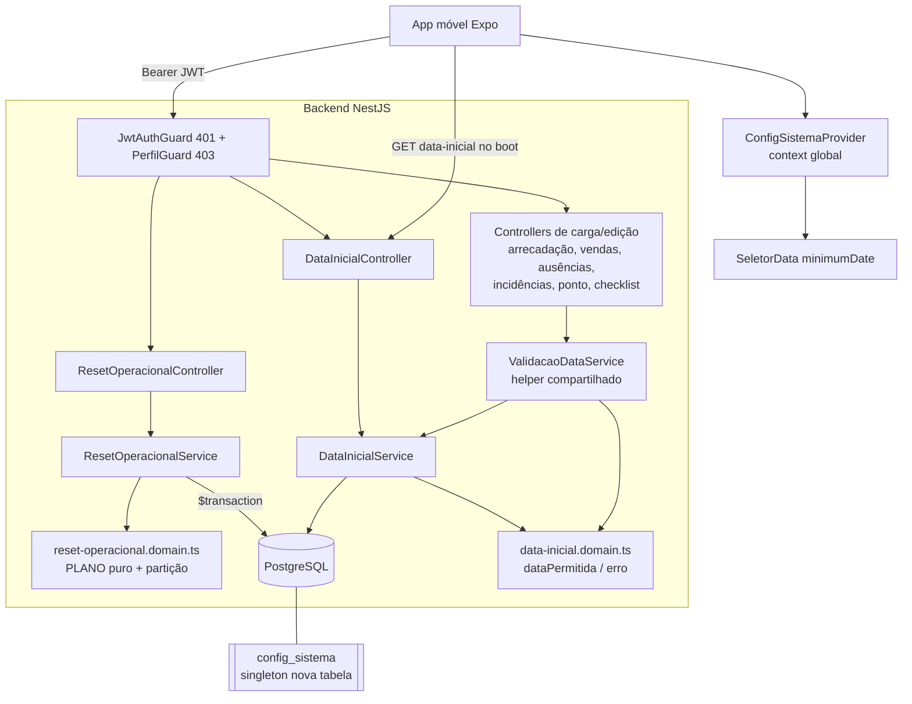

# Design Document — Reinício Operacional + Data Inicial do Sistema

## Overview

Este design descreve como colocar o Check-out PRO "em zero" a partir de uma **data inicial** configurável (padrão **01/07/2026**), reunindo dois recursos complementares:

1. **`Modulo_ResetOperacional`** — operação administrativa que apaga os `Dados_de_Movimento` (vendas, arrecadação, estoque em movimento, sacolas APAE, jornada/escala por data, notificações, checklists, fluxos legados) e zera `insumos.saldo`, **conservando** os `Dados_de_Cadastro` (pessoas, escalas de cadastro, definições de insumos, configuração/metas). Executa em **uma única transação** (tudo ou nada), é **idempotente** e devolve um `Resumo_de_Reinicio` com a contagem por entidade.
2. **`Modulo_DataInicial`** — configuração global *singleton* (`Data_Inicial_Sistema`) que define a data a partir da qual registros podem ser cadastrados/editados e a partir da qual começam os calendários do app. É editável pelo gestor sem redeploy e usada para validar datas no backend e limitar os seletores no app móvel.

O design respeita rigorosamente os padrões do projeto (ver `.kiro/steering/arquitetura.md`):

- Padrão **controller → service → domain**, com lógica de domínio **pura** e testável.
- Autorização por **funcionalidade** a partir da fonte única `acessos.domain.ts` (`@Funcionalidade(...)` + `PerfilGuard`).
- Erros que estendem `ErroDominio` (cada erro declara o próprio `statusHttp`).
- **Migrações aditivas** (nova tabela; nenhuma migração destrutiva).
- **Property-based testing** com `fast-check` (≥100 iterações) para a lógica pura.

> **Nota para o gestor (linguagem simples):** o time de desenvolvimento entrega o **botão** pronto, testado e publicado. Quem aperta o botão de "zerar" em produção é o próprio gestor, dentro do app — o desenvolvimento **não** acessa o banco de produção nem executa o apagamento (Requisito 9).

---

## Architecture

O reinício é uma **operação de dados em tempo de execução** (não uma migração destrutiva de schema). A única mudança de schema é **aditiva**: a nova tabela `config_sistema`.



**Fluxo do reinício (Req 1, 2, 3, 4):**

1. Gestor confirma no app (marcador explícito) e o app chama `POST /admin/reset-operacional` com `{ confirmacao: 'ZERAR' }`.
2. `PerfilGuard` exige `ADMIN_DADOS` (só `GERENTE_DESENVOLVEDOR`) → sem permissão = **403**, sem apagar nada.
3. O service valida o marcador de confirmação → ausente = **400**, sem apagar nada.
4. O service percorre o **plano de reinício puro** (ordem que respeita FKs) dentro de `prisma.$transaction`, acumulando a contagem por entidade e zerando `insumos.saldo`.
5. Retorna `Resumo_de_Reinicio`. Se qualquer passo falhar, a transação reverte (Req 4.2).

**Fluxo da validação de data (Req 6):** cada endpoint de carga/edição resolve a `Data_Inicial_Sistema` vigente (via serviço compartilhado, com cache curto) e valida a data do registro com a função pura `dataPermitida`. Data anterior = `ErroDataAnteriorInicial` (**400**, mensagem pt-BR com a data mínima).

---

## Components and Interfaces

### 1. `Modulo_ResetOperacional` (backend)

Novo módulo em `backend/src/reset-operacional/`, registrado em `app.module.ts`.

```
reset-operacional/
  reset-operacional.controller.ts
  reset-operacional.service.ts
  reset-operacional.domain.ts        // puro (plano + partição)
  reset-operacional.errors.ts        // ConfirmacaoAusenteError
  reset-operacional.module.ts
  dto/reset-operacional.dto.ts
  reset-operacional.domain.spec.ts   // unit
  reset-operacional.properties.spec.ts // fast-check
```

**Controller** (`@Controller('admin/reset-operacional')`):

```ts
@Post()
@HttpCode(HttpStatus.OK)
@Funcionalidade('ADMIN_DADOS')            // Req 1.1, 1.3, 8.2 → 403
async reiniciar(
  @Body() dto: ResetOperacionalDto,       // Req 1.4 → 400 se faltar confirmação
): Promise<ResumoDeReinicio> {
  return this.service.reiniciar(dto);
}
```

**DTO** — marcador de confirmação explícita (Req 1.4), validado por `class-validator`:

```ts
export class ResetOperacionalDto {
  @IsIn(['ZERAR'], { message: 'Confirmação inválida. Envie confirmacao: "ZERAR".' })
  confirmacao!: 'ZERAR';
}
```

> Em produção, `whitelist`/`forbidNonWhitelisted` do `ValidationPipe` global fazem `confirmacao` ausente cair como **400** — cobre Req 1.4. O service também revalida (defesa em profundidade).

**Service** — orquestra a transação (Req 4.1, 4.2, 4.4):

```ts
async reiniciar(dto: ResetOperacionalDto): Promise<ResumoDeReinicio> {
  if (dto?.confirmacao !== 'ZERAR') throw new ConfirmacaoAusenteError();

  return this.prisma.$transaction(async (tx) => {
    const resumo: ResumoDeReinicio = {};
    for (const passo of PLANO_REINICIO) {              // ordem respeita FKs
      if (passo.acao === 'APAGAR') {
        const { count } = await this.apagar(tx, passo.entidade);
        resumo[passo.entidade] = count;
      } else if (passo.acao === 'ZERAR_SALDO_INSUMOS') {
        await tx.insumo.updateMany({ data: { saldo: 0 } }); // Req 2.3
      }
    }
    return resumo;                                     // Req 4.4
  });
}
```

- `apagar(tx, entidade)` faz o mapeamento nome-de-entidade → `tx.<model>.deleteMany({})` (delegate Prisma). O **plano** (quais entidades e em que ordem) vive no domínio puro; o service só executa.
- A `Data_Inicial_Sistema` (`config_sistema`) **não** aparece no plano → conservada (Req 3.5). `config_apae`, `config_vendas`, `metas_indicador`, `metas_mensais`, pessoas, escalas de cadastro e definições de insumo tampouco aparecem (Req 3).

### 2. `Modulo_DataInicial` (backend)

Novo módulo em `backend/src/data-inicial/` (seguindo o padrão *singleton* de `ConfigVendas`/`ConfigApae`).

```
data-inicial/
  data-inicial.controller.ts
  data-inicial.service.ts
  data-inicial.domain.ts             // puro: dataPermitida
  data-inicial.errors.ts             // ErroDataAnteriorInicial
  data-inicial.module.ts             // exporta service p/ reutilização
  dto/data-inicial.dto.ts
  data-inicial.domain.spec.ts
  data-inicial.properties.spec.ts
```

**Controller** (`@Controller('config/data-inicial')`):

```ts
@Get()                                   // Req 5.5 — leitura p/ o app (autenticado)
obter(): Promise<{ dataInicial: string }> { return this.service.obter(); }

@Patch()                                 // Req 5.3, 5.4 — editar
@Funcionalidade('ADMIN_DADOS')           // Req 5.4 → 403
editar(
  @Body() dto: EditarDataInicialDto,
  @UsuarioAtual() usuario: UsuarioAutenticado,
): Promise<{ dataInicial: string }> {
  return this.service.editar(dto.dataInicial, usuario?.sub);
}
```

**DTO**:

```ts
export class EditarDataInicialDto {
  @IsDateString({}, { message: 'Data inicial inválida (use AAAA-MM-DD).' })
  dataInicial!: string;
}
```

**Service** — leitura/escrita do singleton com `upsert` (mesmo padrão de `VendasService.obterConfig`) e default 2026-07-01 (Req 5.1):

```ts
private readonly PADRAO = new Date('2026-07-01T00:00:00.000Z');

async obterData(): Promise<Date> {                    // usado internamente
  const cfg = await this.prisma.configSistema.upsert({
    where: { id: 'sistema' },
    update: {},
    create: { id: 'sistema', dataInicial: this.PADRAO },
  });
  return cfg.dataInicial;
}
async editar(dataISO: string, por?: string) {         // Req 5.3
  const cfg = await this.prisma.configSistema.upsert({
    where: { id: 'sistema' },
    update: { dataInicial: new Date(dataISO), atualizadoPor: por },
    create: { id: 'sistema', dataInicial: new Date(dataISO), atualizadoPor: por },
  });
  return { dataInicial: cfg.dataInicial.toISOString().slice(0, 10) };
}
```

### 3. `ValidacaoDataService` — validação de data mínima compartilhada (Req 6)

Para **não duplicar lógica**, a validação vive num único serviço injetável (exportado pelo `DataInicialModule`) que combina a leitura da config com a função pura de domínio:

```ts
@Injectable()
export class ValidacaoDataService {
  constructor(private readonly dataInicial: DataInicialService) {}

  /** Lança ErroDataAnteriorInicial se `data` < Data_Inicial_Sistema. */
  async exigirDataPermitida(data: Date): Promise<void> {
    const minima = await this.dataInicial.obterData();
    if (!dataPermitida(data, minima)) {                 // função pura
      throw new ErroDataAnteriorInicial(minima);        // Req 6.1, 6.4
    }
  }
}
```

**Pontos de injeção reais** (identificados no código atual). Cada service afetado recebe `ValidacaoDataService` e chama `exigirDataPermitida(data)` antes de persistir:

| Endpoint real | Controller / Service | Campo de data | Req |
|---|---|---|---|
| `POST /arrecadacao/upload` | `ArrecadacaoController.upload` → `ArrecadacaoService.importar(tipo, data, linhas)` | `dto.data` (default hoje) | 6.3 |
| `POST /arrecadacao/sem-movimento` | `ArrecadacaoService.marcarSemMovimento` | `dto.data` | 6.3 |
| `POST /vendas/upload` | `VendasController.upload` → `VendasService.importar(data, linhas)` | `dto.data` (default hoje) | 6.3 |
| `POST /operadores/ausencias` | `OperadoresController.registrarAusencia` → `OperadoresService.registrarAusencia(pessoaId, data)` | `dto.data` | 6.3 |
| `POST /escala/incidencias` | `IncidenciasController.registrar` → `IncidenciasService.registrar(dto,...)` | `dto.data` | 6.3 |
| `POST /fiscais/eu/status` (ponto) | `FiscaisController.definirMeuStatus` → `FiscaisService.definirStatus` | data do registro de ponto = hoje | 6.3 |
| `POST /checklist/:tipo/imagem` e `POST /checklist/:tipo` | `ChecklistController` → `ChecklistService` | `dto.data` (default hoje) | 6.3 |

> **Decisão de design:** a validação é feita na **camada de service** (não num guard/interceptor), porque a data está em posições heterogêneas (query, body, param, default "hoje") e às vezes precisa de normalização (`inicioDoDia`). Um guard genérico não teria acesso uniforme ao campo. Centralizar a **regra** em `dataPermitida` + `ValidacaoDataService` evita duplicação; cada service apenas invoca o helper com a `Date` que já constrói hoje. Endpoints cuja data é sempre "hoje" (ponto, checklist do dia) ficam naturalmente válidos quando a data inicial ≤ hoje, mas a checagem é mantida por consistência e para o caso de datas explícitas.

### 4. Mobile (Expo) — data mínima nos calendários (Req 7)

**Propagação da data inicial (context global):** novo `ConfigSistemaProvider` (`mobile/src/config/ConfigSistemaContext.tsx`) que, ao autenticar, busca `GET /config/data-inicial` e expõe `useConfigSistema().dataInicial` (ISO `yyyy-mm-dd`). Segue o padrão do `AuthProvider` existente. É montado logo abaixo do `AuthProvider` na árvore de navegação.

- Novo serviço `mobile/src/api/services/configSistema.ts`: `obterDataInicial(): Promise<{ dataInicial: string }>`.
- Fallback: enquanto carrega ou em erro de rede, usa `'2026-07-01'` (mesmo default do backend) para nunca deixar o seletor sem limite.

**Componente `SeletorData`:** estender a API com `dataMinima?: string` (ISO). Quando presente, bloqueia o botão "dia anterior" e a navegação abaixo de `dataMinima` (espelhando a lógica atual de `permitirFuturo`):

```tsx
const anteriorBloqueado = !!dataMinima && valor <= dataMinima;
// botão "voltar" fica inativo quando anteriorBloqueado
```

**Telas reais que selecionam data** (a passar `dataMinima={dataInicial}` e/ou validar antes de enviar):

| Tela | Arquivo | Uso |
|---|---|---|
| Importações (carga arrecadação/vendas) | `screens/importacoes/ImportacoesScreen.tsx` | data do dia carregado |
| Painel de Vendas | `screens/indicadores/PainelVendasScreen.tsx` | `data`, `inicioPers`, `fimPers` |
| Operadores (ausência/falta) | `screens/operadores/OperadoresScreen.tsx` | `diaSel` |
| Escala/Incidências | `screens/fiscais/EscalaScreen.tsx` | `data: hojeISO()` nos formulários |
| Checklist | `screens/checklist/*` | data do checklist do dia |

> O app é a **primeira linha** (UX), mas a **fonte de verdade** da validação é sempre o backend (Req 6) — o app apenas evita que o usuário tente uma data inválida.

**Botão de reinício (Req 1.5):** nova ação no Centro de Controle, visível apenas quando `podeAcessar('ADMIN_DADOS')`, com diálogo de **confirmação explícita** (digitar/confirmar "ZERAR") antes de `POST /admin/reset-operacional`.

---

## Data Models

### Nova tabela `config_sistema` (migração aditiva — Req 5.2, 8.3)

Modelo Prisma *singleton* (id fixo `'sistema'`), no mesmo estilo de `ConfigApae`/`ConfigVendas`:

```prisma
// Configuração (singleton) global do Sistema. Guarda a Data_Inicial_Sistema:
// data a partir da qual registros podem ser cadastrados/editados e a partir da
// qual começam os calendários do app. Editável pelo gestor sem redeploy.
model ConfigSistema {
  id            String   @id @default("sistema")
  dataInicial   DateTime @default(dtz("2026-07-01T00:00:00.000Z"))
  atualizadoEm  DateTime @default(now()) @updatedAt
  atualizadoPor String?

  @@map("config_sistema")
}
```

Migração SQL **somente aditiva** (nova tabela + linha singleton idempotente), no padrão de `9k_apae_inteligente`:

```sql
CREATE TABLE "config_sistema" (
  "id" TEXT NOT NULL,
  "dataInicial" TIMESTAMP(3) NOT NULL DEFAULT '2026-07-01 00:00:00',
  "atualizadoEm" TIMESTAMP(3) NOT NULL DEFAULT CURRENT_TIMESTAMP,
  "atualizadoPor" TEXT,
  CONSTRAINT "config_sistema_pkey" PRIMARY KEY ("id")
);
INSERT INTO "config_sistema" ("id", "dataInicial")
VALUES ('sistema', '2026-07-01 00:00:00')
ON CONFLICT ("id") DO NOTHING;
```

Pasta de migração aditiva: `backend/prisma/migrations/9x_config_sistema/migration.sql`.

### `Resumo_de_Reinicio` (retorno da operação — Req 4.4)

```ts
/** Contagem de registros apagados por entidade (chave = nome @@map). */
export type ResumoDeReinicio = Record<string, number>;
// ex.: { vendas_diarias: 120, vendas_hora: 2880, registros_arrecadacao: 540, ... }
```

### Plano de reinício puro (`reset-operacional.domain.ts`)

O coração testável: a **lista ordenada** de entidades e a **partição apagar/conservar**, sem qualquer dependência do Prisma ou do Nest.

```ts
export type AcaoReset = 'APAGAR' | 'ZERAR_SALDO_INSUMOS';

export interface PassoReset {
  entidade: string;   // nome @@map da tabela
  acao: AcaoReset;
  ordem: number;      // menor primeiro; respeita dependências (FK)
}

/**
 * Plano ordenado. A ordem garante que filhos (FK) sejam apagados antes dos
 * pais e antes de zerar `insumos.saldo`.
 */
export const PLANO_REINICIO: readonly PassoReset[] = Object.freeze([
  // 1) Sacolas APAE: movimentos antes do lote (FK loteId, onDelete Cascade)
  { entidade: 'movimentos_lote_apae', acao: 'APAGAR', ordem: 10 },
  { entidade: 'lotes_apae',           acao: 'APAGAR', ordem: 11 },
  // 2) Estoque em movimento antes de zerar o saldo dos insumos (insumos conservados)
  { entidade: 'movimentos_estoque',   acao: 'APAGAR', ordem: 20 },
  { entidade: 'requisicoes',          acao: 'APAGAR', ordem: 21 },
  { entidade: 'sugestoes_pedido',     acao: 'APAGAR', ordem: 22 },
  { entidade: 'insumos',              acao: 'ZERAR_SALDO_INSUMOS', ordem: 23 },
  // 3) Fluxo legado: registros antes das importações (FK importacaoId)
  { entidade: 'registros_operacionais', acao: 'APAGAR', ordem: 30 },
  { entidade: 'registros_importacao',   acao: 'APAGAR', ordem: 31 },
  // 4) Jornada / escala por data (FK apenas para entidades conservadas)
  { entidade: 'registros_ponto_fiscal', acao: 'APAGAR', ordem: 40 },
  { entidade: 'ausencias',              acao: 'APAGAR', ordem: 41 },
  { entidade: 'incidencias_escala',     acao: 'APAGAR', ordem: 42 },
  // 5) Vendas
  { entidade: 'vendas_diarias',       acao: 'APAGAR', ordem: 50 },
  { entidade: 'vendas_hora',          acao: 'APAGAR', ordem: 51 },
  // 6) Arrecadação
  { entidade: 'registros_arrecadacao',      acao: 'APAGAR', ordem: 60 },
  { entidade: 'arrecadacao_sem_movimento',  acao: 'APAGAR', ordem: 61 },
  // 7) Avisos / checklists / fechamento / assistente
  { entidade: 'notificacoes',          acao: 'APAGAR', ordem: 70 },
  { entidade: 'mensagens_assistente',  acao: 'APAGAR', ordem: 71 },
  { entidade: 'fechamentos_concluidos',acao: 'APAGAR', ordem: 72 },
  { entidade: 'checklists',            acao: 'APAGAR', ordem: 73 },
]);

/** Entidades explicitamente CONSERVADAS (Dados_de_Cadastro + config/metas). */
export const ENTIDADES_CONSERVADAS: readonly string[] = Object.freeze([
  'usuarios', 'colaboradores', 'colaborador_identificadores', 'operadores', 'fiscais',
  'escala_entries', 'operador_turnos',
  'insumos', 'fardos', 'pedidos_recorrentes', // insumos: só saldo zera, linha conservada
  'config_apae', 'config_vendas', 'metas_indicador', 'metas_mensais',
  'config_sistema',
]);

/** Conjunto de entidades que o plano APAGA (sem duplicatas). */
export function entidadesApagadas(plano = PLANO_REINICIO): Set<string> {
  return new Set(plano.filter((p) => p.acao === 'APAGAR').map((p) => p.entidade));
}

/** True se apagadas e conservadas não têm interseção (partição válida). */
export function planoEhParticaoValida(
  plano = PLANO_REINICIO,
  conservadas = ENTIDADES_CONSERVADAS,
): boolean {
  const apagar = entidadesApagadas(plano);
  return conservadas.every((c) => !apagar.has(c));
}

/** True se a ordem do plano respeita as dependências informadas (filho→pai). */
export function ordemRespeitaDependencias(
  plano = PLANO_REINICIO,
  dependencias: ReadonlyArray<[string, string]> = DEPENDENCIAS_FK,
): boolean { /* verifica ordem(filho) < ordem(pai) para cada par */ }

/** Pares [filho, pai]: o filho deve ser apagado antes do pai. */
export const DEPENDENCIAS_FK: ReadonlyArray<[string, string]> = Object.freeze([
  ['movimentos_lote_apae', 'lotes_apae'],
  ['registros_operacionais', 'registros_importacao'],
]);
```

### Data inicial pura (`data-inicial.domain.ts`)

```ts
/** Início do dia (UTC) — normaliza para comparar por dia, não por hora. */
export function inicioDoDiaUTC(d: Date): number {
  return Date.UTC(d.getUTCFullYear(), d.getUTCMonth(), d.getUTCDate());
}

/**
 * True se `data` é IGUAL ou POSTERIOR à `dataInicial` (comparação por dia).
 * Fronteira: data == dataInicial é PERMITIDA; data anterior é REJEITADA.
 * (Req 6.1, 6.2)
 */
export function dataPermitida(data: Date, dataInicial: Date): boolean {
  return inicioDoDiaUTC(data) >= inicioDoDiaUTC(dataInicial);
}
```


---

## Correctness Properties

*Uma propriedade é uma característica ou comportamento que deve ser verdadeiro em todas as execuções válidas do sistema — uma afirmação formal sobre o que o software deve fazer. As propriedades são a ponte entre a especificação legível por humanos e as garantias de correção verificáveis por máquina.*

Após a análise (prework) e a reflexão de redundância, a lógica **pura** deste feature se resume a quatro propriedades universais, testadas com `fast-check` (≥100 iterações). A execução real contra o banco (transação, rollback, contagem real) é coberta por testes de integração (ver Testing Strategy), pois não varia de forma significativa com a entrada.

### Property 1: Fronteira exata de `dataPermitida`

*Para qualquer* `dataInicial` e *qualquer* deslocamento inteiro de dias `k`, seja `data = dataInicial + k` dias: `dataPermitida(data, dataInicial)` deve ser **verdadeiro se e somente se `k >= 0`**. Em particular, `k = 0` (data igual à inicial) é **permitido** e `k = -1` (um dia antes) é **rejeitado**.

**Validates: Requirements 6.1, 6.2, 8.4**

### Property 2: A partição apagar/conservar é disjunta e cobre o esperado

*Para o* `PLANO_REINICIO` e a lista `ENTIDADES_CONSERVADAS`: o conjunto `entidadesApagadas(PLANO_REINICIO)` e o conjunto de conservadas são **disjuntos** (interseção vazia), e o conjunto apagado é **exatamente** o conjunto esperado de `Dados_de_Movimento` (as 18 entidades dos Requisitos 2.1–2.7). Adicionalmente, `insumos`, `config_sistema`, `config_apae`, `config_vendas`, `metas_indicador`, `metas_mensais` e as entidades de pessoas/escala de cadastro **nunca** pertencem ao conjunto apagado.

**Validates: Requirements 2.1, 2.2, 2.3, 2.4, 2.5, 2.6, 2.7, 3.1, 3.2, 3.3, 3.4, 3.5, 8.4**

### Property 3: Idempotência conceptual do plano de reinício

*Para qualquer* estado inicial representado como um mapa de contagens por entidade (modelo puro), aplicar o plano de reinício e depois aplicá-lo **novamente** produz o mesmo estado final (todas as entidades de movimento em `0`) e o segundo `Resumo_de_Reinicio` tem **todas as contagens iguais a `0`**. O conjunto `entidadesApagadas` é estável (é um `Set`, sem duplicatas), portanto reexecutar não altera o plano nem o resultado.

**Validates: Requirements 4.3**

### Property 4: O resumo cobre exatamente as entidades apagadas do plano

*Para qualquer* estado inicial (mapa de contagens por entidade), o `Resumo_de_Reinicio` produzido pelo modelo puro de execução tem **exatamente** as chaves de `entidadesApagadas(PLANO_REINICIO)` e, para cada entidade, a contagem reportada é igual à contagem inicial daquela entidade no estado (o que foi apagado = o que existia). Nenhuma entidade conservada aparece no resumo.

**Validates: Requirements 4.4**

> **Observação sobre a ordem que respeita FKs:** a função pura `ordemRespeitaDependencias(PLANO_REINICIO, DEPENDENCIAS_FK)` é verificada por um teste unitário determinístico (não é uma propriedade universal), garantindo `ordem(filho) < ordem(pai)` para `movimentos_lote_apae → lotes_apae` e `registros_operacionais → registros_importacao`.

---

## Error Handling

Todos os erros de domínio estendem `ErroDominio` (cada um declara o próprio `statusHttp`); o `DominioExceptionFilter` global mapeia para a resposta HTTP com mensagem em pt-BR. Não há mapa central manual.

| Situação | Erro / mecanismo | Status | Req |
|---|---|---|---|
| Reinício sem permissão `ADMIN_DADOS` | `PermissaoInsuficienteError` (via `PerfilGuard`, já existente) | **403** | 1.3, 8.2 |
| Reinício sem marcador de confirmação | `ConfirmacaoAusenteError extends ErroDominio` (novo) + `ValidationPipe` | **400** | 1.4 |
| Falha durante a transação de reinício | `prisma.$transaction` reverte; propaga `ErroDominio` (ou erro do Prisma → filtro) | 400/500 | 4.2 |
| Editar data inicial sem `ADMIN_DADOS` | `PermissaoInsuficienteError` (via `PerfilGuard`) | **403** | 5.4 |
| Data inicial com formato inválido | `class-validator` (`@IsDateString`) → `BadRequestException` | **400** | 5.3 |
| Registro com data anterior à inicial | `ErroDataAnteriorInicial extends ErroDominio` (novo) | **400** | 6.1, 6.4 |

**`ErroDataAnteriorInicial`** — mensagem em português com a data mínima (Req 6.4):

```ts
export class ErroDataAnteriorInicial extends ErroDominio {
  readonly statusHttp = HttpStatus.BAD_REQUEST; // 400
  constructor(dataMinima: Date) {
    const iso = dataMinima.toISOString().slice(0, 10);
    const brasil = iso.split('-').reverse().join('/'); // dd/mm/aaaa
    super(`Data anterior à data inicial do sistema. A data mínima permitida é ${brasil}.`);
  }
}
```

**`ConfirmacaoAusenteError`**:

```ts
export class ConfirmacaoAusenteError extends ErroDominio {
  readonly statusHttp = HttpStatus.BAD_REQUEST; // 400
  constructor() { super('Confirmação obrigatória ausente. Envie confirmacao: "ZERAR" para reiniciar.'); }
}
```

Invariante de segurança: quando o guard recusa (403) ou o marcador falta (400), **nenhuma** operação de escrita é iniciada — a transação sequer começa.

---

## Testing Strategy

Abordagem dupla e complementar, alinhada aos padrões do projeto (fast-check ≥100 iterações; `jest` para unit/integração).

### Testes de propriedade (`fast-check`, ≥100 iterações)

Arquivos: `reset-operacional.properties.spec.ts` e `data-inicial.properties.spec.ts`. Cada teste é etiquetado com um comentário referenciando a propriedade do design:

- **Feature: reset-operacional-data-inicial, Property 1** — `dataPermitida` fronteira exata (offset inteiro assinado; inclui `k=0` e `k=-1`).
- **Feature: reset-operacional-data-inicial, Property 2** — disjunção e cobertura da partição do plano.
- **Feature: reset-operacional-data-inicial, Property 3** — idempotência conceptual sobre o modelo de contagens.
- **Feature: reset-operacional-data-inicial, Property 4** — cobertura de chaves do `Resumo_de_Reinicio` no modelo puro.

Cada propriedade do design é implementada por **um único** teste de propriedade. O modelo puro de execução (um reduce sobre `PLANO_REINICIO` que zera contagens e acumula o resumo) permite testar as Propriedades 3 e 4 **sem** o banco de dados.

### Testes unitários (`jest`)

- `dataPermitida`: exemplos concretos de fronteira (véspera, mesmo dia, dia seguinte).
- `ordemRespeitaDependencias(PLANO_REINICIO, DEPENDENCIAS_FK)` = `true` (ordem FK correta).
- `ConfirmacaoAusenteError` / `ErroDataAnteriorInicial`: `statusHttp` e mensagem pt-BR contendo a data mínima.
- DTOs (`ResetOperacionalDto`, `EditarDataInicialDto`): validação `class-validator`.

### Testes de integração (`jest`, banco de teste — nunca produção)

Executam contra um PostgreSQL de teste local/CI (os scripts em `_qa_scripts/` já preparam um Postgres efêmero). **Não** tocam o banco produtivo (Req 9).

- **Reinício apaga movimento e conserva cadastro:** seed com dados em todas as tabelas → `reiniciar({confirmacao:'ZERAR'})` → todas as tabelas de movimento em `count=0`, `insumos.saldo=0`, e `usuarios/colaboradores/operadores/fiscais/escala_entries/operador_turnos/insumos/fardos/pedidos_recorrentes/config_*/metas_*/config_sistema` **intactos** (Req 2, 3).
- **Transacionalidade/rollback:** forçar erro no meio da transação → estado idêntico ao anterior (Req 4.1, 4.2).
- **Idempotência real:** rodar o reinício duas vezes → segundo `Resumo_de_Reinicio` com todas as contagens `0` (Req 4.3).
- **Autorização:** `POST /admin/reset-operacional` e `PATCH /config/data-inicial` sem `ADMIN_DADOS` → **403** (Req 1.3, 5.4); confirmação ausente → **400** (Req 1.4).
- **Validação de data por endpoint:** para arrecadação(upload/sem-movimento), vendas(upload), operadores(ausências), incidências, checklist e ponto — data anterior à inicial → **400** com `ErroDataAnteriorInicial`; data válida → procede (Req 6.1–6.3).
- **Data inicial:** sem registro → GET devolve `2026-07-01` (Req 5.1); PATCH persiste e grava `atualizadoPor` (Req 5.3, 5.5).

### Testes do app móvel (opcionais)

- `SeletorData` com `dataMinima`: botão "dia anterior" inativo quando `valor <= dataMinima` (Req 7.1).
- `ConfigSistemaProvider`: ao autenticar, busca `GET /config/data-inicial` e expõe `dataInicial`; fallback `2026-07-01` em erro (Req 7.2).

### Comandos reais

Backend (`backend/`):

```bash
npm run lint
npm run test            # unit + property (jest)
npm run test:e2e        # integração (usa Postgres de teste)
npm run build           # tsc / nest build
npx prisma migrate dev --name 9x_config_sistema   # gerar migração aditiva (dev)
npx prisma generate
```

Mobile (`mobile/`):

```bash
npm run lint
npm test
```

> **Observação de segurança (Req 9):** nenhum comando de teste/integração aponta para o banco produtivo. A migração aditiva é aplicada em produção pelo pipeline padrão; o **apagamento** só ocorre quando o gestor aciona o botão no app.

---

## Delivery Flow (rama → PR → CI)

Alinhado ao Requisito 9.2 (entregar construído, testado e publicado, **sem** executar o apagamento em produção):

1. Ramo a partir de `main` (ex.: `feat/reset-operacional-data-inicial`).
2. Implementar backend (módulos `reset-operacional` e `data-inicial`, migração aditiva `9x_config_sistema`, `ValidacaoDataService` nos 6 pontos), mobile (`ConfigSistemaProvider`, `SeletorData.dataMinima`, botão de reinício com confirmação) e os testes (unit + property + integração).
3. Rodar localmente: `lint`, `test`, `test:e2e`, `build` (backend) e `lint`/`test` (mobile) — tudo verde.
4. Abrir **Pull Request** para `main`; o **CI** (`.github/workflows/ci.yml`) roda lint + testes + build.
5. Merge somente com **CI verde**. A migração aditiva entra no deploy padrão.
6. O **apagamento em produção** é executado exclusivamente pelo gestor, pelo botão publicado no app (nunca pelo time de desenvolvimento, que não acessa o banco produtivo).

---

## Resumo das mudanças por área

- **Schema (aditivo):** nova tabela `config_sistema` + migração `9x_config_sistema`.
- **Backend — novos módulos:** `reset-operacional/` (controller/service/domain/errors/dto) e `data-inicial/` (controller/service/domain/errors/dto + `ValidacaoDataService`), registrados em `app.module.ts`.
- **Backend — pontos alterados (injeção de `ValidacaoDataService`):** `ArrecadacaoService` (importar, marcarSemMovimento), `VendasService` (importar), `OperadoresService` (registrarAusencia), `IncidenciasService` (registrar), `FiscaisService` (definirStatus/ponto), `ChecklistService` (garantir/enviarImagem).
- **Backend — permissão:** `ADMIN_DADOS` já existe em `acessos.domain.ts` (nenhuma mudança de permissão necessária; reutilizada).
- **Mobile:** `ConfigSistemaProvider` + `useConfigSistema`, serviço `configSistema`, `SeletorData.dataMinima`, botão de reinício com confirmação no Centro de Controle, e propagação de `dataMinima` nas telas de carga/edição.
