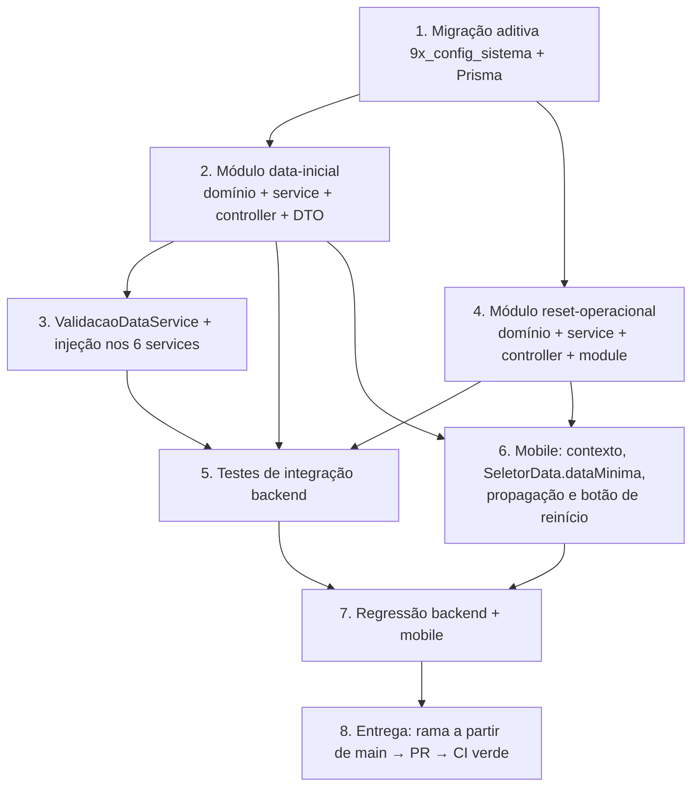

# Implementation Plan — Reinício Operacional + Data Inicial do Sistema

## Overview

Este plano converte o design em passos de código incrementais para o Check-out PRO (backend NestJS + Prisma/PostgreSQL e app móvel Expo). A ordem começa pela mudança de schema **aditiva** (`config_sistema`), constrói o `Modulo_DataInicial` (fonte de verdade da data mínima), depois a validação compartilhada nos endpoints de carga/edição, em seguida o `Modulo_ResetOperacional` (domínio puro → service transacional → controller), os testes de integração contra um Postgres de teste (nunca produção), o mobile (contexto global, seletor com data mínima e botão de reinício com confirmação) e, por fim, a regressão e a entrega (rama → PR → CI verde).

Cada tarefa referencia os requisitos que atende e, quando aplicável, a propriedade de correção do design. As sub-tarefas de teste estão marcadas com `*` (opcionais). O código puro é validado com `fast-check` (≥100 iterações); a execução real (transação/rollback/contagem) é coberta por testes de integração.

## Grafo de dependências das tarefas

## Tasks

- [ ] 1. Migração aditiva `9x_config_sistema` e modelo Prisma
  - Criar `backend/prisma/migrations/9x_config_sistema/migration.sql` **somente aditiva**: `CREATE TABLE "config_sistema"` (colunas `id` PK default `'sistema'`, `dataInicial` TIMESTAMP default `2026-07-01 00:00:00`, `atualizadoEm`, `atualizadoPor` nullable) + `INSERT ... ON CONFLICT ("id") DO NOTHING` para a linha singleton (padrão de `9k_apae_inteligente`)
  - Adicionar o modelo `ConfigSistema` (`@@map("config_sistema")`, id fixo `'sistema'`, `dataInicial` com default `2026-07-01`, `atualizadoEm @updatedAt`, `atualizadoPor String?`) em `backend/prisma/schema.prisma`
  - Rodar `npx prisma generate` para atualizar o client
  - Nenhuma migração destrutiva; nenhuma mudança de permissão (reutiliza `ADMIN_DADOS`)
  - _Requirements: 5.2, 8.3, 8.5_

- [ ] 2. Módulo `data-inicial` (backend)
  - [ ] 2.1 Implementar o domínio puro `data-inicial.domain.ts`
    - `inicioDoDiaUTC(d: Date): number` (normaliza para o início do dia em UTC)
    - `dataPermitida(data, dataInicial): boolean` = `inicioDoDiaUTC(data) >= inicioDoDiaUTC(dataInicial)` (fronteira: igual permitido, anterior rejeitado)
    - Sem dependência de Prisma/Nest
    - _Requirements: 6.1, 6.2, 8.1_

  - [ ]* 2.2 Escrever property test de `dataPermitida` (fast-check ≥100 iterações)
    - **Feature: reset-operacional-data-inicial, Property 1: Fronteira exata de `dataPermitida`**
    - Gerar `dataInicial` e deslocamento inteiro assinado `k`; `data = dataInicial + k` dias; assertar `dataPermitida(data, dataInicial) === (k >= 0)`, incluindo `k=0` (permitido) e `k=-1` (rejeitado)
    - **Validates: Requirements 6.1, 6.2, 8.4**

  - [ ]* 2.3 Escrever unit tests de fronteira de `dataPermitida`
    - Exemplos concretos: véspera (rejeita), mesmo dia (aceita), dia seguinte (aceita)
    - _Requirements: 6.1, 6.2_

  - [ ] 2.4 Implementar `ErroDataAnteriorInicial` em `data-inicial.errors.ts`
    - `extends ErroDominio`, `statusHttp = 400`, mensagem em pt-BR contendo a data mínima em `dd/mm/aaaa`
    - _Requirements: 6.1, 6.4_

  - [ ]* 2.5 Escrever unit test de `ErroDataAnteriorInicial`
    - Verificar `statusHttp === 400` e que a mensagem contém a data mínima formatada
    - _Requirements: 6.4_

  - [ ] 2.6 Implementar `DataInicialService`
    - `obterData(): Promise<Date>` via `configSistema.upsert` (id `'sistema'`, create com default `2026-07-01`) — default quando não definido
    - `obter(): Promise<{ dataInicial: string }>` (ISO `yyyy-mm-dd` para o app)
    - `editar(dataISO, por?)`: `upsert` que persiste `dataInicial` e grava `atualizadoPor`
    - _Requirements: 5.1, 5.2, 5.3, 5.5_

  - [ ] 2.7 Implementar `EditarDataInicialDto` com `class-validator`
    - `@IsDateString` com mensagem pt-BR ("use AAAA-MM-DD")
    - _Requirements: 5.3, 8.1_

  - [ ] 2.8 Implementar `DataInicialController` (`@Controller('config/data-inicial')`)
    - `GET` autenticado que devolve `{ dataInicial }` (leitura para o app)
    - `PATCH` com `@Funcionalidade('ADMIN_DADOS')` + `PerfilGuard` que chama `editar` com `usuario.sub`
    - _Requirements: 5.3, 5.4, 5.5, 8.2_

  - [ ] 2.9 Implementar `DataInicialModule` que **exporta** `DataInicialService` e `ValidacaoDataService`
    - Registrar o módulo em `app.module.ts`
    - _Requirements: 8.1_

- [ ] 3. `ValidacaoDataService` compartilhado e injeção nos services reais
  - [ ] 3.1 Implementar `ValidacaoDataService` (exportado por `DataInicialModule`)
    - `exigirDataPermitida(data: Date)`: lê `DataInicialService.obterData()` e, se `!dataPermitida(...)`, lança `ErroDataAnteriorInicial(minima)`
    - _Requirements: 6.1, 6.2, 6.4, 8.1_

  - [ ] 3.2 Injetar validação em `ArrecadacaoService` (`importar` e `marcarSemMovimento`)
    - Chamar `exigirDataPermitida(data)` antes de persistir; importar `DataInicialModule` no módulo de arrecadação
    - _Requirements: 6.1, 6.2, 6.3_

  - [ ] 3.3 Injetar validação em `VendasService.importar`
    - `exigirDataPermitida(data)` antes de persistir
    - _Requirements: 6.1, 6.2, 6.3_

  - [ ] 3.4 Injetar validação em `OperadoresService.registrarAusencia`
    - `exigirDataPermitida(data)` antes de persistir
    - _Requirements: 6.1, 6.2, 6.3_

  - [ ] 3.5 Injetar validação em `IncidenciasService.registrar`
    - `exigirDataPermitida(dto.data)` antes de persistir
    - _Requirements: 6.1, 6.2, 6.3_

  - [ ] 3.6 Injetar validação em `FiscaisService.definirStatus` (ponto)
    - `exigirDataPermitida(data do ponto)` antes de persistir
    - _Requirements: 6.1, 6.2, 6.3_

  - [ ] 3.7 Injetar validação em `ChecklistService` (garantir/enviarImagem)
    - `exigirDataPermitida(dto.data)` antes de persistir
    - _Requirements: 6.1, 6.2, 6.3_

  - [ ]* 3.8 Escrever unit tests de que data anterior → `ErroDataAnteriorInicial` (400) em cada service
    - Mock de `DataInicialService.obterData` retornando `2026-07-01`; data anterior lança, data ≥ inicial procede
    - _Requirements: 6.1, 6.2, 6.3_

- [ ] 4. Módulo `reset-operacional` (backend)
  - [ ] 4.1 Implementar o domínio puro `reset-operacional.domain.ts`
    - `AcaoReset`, `PassoReset`, e `PLANO_REINICIO` (lista ordenada `Object.freeze`, ordem que respeita FKs: movimentos APAE → lotes; estoque → `ZERAR_SALDO_INSUMOS`; legado registros → importações; jornada/escala; vendas; arrecadação; notificações/assistente/fechamentos/checklists)
    - `ENTIDADES_CONSERVADAS` (pessoas, escalas de cadastro, `insumos/fardos/pedidos_recorrentes`, `config_*`, `metas_*`, `config_sistema`)
    - `entidadesApagadas(plano)`, `planoEhParticaoValida(plano, conservadas)`, `ordemRespeitaDependencias(plano, dependencias)` e `DEPENDENCIAS_FK`
    - Sem dependência de Prisma/Nest
    - _Requirements: 2.1, 2.2, 2.3, 2.4, 2.5, 2.6, 2.7, 3.1, 3.2, 3.3, 3.4, 3.5_

  - [ ]* 4.2 Escrever property test da partição do plano (fast-check ≥100 iterações)
    - **Feature: reset-operacional-data-inicial, Property 2: A partição apagar/conservar é disjunta e cobre o esperado**
    - Assertar interseção vazia entre `entidadesApagadas` e `ENTIDADES_CONSERVADAS`; conjunto apagado = exatamente as 18 entidades de movimento; conservadas nunca aparecem
    - **Validates: Requirements 2.1, 2.2, 2.3, 2.4, 2.5, 2.6, 2.7, 3.1, 3.2, 3.3, 3.4, 3.5, 8.4**

  - [ ]* 4.3 Escrever unit test de `ordemRespeitaDependencias(PLANO_REINICIO, DEPENDENCIAS_FK)`
    - Assertar `true` (ordem filho < pai para `movimentos_lote_apae → lotes_apae` e `registros_operacionais → registros_importacao`)
    - _Requirements: 2.4, 2.7_

  - [ ] 4.4 Implementar `ConfirmacaoAusenteError` em `reset-operacional.errors.ts`
    - `extends ErroDominio`, `statusHttp = 400`, mensagem pt-BR pedindo `confirmacao: "ZERAR"`
    - _Requirements: 1.4_

  - [ ]* 4.5 Escrever unit tests de `ConfirmacaoAusenteError` e do `ResetOperacionalDto`
    - `statusHttp === 400`; DTO com `@IsIn(['ZERAR'])` rejeita valor ausente/inválido
    - _Requirements: 1.4_

  - [ ] 4.6 Implementar `ResetOperacionalDto` e o modelo puro de execução (reduce sobre o plano)
    - DTO: `@IsIn(['ZERAR'])` para `confirmacao`
    - Modelo puro de contagens: dado um mapa `entidade→count`, aplicar o plano zera as apagadas e acumula `ResumoDeReinicio` (base para testar Properties 3 e 4 sem banco)
    - _Requirements: 1.4, 4.4_

  - [ ]* 4.7 Escrever property test de idempotência conceptual (fast-check ≥100 iterações)
    - **Feature: reset-operacional-data-inicial, Property 3: Idempotência conceptual do plano de reinício**
    - Aplicar o plano ao modelo de contagens duas vezes: estado final igual (movimento em 0) e o segundo resumo com todas as contagens = 0
    - **Validates: Requirements 4.3**

  - [ ]* 4.8 Escrever property test da cobertura do resumo (fast-check ≥100 iterações)
    - **Feature: reset-operacional-data-inicial, Property 4: O resumo cobre exatamente as entidades apagadas do plano**
    - Chaves do `ResumoDeReinicio` = `entidadesApagadas(PLANO_REINICIO)`; cada contagem = contagem inicial da entidade; nenhuma conservada aparece
    - **Validates: Requirements 4.4**

  - [ ] 4.9 Implementar `ResetOperacionalService`
    - Revalidar `confirmacao === 'ZERAR'` (senão `ConfirmacaoAusenteError`)
    - Executar dentro de `prisma.$transaction`: percorrer `PLANO_REINICIO`, `deleteMany({})` por entidade acumulando `count`, e `insumo.updateMany({ data: { saldo: 0 } })` no passo `ZERAR_SALDO_INSUMOS`; devolver `ResumoDeReinicio`
    - Mapear nome-de-entidade → delegate Prisma; rollback automático em erro
    - _Requirements: 2.1, 2.2, 2.3, 2.4, 2.5, 2.6, 2.7, 3.3, 3.5, 4.1, 4.2, 4.4_

  - [ ] 4.10 Implementar `ResetOperacionalController` (`@Controller('admin/reset-operacional')`)
    - `POST` com `@HttpCode(200)`, `@Funcionalidade('ADMIN_DADOS')` + `PerfilGuard`, body `ResetOperacionalDto`
    - _Requirements: 1.1, 1.2, 1.3, 1.4, 8.2_

  - [ ] 4.11 Implementar `ResetOperacionalModule` e registrar em `app.module.ts`
    - _Requirements: 8.1, 8.5_

- [ ] 5. Testes de integração backend (Postgres de teste — NUNCA produção)
  - [ ]* 5.1 Teste: reinício apaga movimento e conserva cadastro
    - Seed em todas as tabelas → `reiniciar({confirmacao:'ZERAR'})` → tabelas de movimento com `count=0`, `insumos.saldo=0`, e pessoas/escalas de cadastro/`insumos`/`fardos`/`pedidos_recorrentes`/`config_*`/`metas_*`/`config_sistema` intactos
    - _Requirements: 2.1, 2.2, 2.3, 2.4, 2.5, 2.6, 2.7, 3.1, 3.2, 3.3, 3.4, 3.5_

  - [ ]* 5.2 Teste: transacionalidade / rollback
    - Forçar erro no meio da transação → estado idêntico ao anterior à operação
    - _Requirements: 4.1, 4.2_

  - [ ]* 5.3 Teste: idempotência real
    - Rodar o reinício duas vezes → segundo `Resumo_de_Reinicio` com todas as contagens = 0
    - _Requirements: 4.3_

  - [ ]* 5.4 Teste: autorização e confirmação
    - `POST /admin/reset-operacional` e `PATCH /config/data-inicial` sem `ADMIN_DADOS` → 403; confirmação ausente → 400
    - _Requirements: 1.3, 1.4, 5.4_

  - [ ]* 5.5 Teste: validação de data por endpoint
    - Para arrecadação (upload/sem-movimento), vendas (upload), operadores (ausências), incidências, checklist e ponto: data anterior → 400 (`ErroDataAnteriorInicial`); data válida → procede
    - _Requirements: 6.1, 6.2, 6.3_

  - [ ]* 5.6 Teste: leitura/edição da data inicial
    - Sem registro → GET devolve `2026-07-01`; PATCH persiste e grava `atualizadoPor`
    - _Requirements: 5.1, 5.3, 5.5_

- [ ] 6. Checkpoint — garantir que todos os testes de backend passam
  - Ensure all tests pass, ask the user if questions arise.

- [ ] 7. Mobile (Expo) — contexto, seletor e botão de reinício
  - [ ] 7.1 Implementar o serviço `mobile/src/api/services/configSistema.ts`
    - `obterDataInicial(): Promise<{ dataInicial: string }>` chamando `GET /config/data-inicial`
    - _Requirements: 7.2_

  - [ ] 7.2 Implementar `ConfigSistemaProvider` + `useConfigSistema` (`mobile/src/config/ConfigSistemaContext.tsx`)
    - Ao autenticar, buscar `obterDataInicial`; expor `dataInicial` (ISO); fallback `'2026-07-01'` enquanto carrega ou em erro; montar abaixo do `AuthProvider`
    - _Requirements: 7.2_

  - [ ] 7.3 Estender `SeletorData` com `dataMinima?: string`
    - Bloquear o botão "dia anterior" e a navegação abaixo de `dataMinima` (`valor <= dataMinima`), espelhando `permitirFuturo`
    - _Requirements: 7.1_

  - [ ] 7.4 Propagar `dataMinima={dataInicial}` nas telas de carga/edição
    - Importações, Painel de Vendas, Operadores (ausência), Escala/Incidências e Checklist
    - _Requirements: 7.1, 7.2_

  - [ ] 7.5 Adicionar o botão "Zerar dados operacionais" no Centro de Controle
    - Visível apenas quando `podeAcessar('ADMIN_DADOS')`; diálogo de confirmação explícita (confirmar "ZERAR") antes de `POST /admin/reset-operacional`
    - _Requirements: 1.5_

  - [ ]* 7.6 Escrever teste de componente do `SeletorData`/botão de reinício
    - `SeletorData`: botão "dia anterior" inativo quando `valor <= dataMinima`; botão de reinício só renderiza com `ADMIN_DADOS` e exige confirmação
    - _Requirements: 1.5, 7.1_

- [ ] 8. Regressão — backend e mobile verdes
  - [ ] 8.1 Backend: `npm run lint`, `npm run test`, `npm run test:e2e`, `npm run build` (e migração aplicada em dev)
    - Corrigir qualquer falha até tudo verde
    - _Requirements: 8.1, 8.3, 8.4_

  - [ ] 8.2 Mobile: type-check / `npm run lint` / `npm test`
    - Corrigir qualquer falha até tudo verde
    - _Requirements: 7.1, 7.2_

- [ ] 9. Entrega — rama a partir de `main` → PR → CI verde (SEM executar o apagamento em produção)
  - Criar rama a partir de `main` (ex.: `feat/reset-operacional-data-inicial`) e publicar as mudanças
  - Abrir Pull Request para `main`; o CI (`.github/workflows/ci.yml`) roda lint + testes + build
  - **IMPORTANTE (Req 9):** NÃO executar o reinício/apagamento no banco de produção; apenas construir, testar e publicar. O apagamento em produção é acionado exclusivamente pelo gestor, pelo botão do app
  - _Requirements: 9.1, 9.2_

## Notes

- Sub-tarefas marcadas com `*` são de teste e podem ser puladas para um MVP mais rápido; as demais são obrigatórias.
- Cada tarefa referencia requisitos específicos para rastreabilidade; as tarefas de property test referenciam a propriedade de correção do design (Properties 1–4).
- Os property tests usam `fast-check` com ≥100 iterações; a execução real (transação/rollback/contagem) é validada por testes de integração contra um Postgres de teste — nunca produção.
- Os checkpoints garantem validação incremental antes de avançar.
