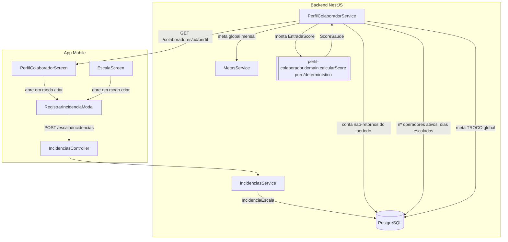
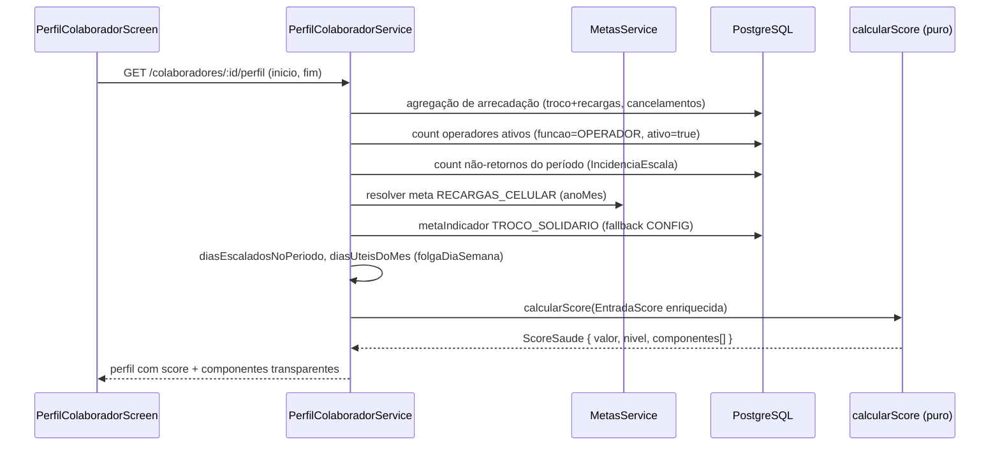

# Documento de Design — Score de Perfil Abrangente

## Overview

Esta feature reescreve o **Score de Saúde** do operador para que ele seja
**minucioso, proporcional e determinístico**, comparando o desempenho real do
operador contra uma **meta individual derivada** da meta global. Além disso,
expõe no app o **marcado manual de "não retorno do intervalo" para operadores**
a partir do perfil (o fluxo já existe na Escala), reaproveitando a tabela
genérica `IncidenciaEscala` — sem novas tabelas nem migrações (ADR 0007).

O coração da mudança é a função pura `calcularScore` em
`perfil-colaborador.domain.ts`. Ela passa a receber insumos mais ricos
(meta global mensal, número de operadores ativos, dias escalados no período e
contagem de não-retornos do período) e a produzir três componentes — Assiduidade,
Contribuição e Disciplina — combinados por média ponderada normalizada
(0–100, semáforo BOM/ATENCAO/CRITICO). O serviço `perfil-colaborador.service.ts`
passa a alimentar esses insumos a partir de dados já existentes no banco.

Princípios de design (herdados do módulo e reforçados por esta feature):

- **Pureza e determinismo**: toda a matemática do score vive em funções puras,
  sem IA, sem `Date.now()`, sem aleatoriedade → mesma entrada, mesma saída.
- **Justiça proporcional**: a meta de cada operador é derivada da meta global,
  do número de operadores ativos e dos dias em que ele foi escalado.
- **Monotonicidade**: melhorar um componente nunca reduz a nota final; piorar a
  disciplina (mais não-retornos) nunca aumenta a sub-nota de disciplina.
- **Robustez a dados faltantes**: meta indefinida ou zero dias escalados nunca
  causam divisão por zero — geram uma sub-nota **neutra determinística**.
- **Reuso sem novas tabelas**: metas via `MetaIndicador`/`MetaMensal`,
  não-retornos via `IncidenciaEscala`.

### Escopo e não-escopo

Em escopo:
- Novo modelo de pontuação (domínio puro + wiring no serviço).
- Exposição do marcado de não-retorno de operador no perfil (mobile).
- Transparência dos componentes (sub-notas + pesos) já retornados hoje.

Fora de escopo:
- Novas tabelas/migrations.
- Score de fiscais (segue focado em assiduidade, como hoje).
- Mudanças na auto-detecção de não-retorno pelo ponto (fiscais).

## Architecture



### Fluxo de cálculo do score (operador)



### Decisões arquiteturais

1. **Toda a matemática nova fica no domínio puro** (`calcularScore`). O serviço
   apenas *coleta insumos* e *delega*. Isso mantém o cálculo 100% testável por
   propriedades (fast-check) sem infraestrutura.
2. **Sem novas dependências de módulo pesadas**: o serviço já injeta
   `IncidenciasService`. Para metas, injeta-se `MetasService` (recargas mensais)
   e lê-se `MetaIndicador` direto via Prisma para TROCO (mesmo padrão de
   `ArrecadacaoService.metaDe`), evitando acoplar o `ArrecadacaoService` inteiro.
3. **Não-retorno do período**: hoje o perfil já traz um resumo de 6 meses via
   `IncidenciasService.resumoDoColaborador`. Para o score, precisa-se da
   contagem **dentro do período selecionado** `[inicio, fim]`. Adiciona-se um
   método pontual `contarNaoRetornos(colaboradorId, inicio, fim)` no
   `IncidenciasService` (uma query `count`), sem novas tabelas.
4. **Backend já suporta operadores**: `IncidenciasService.registrar` valida a
   existência do colaborador, resolve `funcionarioId` como `null` para quem não
   é fiscal, e o campo `IncidenciaEscala.funcionarioId` é `String?`. A permissão
   `OPERADORES_AUSENCIAS` já protege registrar/editar/remover. **Nenhuma mudança
   de backend é necessária para o Requisito 1** além do que já existe — a lacuna
   é apenas de UI (expor o botão "Registrar não retorno" no perfil do operador).

## Components and Interfaces

### 1. Domínio puro — `perfil-colaborador.domain.ts`

#### `EntradaScore` (evoluída)

A entrada de contribuição deixa de ser `{ valor, meta }` genérico e passa a
carregar os insumos da meta individual derivada; a disciplina passa a incluir a
contagem de não-retornos.

```typescript
export interface EntradaScore {
  /** Taxa de absenteísmo no período (0–100). */
  taxaFaltas: number;

  /**
   * Operador — Contribuição (indicadores "maior é melhor"):
   * aporte real (troco + recargas) e os insumos para derivar a meta individual
   * do período. `metaIndividualPeriodo` é calculada pelo serviço (ou pelo
   * helper puro `metaIndividualDerivada`) e pode ser `null` (indefinida).
   */
  contribuicao?: {
    /** Soma de TROCO_SOLIDARIO + RECARGAS_CELULAR do operador no período. */
    aporteReal: number;
    /** Meta individual do período (R$); null = indefinida → sub-nota neutra. */
    metaIndividualPeriodo: number | null;
  };

  /**
   * Operador — Disciplina (indicadores "menor é melhor"):
   * cancelamentos (itens + cupom) vs. linha de base da equipe + não-retornos.
   */
  disciplina?: {
    /** Soma de CANCELAMENTO_ITENS + CANCELAMENTO_CUPOM do operador. */
    cancelamentos: number;
    /** Linha de base justa: soma das médias da equipe dos dois cancelamentos. */
    linhaBaseCancelamentos: number;
    /** Contagem de Incidencia_Nao_Retorno do operador no período. */
    naoRetornos: number;
  };

  /** Fiscal: atividade (mantida como hoje, opcional). */
  atividade?: { valor: number; media: number };
}
```

> Compatibilidade: os campos antigos `contribuicao.meta`, `contribuicao.valor` e
> `cancelamentos` são substituídos. Como `calcularScore` é interno ao módulo e
> os testes acompanham a mudança, não há contrato externo quebrado (o formato de
> saída `ScoreSaude` permanece idêntico).

#### Novos helpers puros

```typescript
/**
 * Meta individual do período para um indicador "maior é melhor".
 *
 * Fórmula escolhida (period-level, dimensionalmente consistente):
 *   metaIndividualPeriodo =
 *     (metaGlobalMensal / nOperadoresAtivos) * (diasEscaladosPeriodo / diasUteisMes)
 *
 * Retorna `null` (indefinida) quando nOperadoresAtivos <= 0,
 * diasEscaladosPeriodo <= 0, diasUteisMes <= 0 ou metaGlobalMensal <= 0,
 * evitando divisão por zero.
 */
export function metaIndividualDerivada(p: {
  metaGlobalMensal: number;
  nOperadoresAtivos: number;
  diasEscaladosPeriodo: number;
  diasUteisMes: number;
}): number | null;

/** Sub-nota de Contribuição (0–100) proporcional a aporteReal / meta. */
export function notaContribuicao(
  aporteReal: number,
  metaIndividualPeriodo: number | null,
): number;

/** Sub-nota de Disciplina (0–100): base de cancelamentos menos penalidade de não-retorno. */
export function notaDisciplina(d: {
  cancelamentos: number;
  linhaBaseCancelamentos: number;
  naoRetornos: number;
}): number;

/** Sub-nota de Assiduidade (0–100) a partir da taxa de faltas. */
export function notaAssiduidade(taxaFaltas: number): number;
```

#### `calcularScore` (evoluída)

Combina os componentes presentes com pesos normalizados. Constantes de
calibração ficam nomeadas no topo do módulo:

```typescript
const NEUTRA = 50;               // sub-nota neutra determinística (dados ausentes)
const PESO_ASSIDUIDADE = 0.4;
const PESO_CONTRIBUICAO = 0.3;
const PESO_DISCIPLINA = 0.3;
const FATOR_CANCELAMENTO = 50;   // sensibilidade da penalização de cancelamentos
const PENAL_POR_NAO_RETORNO = 20; // pontos subtraídos por não-retorno
```

Lógica de cada componente:

- **Assiduidade** (Req 5): `clamp(100 - taxaFaltas * 3)`. Monótona decrescente na
  taxa de faltas.
- **Contribuição** (Req 3): se `metaIndividualPeriodo === null` → `NEUTRA` (Req 2.3);
  senão `clamp((aporteReal / metaIndividualPeriodo) * 100)`. Vale 100 quando
  `aporteReal >= metaIndividualPeriodo` (Req 3.3), é proporcional e monótona
  crescente no aporte (Req 3.1, 3.4), e limitada a [0,100] (Req 3.2).
- **Disciplina** (Req 4): parte da nota de cancelamentos
  `notaCancel = linhaBase > 0 ? clamp(100 - ((cancel - linhaBase) / linhaBase) * FATOR_CANCELAMENTO) : (cancel > 0 ? clamp(100 - FATOR_CANCELAMENTO) : 100)`
  e aplica a penalidade de não-retorno:
  `notaDisciplina = clamp(notaCancel - naoRetornos * PENAL_POR_NAO_RETORNO)`.
  Assim, mais não-retornos → sub-nota menor ou igual (Req 4.4); em/abaixo da base
  e sem não-retornos → 100 (Req 4.6); sempre em [0,100] (Req 4.5); um único
  componente de Disciplina (Req 4.7).
- **Nota final** (Req 6): `round(Σ(valor*peso) / Σ(peso presentes))`, semáforo
  `>=80 BOM`, `60–79 ATENCAO`, `<60 CRITICO`. Monótona não-decrescente em cada
  componente (Req 6.6).

### 2. Serviço — `perfil-colaborador.service.ts`

Alterações no método `perfil(...)` (trecho do operador):

```typescript
// anoMes de referência (mês de `fim`).
const anoMes = anoMesDe(fim);

// Metas globais mensais dos indicadores "maior é melhor".
const metaTroco = await this.resolverMetaGlobal('TROCO_SOLIDARIO', anoMes);
const metaRecargas = await this.metas.resolver('RECARGAS_CELULAR', anoMes);
const metaGlobalMensal = metaTroco + metaRecargas;

// Insumos de justiça.
const nOperadoresAtivos = await this.prisma.colaborador.count({
  where: { funcao: 'OPERADOR', ativo: true },
});
const diasEscaladosPeriodo = contarDiasEscalados(folga, inicioDia, fimEscala);
const diasUteisMes = contarDiasEscalados(folga, inicioDoMes(fim), fimDoMes(fim));

const metaIndividualPeriodo = metaIndividualDerivada({
  metaGlobalMensal,
  nOperadoresAtivos,
  diasEscaladosPeriodo,
  diasUteisMes,
});

// Não-retornos DENTRO do período (novo método do IncidenciasService).
const naoRetornos = await this.incidenciasService.contarNaoRetornos(
  id, inicioDia, fimExcl,
);

const score = calcularScore({
  taxaFaltas: faltas.taxa,
  contribuicao: {
    aporteReal:
      valorIndicador('TROCO_SOLIDARIO') + valorIndicador('RECARGAS_CELULAR'),
    metaIndividualPeriodo,
  },
  disciplina: {
    cancelamentos:
      valorIndicador('CANCELAMENTO_ITENS') + valorIndicador('CANCELAMENTO_CUPOM'),
    linhaBaseCancelamentos:
      mediaIndicador('CANCELAMENTO_ITENS') + mediaIndicador('CANCELAMENTO_CUPOM'),
    naoRetornos,
  },
});
```

Novos auxiliares no serviço:
- `resolverMetaGlobal(tipo, anoMes)`: para `RECARGAS_CELULAR` usa `MetasService`;
  para `TROCO_SOLIDARIO` lê `prisma.metaIndicador` com fallback a
  `CONFIG_ARRECADACAO[tipo].meta` (padrão 2000), espelhando `ArrecadacaoService.metaDe`.
- Reuso de `contarDiasEscalados` (extrair para helper puro compartilhado no
  domínio de perfil ou reusar o de `operadores.domain`).

### 3. `IncidenciasService` — contagem por período

```typescript
/** Conta não-retornos de um colaborador em [inicio, fim). */
async contarNaoRetornos(
  colaboradorId: string,
  inicio: Date,
  fimExcl: Date,
): Promise<number> {
  return this.prisma.incidenciaEscala.count({
    where: {
      colaboradorId,
      tipo: 'NAO_RETORNO_INTERVALO',
      data: { gte: inicioDoDia(inicio), lt: fimExcl },
    },
  });
}
```

### 4. Mobile — expor o marcado de não-retorno no perfil do operador

Estado atual:
- `EscalaScreen` **já** oferece "Registrar não retorno" por colaborador
  (inclui operadores, pois usa `item.colaboradorId`) e abre o
  `RegistrarIncidenciaModal` em modo criar. **Nenhuma mudança necessária aqui.**
- `PerfilColaboradorScreen` só permite **editar** um não-retorno já existente
  (a partir da linha do tempo). Falta o botão de **criar**.

Mudança (Req 1.6): adicionar no `HistoricoIncidencias` do
`PerfilColaboradorScreen`, quando `podeEditar` (permissão `OPERADORES_AUSENCIAS`),
um botão "Registrar não retorno" que abre o `RegistrarIncidenciaModal` em modo
criar com `colaboradorId` e `valoresIniciais = { data: hojeISO(), origem: 'MANUAL' }`.
O modal e o `escalaService.registrarIncidencia` já existem e são reutilizados
sem alteração.

## Data Models

**Nenhuma tabela nova. Nenhuma migração.** Todos os dados vêm de modelos
existentes:

| Dado | Origem | Observação |
|------|--------|------------|
| Aporte real (troco + recargas) | `RegistroArrecadacao` (agregado por operador) | Já calculado no perfil (`valorIndicador`) |
| Cancelamentos (itens + cupom) e médias da equipe | `RegistroArrecadacao` | Já calculado (`valorIndicador`/`mediaIndicador`) |
| Meta global de `RECARGAS_CELULAR` | `MetaMensal` (via `MetasService`, fallback `CONFIG_METAS`) | Meta mensal por `anoMes` |
| Meta global de `TROCO_SOLIDARIO` | `MetaIndicador` (global, fallback `CONFIG_ARRECADACAO`) | Não é gerido por mês |
| Nº de operadores ativos | `Colaborador` (`funcao=OPERADOR`, `ativo=true`) | `count` |
| Dias escalados (período e mês) | `Colaborador.folgaDiaSemana` | Contagem determinística por dia-da-semana |
| Não-retornos do período | `IncidenciaEscala` (`tipo=NAO_RETORNO_INTERVALO`) | `count` em `[inicio, fim)` |
| Taxa de faltas | `Ausencia` (via `analisarFaltas`) | Como hoje |

Modelo de saída (inalterado no formato — Req 7):

```typescript
interface ComponenteScore { chave: string; rotulo: string; valor: number; peso: number; }
interface ScoreSaude { valor: number; nivel: 'BOM'|'ATENCAO'|'CRITICO'; componentes: ComponenteScore[]; }
```

### Fórmula da meta individual derivada — justificativa

Foi escolhida a variante **por período** (dimensionalmente consistente):

```
metaIndividualPeriodo = (metaGlobalMensal / nOperadoresAtivos)
                        * (diasEscaladosNoPeriodo / diasUteisDoMes)
```

Onde `diasUteisDoMes` são os dias do mês de referência cujo dia-da-semana difere
do `folgaDiaSemana` do operador (mesma contagem de `diasEscaladosNoPeriodo`,
porém sobre o mês inteiro).

Justificativa:
1. `metaGlobalMensal / nOperadoresAtivos` é a **cota mensal equitativa** por
   operador (divisão pelo nº de operadores ativos — Req 2.1).
2. `(diasEscaladosNoPeriodo / diasUteisDoMes)` é a **fração da carga mensal do
   operador** que cai dentro do período avaliado. Escala a cota mensal para o
   período, mantendo a comparação consistente (aporte do período vs. meta do
   período) e **proporcional aos Dias_Escalados** (Req 2.5).
3. Quando o período é o mês inteiro, o fator = 1 e a meta = cota mensal cheia
   (reduz-se de forma limpa).
4. É **estritamente positiva** quando `metaGlobalMensal`, `nOperadoresAtivos` e
   `diasEscaladosNoPeriodo` são todos > 0 (Req 2.2), e **indefinida (neutra)**
   quando `nOperadoresAtivos = 0` ou `diasEscalados = 0` (Req 2.3).

Relação com a leitura literal da Req 2.1 (taxa diária): a meta **diária** justa é
`metaGlobalMensal / (nOperadoresAtivos * diasUteisDoMes)`, ou seja, "meta global
÷ nº de operadores ÷ dias". A fórmula do período é essa taxa diária multiplicada
pelos `diasEscaladosNoPeriodo` — honrando a intenção da Req 2.1 (derivação por
operador e por dia) e agregando sobre os dias escalados para a comparação. A
variante alternativa `metaGlobal / nOperadores / diasDoMes * diasEscalados`
(usando dias corridos do mês) é equivalente a menos da escolha do denominador;
optou-se por `diasUteisDoMes` (dias escalados no mês) por ser mais justa para
operadores com folgas diferentes.

### Refinamentos inteligentes propostos (para revisão do usuário)

1. **Poucos dias escalados / meta indefinida** → sub-nota de Contribuição
   **neutra determinística** (`NEUTRA = 50`), nunca divisão por zero (Req 2.3).
2. **Topes/clamps para outliers** → Contribuição limitada a 100 mesmo quando o
   aporte supera muito a meta; Disciplina nunca abaixo de 0 por excesso de
   não-retornos. Evita que um único indicador domine a nota.
3. **Confiabilidade com poucos dados** (opcional): quando `diasEscaladosPeriodo`
   for muito baixo (ex.: `< 3`), tratar a Contribuição como neutra (baixa
   confiança) em vez de proporcional, para não premiar/punir com base em
   amostra ínfima. Fica como decisão configurável; por padrão **desligado**
   (só o caso `diasEscalados = 0` é neutralizado, conforme Req 2.3).


## Correctness Properties

*Uma propriedade é uma característica ou comportamento que deve ser verdadeiro em
todas as execuções válidas do sistema — uma afirmação formal sobre o que o
sistema deve fazer. As propriedades são a ponte entre a especificação legível por
humanos e as garantias de correção verificáveis por máquina.*

Todas as propriedades abaixo se aplicam às funções **puras e determinísticas** do
domínio (`metaIndividualDerivada`, `notaContribuicao`, `notaDisciplina`,
`notaAssiduidade`, `contarDiasEscalados`, `calcularScore`), exercitáveis por
fast-check com ≥100 iterações.

### Property 1: Derivação da meta individual

*Para todos* `metaGlobalMensal > 0`, `nOperadoresAtivos > 0`,
`diasEscaladosPeriodo > 0` e `diasUteisMes > 0`, `metaIndividualDerivada`
retorna exatamente `(metaGlobalMensal / nOperadoresAtivos) * (diasEscaladosPeriodo / diasUteisMes)`,
que é um número finito **estritamente positivo**.

**Validates: Requirements 2.1, 2.2**

### Property 2: Meta indefinida evita divisão por zero (sub-nota neutra)

*Para todos* os insumos em que `nOperadoresAtivos <= 0`, `diasEscaladosPeriodo <= 0`,
`diasUteisMes <= 0` ou `metaGlobalMensal <= 0`, `metaIndividualDerivada` retorna
`null` e `notaContribuicao(aporteReal, null)` retorna o valor neutro
determinístico (finito, em [0,100]), nunca `NaN`/`Infinity`.

**Validates: Requirements 2.3**

### Property 3: Contagem de dias escalados

*Para todo* intervalo `[inicio, fim]` e todo `folgaDiaSemana` em `0..6`,
`contarDiasEscalados` retorna exatamente a quantidade de dias do intervalo cujo
dia-da-semana (UTC) difere de `folgaDiaSemana` (conferível por contagem direta
dia a dia).

**Validates: Requirements 2.5**

### Property 4: Correção da sub-nota de Contribuição

*Para todo* `aporteReal >= 0` e `metaIndividualPeriodo > 0`, `notaContribuicao`
é igual a `clamp((aporteReal / metaIndividualPeriodo) * 100, 0, 100)`; em
particular está sempre em [0,100] e vale exatamente 100 sempre que
`aporteReal >= metaIndividualPeriodo`.

**Validates: Requirements 3.1, 3.2, 3.3**

### Property 5: Monotonicidade da Contribuição no aporte

*Para todos* `aporteReal1 <= aporteReal2` e `metaIndividualPeriodo > 0`,
`notaContribuicao(aporteReal1, meta) <= notaContribuicao(aporteReal2, meta)`.

**Validates: Requirements 3.4**

### Property 6: Correção da sub-nota de Disciplina

*Para todos* `cancelamentos >= 0`, `linhaBaseCancelamentos >= 0` e
`naoRetornos >= 0`, `notaDisciplina` está sempre em [0,100], é proporcional ao
desvio dos cancelamentos em relação à linha de base, e vale exatamente 100
quando `cancelamentos <= linhaBaseCancelamentos` **e** `naoRetornos = 0`.

**Validates: Requirements 4.1, 4.5, 4.6**

### Property 7: Disciplina decresce com não-retornos

*Para todos* `naoRetornos1 <= naoRetornos2`, mantendo `cancelamentos` e
`linhaBaseCancelamentos` fixos, `notaDisciplina(..., naoRetornos2) <= notaDisciplina(..., naoRetornos1)`.
(O efeito do não-retorno é, portanto, visível no valor do componente.)

**Validates: Requirements 4.3, 4.4, 7.2**

### Property 8: Correção e monotonicidade da Assiduidade

*Para toda* `taxaFaltas >= 0`, `notaAssiduidade` está em [0,100]; e para todas
`taxaFaltas1 <= taxaFaltas2`, `notaAssiduidade(taxaFaltas2) <= notaAssiduidade(taxaFaltas1)`.

**Validates: Requirements 5.1, 5.2, 5.3**

### Property 9: Nota final é combinação convexa em [0,100]

*Para toda* `EntradaScore` válida, `score.valor` está em [0,100] e é igual ao
arredondamento da média ponderada das sub-notas dos componentes presentes com
pesos normalizados (soma dos pesos aplicados = 1) — ou seja, uma combinação
convexa das sub-notas, limitada pelos valores mínimo e máximo dos componentes.

**Validates: Requirements 6.1, 6.2**

### Property 10: Partição do semáforo

*Para toda* `EntradaScore` válida, o `nivel` é `BOM` se `valor >= 80`, `ATENCAO`
se `60 <= valor < 80` e `CRITICO` se `valor < 60` — uma partição total e
exclusiva do intervalo.

**Validates: Requirements 6.3, 6.4, 6.5**

### Property 11: Monotonicidade global da nota

*Para toda* `EntradaScore` e *qualquer* componente cuja sub-nota aumente
(mantidos os demais), o `score.valor` resultante é maior ou igual ao anterior.

**Validates: Requirements 6.6**

### Property 12: Componentes bem-formados e presentes conforme os dados

*Para toda* `EntradaScore`, cada `ComponenteScore` retornado tem `chave` e
`rotulo` não-vazios, `valor` em [0,100] e `peso > 0`; o componente de
Assiduidade está sempre presente, e os componentes de Contribuição e Disciplina
estão presentes se e somente se seus respectivos insumos foram fornecidos.

**Validates: Requirements 7.1, 7.3**

### Property 13: Determinismo

*Para toda* `EntradaScore`, duas chamadas consecutivas de `calcularScore`
produzem resultados profundamente iguais (valor, nível e componentes).

**Validates: Requirements 8.1**

## Error Handling

| Cenário | Tratamento | Requisito |
|---------|-----------|-----------|
| `nOperadoresAtivos = 0` ou `diasEscalados = 0` | `metaIndividualDerivada` → `null`; Contribuição usa sub-nota neutra (50) | 2.3 |
| `metaGlobalMensal = 0` (sem meta configurada) | Meta indefinida → sub-nota neutra (não pune o operador por falta de meta) | 2.3 |
| `linhaBaseCancelamentos = 0` (equipe sem cancelamentos) | Se o operador também não cancelou → 100; se cancelou → penalização fixa limitada | 4.1, 4.6 |
| Tabela `MetaMensal`/`MetaIndicador` ainda não migrada | `try/catch` com fallback a `CONFIG_METAS`/`CONFIG_ARRECADACAO` (padrão do código atual) | 2.4 |
| Registrar não-retorno para colaborador inexistente | `ColaboradorIncidenciaInvalidoError` (400) — já implementado | 1.5 |
| Registrar duplicado (colaborador+tipo+data) | `IncidenciaDuplicadaError` (409) via unique constraint — já implementado | 1.4 |
| Registrar/editar/remover sem permissão | `OPERADORES_AUSENCIAS` via `PerfilGuard` — já implementado | 1.7 |
| Valores numéricos com `NaN`/`Infinity` acidentais | `clamp` e checagens de finitude garantem saída sempre em [0,100] | 3.2, 4.5, 6.2 |

Todas as sub-notas passam por `clamp(_, 0, 100)`, garantindo que nenhuma entrada
degenerada produza um score fora de faixa ou não-numérico.

## Testing Strategy

### Abordagem dupla

- **Testes de propriedade (fast-check, ≥100 iterações)**: validam as 13
  propriedades universais das funções puras do domínio (`perfil-colaborador.domain.ts`).
- **Testes de exemplo/unidade**: casos concretos e de borda (contribuição neutra
  por meta indefinida, disciplina 100 sem cancelamentos/não-retornos, semáforo
  nos limiares 60/80).
- **Testes de integração/exemplo (serviço)**: wiring dos insumos
  (`resolverMetaGlobal`, `contarNaoRetornos`, `nOperadoresAtivos`, dias
  escalados) e o registro/remoção de não-retorno de operador.
- **Testes de componente (mobile, jest + @testing-library/react-native)**:
  o `PerfilColaboradorScreen` exibe o botão "Registrar não retorno" com
  permissão e abre o `RegistrarIncidenciaModal` em modo criar.

### Configuração dos testes de propriedade

- Biblioteca: **fast-check** (já presente em `backend/devDependencies`).
- Mínimo de **100 iterações** por propriedade (`fc.assert(fc.property(...), { numRuns: 100 })`).
- Arquivo: `backend/src/colaboradores/perfil-colaborador.properties.spec.ts`
  (seguindo o padrão `*.properties.spec.ts` já usado no repositório).
- Cada teste anotado com um comentário referenciando a propriedade do design:
  - Tag: **Feature: score-perfil-abrangente, Property {número}: {texto}**
- Cada propriedade de correção é implementada por **um único** teste de propriedade.

### Comandos reais

Backend (`checkout-pro/backend`):
```bash
npm test                                   # toda a suíte (jest)
npm test -- perfil-colaborador             # apenas os specs do perfil
npm run lint                               # eslint
npm run build                              # prisma generate + nest build
```

Mobile (`checkout-pro/mobile`):
```bash
npm test                                   # jest (jest-expo)
npm test -- PerfilColaboradorScreen        # apenas a tela do perfil
npm run type-check                         # tsc --noEmit
npm run lint
```

### Cobertura por propriedade (rastreabilidade)

| Propriedade | Função sob teste | Requisitos |
|-------------|------------------|------------|
| P1 | `metaIndividualDerivada` | 2.1, 2.2 |
| P2 | `metaIndividualDerivada` + `notaContribuicao` | 2.3 |
| P3 | `contarDiasEscalados` | 2.5 |
| P4 | `notaContribuicao` | 3.1, 3.2, 3.3 |
| P5 | `notaContribuicao` | 3.4 |
| P6 | `notaDisciplina` | 4.1, 4.5, 4.6 |
| P7 | `notaDisciplina` | 4.3, 4.4, 7.2 |
| P8 | `notaAssiduidade` | 5.1, 5.2, 5.3 |
| P9 | `calcularScore` | 6.1, 6.2 |
| P10 | `calcularScore` | 6.3, 6.4, 6.5 |
| P11 | `calcularScore` | 6.6 |
| P12 | `calcularScore` | 7.1, 7.3 |
| P13 | `calcularScore` | 8.1 |

Critérios cobertos por exemplo/integração/smoke (não-PBT): 1.1–1.8 (persistência,
UI e permissão de incidências), 2.4 e 4.2 (wiring do aporte/cancelamentos), 4.7
(estrutura de um único componente de disciplina) e 8.2 (ausência de IA/aleatoriedade,
por revisão de código + determinismo P13).

## Fluxo de entrega

1. Criar uma rama a partir de `main` (ex.: `feat/score-perfil-abrangente`).
2. Implementar domínio → serviço → mobile, com os testes de propriedade e de
   exemplo/componente.
3. Rodar localmente: backend `npm test && npm run lint && npm run build`; mobile
   `npm test && npm run type-check && npm run lint`.
4. Abrir **PR** para `main` com descrição das mudanças e do modelo de pontuação.
5. Garantir **CI verde** (workflow `.github/workflows/ci.yml`) antes do merge.
