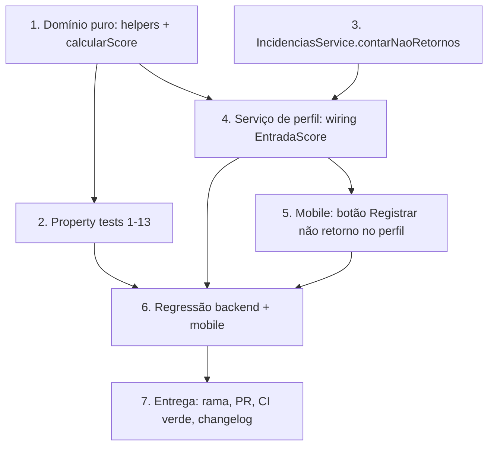

# Plano de Implementação — Score de Perfil Abrangente

## Overview

A implementação segue de dentro para fora: primeiro o **domínio puro**
(`perfil-colaborador.domain.ts`) com seus helpers e a nova `calcularScore`,
validado por **testes de propriedade** (fast-check, ≥100 iterações); depois a
**contagem por período** no `IncidenciasService`; em seguida o **wiring no
serviço de perfil** que alimenta os insumos e monta a `EntradaScore`; e por fim
a **exposição no app mobile** do botão "Registrar não retorno" no perfil do
operador. Cada passo se apoia no anterior e termina integrado, sem código órfão.

Não há tabelas novas nem migrações (ADR 0007): metas via
`MetaIndicador`/`MetaMensal`, não-retornos via `IncidenciaEscala`.

## Grafo de dependências das tarefas

Ordem crítica: **1 → 2** (domínio antes das propriedades), **1 + 3 → 4** (serviço
depende do domínio e da contagem), **4 → 5** (mobile depois do serviço),
**tudo → 6 → 7** (regressão e entrega ao final).

## Tasks

- [ ] 1. Evoluir o domínio puro do score (`backend/src/colaboradores/perfil-colaborador.domain.ts`)
  - [ ] 1.1 Definir constantes de calibração nomeadas e evoluir `EntradaScore`
    - Declarar no topo do módulo: `NEUTRA = 50`, `PESO_ASSIDUIDADE = 0.4`, `PESO_CONTRIBUICAO = 0.3`, `PESO_DISCIPLINA = 0.3`, `FATOR_CANCELAMENTO = 50`, `PENAL_POR_NAO_RETORNO = 20`
    - Reescrever `EntradaScore`: `contribuicao?: { aporteReal; metaIndividualPeriodo: number | null }` e `disciplina?: { cancelamentos; linhaBaseCancelamentos; naoRetornos }`, mantendo `taxaFaltas` e `atividade?` de fiscal
    - _Requirements: 3.1, 4.2, 4.3, 7.1_

  - [ ] 1.2 Implementar helper puro `metaIndividualDerivada`
    - Fórmula: `(metaGlobalMensal / nOperadoresAtivos) * (diasEscaladosPeriodo / diasUteisMes)`
    - Retornar `null` quando qualquer insumo (`metaGlobalMensal`, `nOperadoresAtivos`, `diasEscaladosPeriodo`, `diasUteisMes`) for `<= 0`, evitando divisão por zero
    - _Requirements: 2.1, 2.2, 2.3, 2.4_

  - [ ] 1.3 Implementar helper puro `contarDiasEscalados`
    - Contar dias de `[inicio, fim]` cujo dia-da-semana (UTC) difere de `folgaDiaSemana` (0..6), determinístico
    - Extrair como helper puro compartilhado no domínio de perfil (ou reusar o de `operadores.domain`)
    - _Requirements: 2.5_

  - [ ] 1.4 Implementar helper puro `notaContribuicao`
    - Se `metaIndividualPeriodo === null` → `NEUTRA`; senão `clamp((aporteReal / metaIndividualPeriodo) * 100, 0, 100)`
    - Vale 100 quando `aporteReal >= metaIndividualPeriodo`; proporcional e monótona crescente no aporte
    - _Requirements: 2.3, 3.1, 3.2, 3.3, 3.4_

  - [ ] 1.5 Implementar helper puro `notaDisciplina`
    - Base de cancelamentos: `linhaBase > 0 ? clamp(100 - ((cancel - linhaBase) / linhaBase) * FATOR_CANCELAMENTO) : (cancel > 0 ? clamp(100 - FATOR_CANCELAMENTO) : 100)`
    - Aplicar penalidade: `clamp(notaCancel - naoRetornos * PENAL_POR_NAO_RETORNO, 0, 100)`
    - Um único componente de Disciplina (não criar componente separado)
    - _Requirements: 4.1, 4.3, 4.4, 4.5, 4.6, 4.7, 7.2_

  - [ ] 1.6 Implementar helper puro `notaAssiduidade`
    - `clamp(100 - taxaFaltas * 3, 0, 100)`, monótona decrescente na taxa de faltas
    - _Requirements: 5.1, 5.2, 5.3_

  - [ ] 1.7 Reescrever `calcularScore` com pesos normalizados e semáforo
    - Montar os componentes presentes (Assiduidade sempre; Contribuição e Disciplina quando os insumos existirem) com chave, rótulo, valor (0–100) e peso
    - Nota final: `round(Σ(valor*peso) / Σ(peso presentes))`, com soma dos pesos aplicados = 1 (normalização)
    - Semáforo: `>=80 BOM`, `60–79 ATENCAO`, `<60 CRITICO`; determinístico (sem IA, sem `Date.now()`, sem aleatoriedade)
    - _Requirements: 6.1, 6.2, 6.3, 6.4, 6.5, 6.6, 7.1, 7.3, 8.1, 8.2_

- [ ] 2. Testes de propriedade do domínio (`backend/src/colaboradores/perfil-colaborador.properties.spec.ts`)
  - [ ]* 2.1 Property 1 — Derivação da meta individual
    - **Property 1: Derivação da meta individual** — fast-check ≥100 runs
    - `// Feature: score-perfil-abrangente, Property 1`
    - **Validates: Requirements 2.1, 2.2**

  - [ ]* 2.2 Property 2 — Meta indefinida evita divisão por zero (sub-nota neutra)
    - **Property 2** (`metaIndividualDerivada` + `notaContribuicao`), ≥100 runs
    - `// Feature: score-perfil-abrangente, Property 2`
    - **Validates: Requirements 2.3**

  - [ ]* 2.3 Property 3 — Contagem de dias escalados
    - **Property 3** (`contarDiasEscalados`), ≥100 runs
    - `// Feature: score-perfil-abrangente, Property 3`
    - **Validates: Requirements 2.5**

  - [ ]* 2.4 Property 4 — Correção da sub-nota de Contribuição
    - **Property 4** (`notaContribuicao`), ≥100 runs
    - `// Feature: score-perfil-abrangente, Property 4`
    - **Validates: Requirements 3.1, 3.2, 3.3**

  - [ ]* 2.5 Property 5 — Monotonicidade da Contribuição no aporte
    - **Property 5** (`notaContribuicao`), ≥100 runs
    - `// Feature: score-perfil-abrangente, Property 5`
    - **Validates: Requirements 3.4**

  - [ ]* 2.6 Property 6 — Correção da sub-nota de Disciplina
    - **Property 6** (`notaDisciplina`), ≥100 runs
    - `// Feature: score-perfil-abrangente, Property 6`
    - **Validates: Requirements 4.1, 4.5, 4.6**

  - [ ]* 2.7 Property 7 — Disciplina decresce com não-retornos
    - **Property 7** (`notaDisciplina`), ≥100 runs
    - `// Feature: score-perfil-abrangente, Property 7`
    - **Validates: Requirements 4.3, 4.4, 7.2**

  - [ ]* 2.8 Property 8 — Correção e monotonicidade da Assiduidade
    - **Property 8** (`notaAssiduidade`), ≥100 runs
    - `// Feature: score-perfil-abrangente, Property 8`
    - **Validates: Requirements 5.1, 5.2, 5.3**

  - [ ]* 2.9 Property 9 — Nota final é combinação convexa em [0,100]
    - **Property 9** (`calcularScore`), ≥100 runs
    - `// Feature: score-perfil-abrangente, Property 9`
    - **Validates: Requirements 6.1, 6.2**

  - [ ]* 2.10 Property 10 — Partição do semáforo
    - **Property 10** (`calcularScore`), ≥100 runs
    - `// Feature: score-perfil-abrangente, Property 10`
    - **Validates: Requirements 6.3, 6.4, 6.5**

  - [ ]* 2.11 Property 11 — Monotonicidade global da nota
    - **Property 11** (`calcularScore`), ≥100 runs
    - `// Feature: score-perfil-abrangente, Property 11`
    - **Validates: Requirements 6.6**

  - [ ]* 2.12 Property 12 — Componentes bem-formados e presentes conforme os dados
    - **Property 12** (`calcularScore`), ≥100 runs
    - `// Feature: score-perfil-abrangente, Property 12`
    - **Validates: Requirements 7.1, 7.3**

  - [ ]* 2.13 Property 13 — Determinismo
    - **Property 13** (`calcularScore`), ≥100 runs
    - `// Feature: score-perfil-abrangente, Property 13`
    - **Validates: Requirements 8.1**

  - [ ]* 2.14 Testes de exemplo/borda do domínio
    - Contribuição neutra por meta indefinida; Disciplina = 100 sem cancelamentos/não-retornos; semáforo nos limiares 60 e 80
    - _Requirements: 2.3, 4.6, 6.3, 6.4, 6.5_

- [ ] 3. Checkpoint — Garantir que domínio e propriedades passam
  - Ensure all tests pass, ask the user if questions arise.

- [ ] 4. Adicionar `contarNaoRetornos` ao `IncidenciasService` (`backend/src/incidencias/incidencias.service.ts`)
  - [ ] 4.1 Implementar `contarNaoRetornos(colaboradorId, inicio, fimExcl)`
    - Query `prisma.incidenciaEscala.count` com `tipo = 'NAO_RETORNO_INTERVALO'` e `data: { gte: inicioDoDia(inicio), lt: fimExcl }`; sem tabelas novas
    - _Requirements: 4.3_

  - [ ]* 4.2 Teste unitário de `contarNaoRetornos`
    - Verificar a contagem dentro de `[inicio, fim)` com Prisma mockado (limites do intervalo e filtro por tipo)
    - _Requirements: 4.3_

- [ ] 5. Wiring dos insumos no serviço de perfil (`backend/src/colaboradores/perfil-colaborador.service.ts`)
  - [ ] 5.1 Implementar auxiliar `resolverMetaGlobal(tipo, anoMes)`
    - `RECARGAS_CELULAR` via `MetasService`; `TROCO_SOLIDARIO` via `prisma.metaIndicador` com fallback a `CONFIG_ARRECADACAO[tipo].meta`; `try/catch` para tabela não migrada
    - _Requirements: 2.4_

  - [ ] 5.2 Coletar os insumos de justiça e não-retornos do período
    - `nOperadoresAtivos` (`count` de `funcao=OPERADOR, ativo=true`); `diasEscaladosPeriodo` e `diasUteisMes` via `contarDiasEscalados` com `folgaDiaSemana`; `naoRetornos` via `incidenciasService.contarNaoRetornos`
    - `metaGlobalMensal = metaTroco + metaRecargas`; `metaIndividualPeriodo = metaIndividualDerivada(...)`
    - _Requirements: 2.1, 2.5, 4.3_

  - [ ] 5.3 Montar a nova `EntradaScore` e delegar a `calcularScore`
    - `contribuicao.aporteReal = TROCO_SOLIDARIO + RECARGAS_CELULAR`; `disciplina.cancelamentos = CANCELAMENTO_ITENS + CANCELAMENTO_CUPOM`; `linhaBaseCancelamentos` = soma das médias da equipe; `naoRetornos` do período
    - Garantir que o perfil retorna os componentes transparentes (sub-notas + pesos)
    - _Requirements: 3.1, 4.1, 4.2, 4.3, 6.1, 7.1, 7.3_

  - [ ]* 5.4 Testes de integração/exemplo do wiring
    - Verificar `resolverMetaGlobal` com e sem meta configurada (fallback); `EntradaScore` montada com os insumos corretos usando dependências mockadas (`MetasService`, `IncidenciasService`, Prisma)
    - _Requirements: 2.4, 4.2, 4.7_

- [ ] 6. Checkpoint — Garantir backend íntegro (domínio + serviço + incidências)
  - Ensure all tests pass, ask the user if questions arise.

- [ ] 7. Expor "Registrar não retorno" no perfil do operador (`mobile/src/screens/colaboradores/PerfilColaboradorScreen.tsx`)
  - [ ] 7.1 Adicionar botão "Registrar não retorno" em modo criar
    - No `HistoricoIncidencias`, quando `podeEditar` (permissão `OPERADORES_AUSENCIAS`), exibir o botão que abre `RegistrarIncidenciaModal` em modo criar com `colaboradorId` e `valoresIniciais = { data: hojeISO(), origem: 'MANUAL' }`
    - Reutilizar `RegistrarIncidenciaModal` e `escalaService.registrarIncidencia` (sem alterá-los); confirmar que `EscalaScreen` já expõe o fluxo
    - _Requirements: 1.6_

  - [ ]* 7.2 Teste de componente da tela de perfil
    - Verificar que o botão aparece só com permissão e que abre o modal em modo criar (jest + @testing-library/react-native)
    - _Requirements: 1.6, 1.7_

- [ ] 8. Regressão completa
  - [ ] 8.1 Backend verde
    - Executar `npm run build`, `npm run lint` e `npm test` em `checkout-pro/backend`; corrigir o que aparecer
    - _Requirements: 8.1, 8.2_

  - [ ] 8.2 Mobile verde
    - Executar `npm run type-check`, `npm run lint` e `npm test` em `checkout-pro/mobile`; corrigir o que aparecer
    - _Requirements: 1.6_

- [ ] 9. Entrega
  - [ ] 9.1 Documentar no changelog
    - Registrar a mudança do modelo de pontuação e a exposição do não-retorno no perfil em `REGISTRO_DE_MUDANCAS.md`
    - _Requirements: 7.1, 7.2_

  - [ ] 9.2 Rama, PR e CI
    - Criar rama a partir de `main` (`feat/score-perfil-abrangente`), abrir **PR** contra `main` (nunca push direto) e garantir **CI verde** (`.github/workflows/ci.yml`)
    - _Requirements: 8.1, 8.2_

## Notes

- Tarefas marcadas com `*` são opcionais (testes) e podem ser adiadas num MVP; as tarefas de implementação central nunca são opcionais.
- Cada tarefa referencia requisitos específicos para rastreabilidade; as sub-tarefas de teste de propriedade referenciam a propriedade correspondente do design.
- Os checkpoints garantem validação incremental antes de avançar.
- Nenhuma tabela nova nem migração: metas via `MetaIndicador`/`MetaMensal`, não-retornos via `IncidenciaEscala`.
