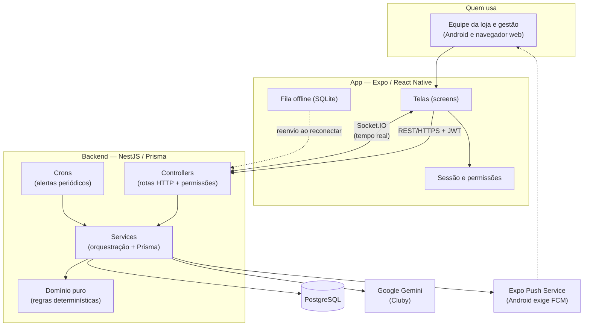
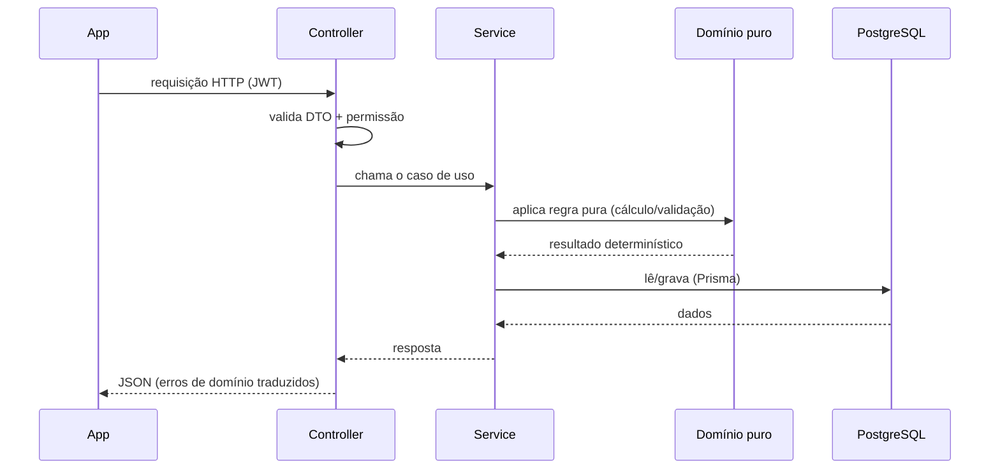

> **Estado:** ✅ Em dia · **Responsável:** Engenharia · **Última verificação:** 2026-07-19 · **Cobre:** como App, Backend e Banco se conectam + índice "quero fazer X → veja Y"

# Mapa do projeto

Este documento mostra, de forma visual, **como as peças do Check-out PRO se
conectam** e oferece um índice prático do tipo "**quero fazer X → veja o
documento Y**", para você chegar rápido à parte certa da documentação.

Para os termos usados aqui, consulte o [Glossário](glossario.md).

---

## As três peças e como conversam

O projeto é um **monorepo** (um único repositório) com três peças principais:

- **App (mobile/web)** — o que a equipe usa: telas em Expo/React Native, que
  também rodam no navegador.
- **Backend (API)** — o cérebro: NestJS + Prisma, com as regras de negócio e a
  segurança.
- **Banco de dados** — PostgreSQL, onde tudo fica guardado.

Além disso, o backend fala com **serviços externos**: o banco, a IA (Google
Gemini) e o serviço de push (Expo Push Service, que no Android depende do FCM).

### Como ler o diagrama

1. A equipe usa o **App**, no Android ou no navegador.
2. O App conversa com o **Backend** por **REST sobre HTTPS**, autenticando com
   **JWT**. Avisos em tempo real usam **Socket.IO**. Sem conexão, as batidas de
   ponto ficam numa **fila offline** e são reenviadas ao reconectar.
3. No Backend, cada rota passa por um **controller** (contrato HTTP + permissão),
   chama um **service** (orquestração e acesso a dados) que, quando há uma regra
   de negócio, delega ao **domínio puro** (funções determinísticas e testáveis).
4. Os **crons** rodam tarefas periódicas (por exemplo, avaliar risco de TAC a
   cada minuto).
5. O Backend guarda tudo no **PostgreSQL** e integra a **IA (Gemini)** e o
   **push** (que chega ao celular do usuário).

Detalhes de arquitetura estão na [Visão de arquitetura](../02-arquitetura/visao-geral.md);
o mapa técnico rápido, no steering [`arquitetura.md`](../../.kiro/steering/arquitetura.md).

---

## Fluxo do padrão backend (por dentro de uma requisição)

---

## Índice: "quero fazer X → veja Y"

| Quero… | Veja |
|---|---|
| Entender o produto em linguagem de negócio | [Resumo executivo](resumo-executivo.md) |
| Saber o que significa um termo | [Glossário](glossario.md) |
| Subir o projeto do zero (primeiros 30 min) | [Onboarding](onboarding.md) |
| Rodar o projeto na minha máquina | [Instalação local](../07-operacao/instalacao-local.md) |
| Entender a arquitetura geral | [Visão de arquitetura](../02-arquitetura/visao-geral.md) |
| Ver por que decidimos algo (padrões) | [Decisões de arquitetura (ADR)](../02-arquitetura/decisoes/) |
| Entender um **módulo do backend** por dentro | [Atlas do backend](../03-atlas-backend/) |
| Entender uma **tela do app** por dentro | [Atlas do mobile](../04-atlas-mobile/) |
| Saber quem pode fazer o quê | [Perfis e permissões](../01-produto/perfis-e-permissoes.md) |
| Consultar as regras de negócio | [Regras de negócio](../01-produto/regras-de-negocio/) |
| Ver todas as rotas da API | [API HTTP](../05-referencia-dados/api-http.md) |
| Ver as tabelas e campos do banco | [Modelo de dados](../05-referencia-dados/modelo-de-dados.md) · [Dicionário de dados](../05-referencia-dados/dicionario-de-dados.md) |
| Entender como testamos | [Estratégia de testes](../06-qualidade/estrategia-de-testes.md) |
| Ver a lista de testes automáticos | [Catálogo de testes](../06-qualidade/catalogo-de-testes.md) |
| Fazer QA manual | [Guia de QA manual](../06-qualidade/guia-qa-manual.md) |
| Publicar/operar em produção | [Checklist de produção](../07-operacao/checklist-producao.md) |
| Ver os números do projeto | [Estado e métricas](../08-gestao/estado-e-metricas.md) |
| Saber prioridades e pendências | [Roadmap e pendências](../08-gestao/roadmap-e-pendencias.md) |
| Ver o que mudou e quando | [Histórico de mudanças](../08-gestao/historico-de-mudancas.md) |

### Onde ficam as peças no repositório

| Peça | Pasta |
|---|---|
| App (mobile/web) | `mobile/` |
| Backend (API) | `backend/` |
| Esquema e migrações do banco | `backend/prisma/` |
| Documentação | `docs/` |
| Handoff técnico e estado operacional | `.kiro/steering/` |
