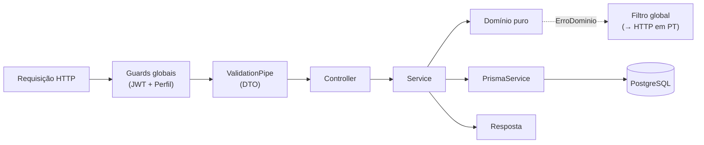

> **Estado:** ✅ Em dia · **Responsável:** Engenharia · **Última verificação:** 2026-07-19 · **Cobre:** arquitetura — backend (NestJS)

# Backend (NestJS)

Como o backend do Check-out PRO está organizado por dentro: a anatomia de um
módulo, a injeção de dependência, o acesso ao banco, a infraestrutura
compartilhada (`common`), os agendamentos (cron) e o WebSocket. Para o mapa de
alto nível, veja a [Visão de arquitetura](visao-geral.md). Para o detalhe fino de
cada módulo, consulte o [Atlas do backend](../03-atlas-backend/).

## 1. Anatomia de um módulo
Cada domínio é um **módulo NestJS** com um conjunto de arquivos padronizado. O
modelo canônico está em [`_modelo-modulo.md`](../03-atlas-backend/_modelo-modulo.md).
Um módulo típico (ex.: `acessos`, `ponto`, `arrecadacao`) tem:

| Arquivo | Papel |
|---|---|
| `*.controller.ts` | **Camada HTTP:** define rotas, valida a entrada (DTO), declara a permissão exigida (`@Funcionalidade`) e chama o service. Sem regra de negócio. |
| `*.service.ts` | **Orquestra o caso de uso** e concentra os efeitos colaterais (Prisma, bcrypt, JWT, push, transações). Delega a decisão pura ao domínio. |
| `*.domain.ts` | **Regras puras, sem I/O** — determinísticas e testáveis (ver [ADR 0003](decisoes/0003-dominio-puro-e-property-based-testing.md)). |
| `*.errors.ts` | **Erros de domínio** que estendem `ErroDominio`, cada um com seu `statusHttp`. |
| `dto/*.dto.ts` | **Contrato de entrada** validado por `class-validator`/`class-transformer`. |
| `*.module.ts` | **Ligações (DI):** declara providers, importa dependências e exporta o que outros módulos consomem. |
| `*.spec.ts` | Testes (domínio puro, serviço e controller). |

Nem todo módulo tem todos os arquivos: módulos só de leitura/agregação podem não
ter `*.domain.ts` próprio (ex.: [`central-jornada`](../03-atlas-backend/central-jornada.md)
e [`ciclo-folha`](../03-atlas-backend/ciclo-folha.md) reaproveitam funções puras
de `common/datas` e de [`ponto`](../03-atlas-backend/ponto.md)).

### Separação de responsabilidades
O fluxo de uma requisição atravessa as camadas nesta ordem:

## 2. Injeção de dependência (DI)
O Nest resolve as dependências pelo **construtor**. O service recebe o
`PrismaService`, o `JwtService`, outros serviços de domínio e utilitários
injetáveis (ex.: o **relógio** `RELOGIO`, que torna o "agora" testável). Cada
`*.module.ts`:

- **Declara** seus `providers` (services do módulo).
- **Importa** os módulos de que depende (quando não são globais).
- **Exporta** os serviços que outros módulos consomem (ex.: `fechamento` exporta
  `FechamentoService`, chamado por `arrecadacao` e `vendas`).

Dependências **opcionais** (`@Optional()`) são usadas para desacoplar fluxos que
podem não estar presentes em todo contexto (ex.: `NotificacoesService` e
`ValidacaoDataService` em vários módulos), mantendo o serviço utilizável em teste
sem montar o grafo inteiro.

## 3. `PrismaService` global
O acesso ao PostgreSQL é centralizado no
[`PrismaService`](../03-atlas-backend/prisma.md), que estende o `PrismaClient` e
integra-se ao ciclo de vida do Nest (`onModuleInit`/`onModuleDestroy`). Pontos
de arquitetura:

- **`@Global`:** o `PrismaModule` é global — qualquer service injeta o
  `PrismaService` sem reimportar o módulo.
- **Ponto único de acesso:** nenhum módulo fala com o banco por outro caminho.
- **Boot resiliente:** se o banco não estiver disponível no start, a aplicação
  não cai; a conexão é retomada na primeira consulta (conveniente em dev, a
  vigiar em produção).
- **Transações** ficam no service quando há invariante a proteger (ex.: `ponto`
  grava batida em transação `SERIALIZABLE` com retry em conflito; `arrecadacao`
  e `vendas` "substituem o dia" dentro de uma transação).

O esquema do banco vive em `backend/prisma/schema.prisma` (fora de `src`), e o
detalhe campo a campo está no
[Dicionário de dados](../05-referencia-dados/dicionario-de-dados.md).

## 4. Infraestrutura compartilhada (`common`)
O módulo [`common`](../03-atlas-backend/common.md) é a base transversal, provida
globalmente pelo `SegurancaModule` (`@Global`). Ele não expõe rotas — fornece:

### 4.1 Guards, decorators e filtro
- **Guards globais** (`APP_GUARD`): `JwtAuthGuard` (autentica e anexa
  `request.usuario`, checando revogação por `tokenVersion`) e `PerfilGuard`
  (autoriza por funcionalidade, semântica OR). Aplicados a **todas** as rotas.
- **Decorators:** `@Publico()` (dispensa autenticação), `@Funcionalidade(...)`
  (permissão exigida) e `@UsuarioAtual()` (injeta a identidade autenticada).
- **Filtro global** (`APP_FILTER` = `DominioExceptionFilter`): repassa
  `HttpException` do Nest, traduz `ErroDominio` pelo `statusHttp` declarado e
  mapeia erros desconhecidos para 500 **sem vazar detalhes**.

O detalhe de segurança está em [Segurança](seguranca.md).

### 4.2 Datas, números e justificativas (funções puras)
- **`datas.ts`:** início/fim de dia, semana e mês em UTC; **ciclo de folha 26→25**
  (`periodoFolha`, `periodoFolhaDeslocado`); e conversões de **Brasília** (UTC−3)
  explícitas (`diaCivilBrasilia`, `agoraNaBrasilia`, `fimDoDiaBrasiliaEmUtc`).
  Fonte única — antes duplicadas em vários domínios.
- **`numeros.ts`:** `arredondar` (2 casas) e `parseValor` (aceita "1.234,56" e
  "1234.56").
- **`justificativas.ts`:** peso das ocorrências por justificativa (ver
  [ADR 0009](decisoes/0009-justificativa-de-ocorrencias.md)).
- **`relogio.ts`:** relógio injetável (`RELOGIO`), para tornar o tempo testável.

### 4.3 Observabilidade e configuração
- **`CorrelationIdMiddleware`:** reaproveita ou gera `x-request-id` e o devolve
  no header (aplicado a `*` no `AppModule`).
- **`LoggingInterceptor`** (`APP_INTERCEPTOR`): uma linha por requisição
  (`MÉTODO URL STATUS DURAÇÃOms [correlationId]`); não loga corpos; não-lançante.
- **`config/jwt-secret.ts`:** resolve o segredo JWT (obrigatório em produção).
- **`cors.ts`** e **`upload-options.ts`:** origens de CORS e limites de upload
  (texto e imagem).

## 5. Bootstrap da aplicação (`main.ts`)
No arranque, além de montar o `AppModule`, o backend:

- Aplica **helmet** (cabeçalhos de segurança HTTP), com `crossOriginResourcePolicy`
  em `cross-origin` para que o app web (em outro domínio) carregue as imagens
  estáticas.
- Habilita **CORS** por allowlist (`CORS_ORIGINS`); sem a variável (dev), reflete
  a origem. Autenticação é por `Bearer` (sem cookies), então **credentials** fica
  desligado.
- Registra o **`ValidationPipe` global** (`whitelist`, `forbidNonWhitelisted`,
  `transform`): DTOs são a fronteira de entrada.
- Serve **estáticos**: `/assets` (imagens dos procedimentos guiados, versionadas)
  e o storage de uploads (fotos de checklist) sob o prefixo público configurado.
- Escuta em `0.0.0.0` na porta de `PORT` (compatível com provedores como Render).

## 6. Agendamentos (cron)
O `ScheduleModule` (registrado no `AppModule`) habilita tarefas periódicas com
`@Cron`/`@Interval`. Elas são **best-effort e defensivas** (uma pessoa/registro
que falha não derruba as demais). Exemplos reais:

| Tarefa | Cadência | O que faz |
|---|---|---|
| `IndicadoresResumoService.resumoDiario` | diária 08:00 (Brasília) | Panorama do dia anterior (semáforo, destaques, anomalias) aos gestores. Ver [`arrecadacao`](../03-atlas-backend/arrecadacao.md). |
| `PontoAlertasService.verificar` | a cada 1 min | Recalcula jornadas e dispara alertas de TAC. Ver [`ponto`](../03-atlas-backend/ponto.md). |
| `PontoDeteccaoAutomaticaService.verificar` | a cada 5 min | Falta automática (2h sem batida) e não-retorno do intervalo. |

O deslocamento de Brasília é **fixo (UTC−3)** — correto sem horário de verão (a
volta exigiria revisão). A dedup de avisos que precisa sobreviver a reinícios usa
**reserva atômica no banco** (ex.: `AlertaTacEnviado`), não estado em memória.

## 7. WebSocket (tempo real)
O backend expõe **gateways Socket.IO** para entrega em tempo real, além do REST:

- **`/notificacoes`** — o cliente conecta com o token JWT no handshake e entra na
  sala `usuario:<id>`, recebendo cada aviso (evento `notificacao`). O
  desacoplamento serviço↔gateway é feito por um **barramento RxJS**
  (`NotificacaoEventos`), evitando dependência circular. Ver
  [`notificacoes`](../03-atlas-backend/notificacoes.md).
- **`/fiscais`** — painel de status dos fiscais em tempo real (evento
  `fiscal:status`), em broadcast (diferente da entrega por usuário das
  notificações).

Ambos validam o JWT no handshake; token inválido/ausente encerra a conexão. As
origens permitidas seguem `origensCorsDoAmbiente()`.

## 8. Dependências entre módulos (exemplos)
A separação de responsabilidades gera dependências claras (e testáveis):

- [`arrecadacao`](../03-atlas-backend/arrecadacao.md) e
  [`vendas`](../03-atlas-backend/vendas.md) chamam
  [`fechamento`](../03-atlas-backend/fechamento.md) após cada upload
  (`concluirSeCompletou`).
- [`ponto`](../03-atlas-backend/ponto.md) e
  [`central-jornada`](../03-atlas-backend/central-jornada.md) pedem
  `exigirCicloAberto` a [`ciclo-folha`](../03-atlas-backend/ciclo-folha.md) antes
  de alterar a jornada.
- Vários fluxos chamam [`notificacoes`](../03-atlas-backend/notificacoes.md) para
  avisar a equipe (sem decidir permissão — isso é reusado de
  [`acessos`](../03-atlas-backend/acessos.md)).

## 9. Onde aprofundar
- [Atlas do backend](../03-atlas-backend/) — um documento por módulo (função a
  função, estado a estado, teste a teste).
- [`common`](../03-atlas-backend/common.md) e
  [`prisma`](../03-atlas-backend/prisma.md) — a infraestrutura descrita aqui.
- [Segurança](seguranca.md) · [Fluxo de dados](fluxo-de-dados.md).
