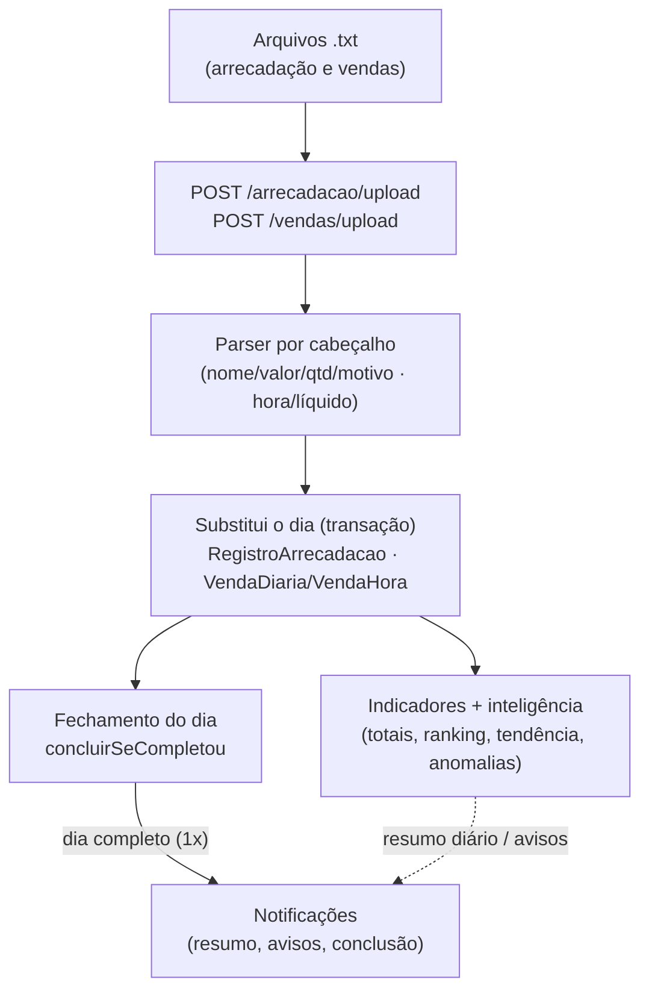
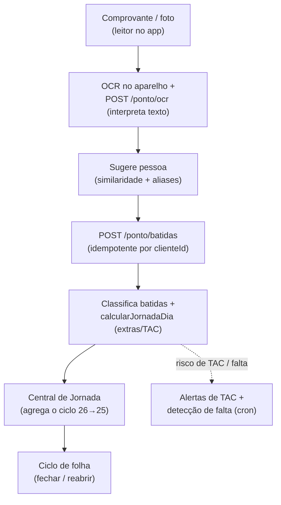

> **Estado:** ✅ Em dia · **Responsável:** Engenharia · **Última verificação:** 2026-07-19 · **Cobre:** arquitetura — fluxo de dados

# Fluxo de dados

Esta página descreve, ponta a ponta, os dois fluxos que dão a espinha dorsal do
Check-out PRO: a **importação dos arquivos do dia** (arrecadação e vendas) e o
**registro de ponto** (do comprovante à apuração do ciclo de folha). Para o
detalhe de cada módulo, siga os links para o [Atlas do backend](../03-atlas-backend/).

---

## 1. Importação dos arquivos do dia
Todo dia, os relatórios exportados do sistema de frente de caixa chegam como
arquivos **`.txt`** (a decisão de usar TXT no lugar de CSV/XLSX está na
[ADR 0006](decisoes/0006-fluxo-txt-substitui-csv-xlsx.md)). São dois grupos:

- **Arrecadação por operador** — os 5 indicadores: troco solidário, recargas de
  celular, cancelamento de itens, cancelamento de cupom e devoluções.
- **Vendas por hora** — o faturamento do dia distribuído por hora.

### 1.1 Diagrama

### 1.2 Passo a passo
1. **Upload.** O importador envia o `.txt` (`POST /arrecadacao/upload` ou
   `POST /vendas/upload`, permissão `IMPORTACOES`). O upload de texto tem limite
   conservador (proteção de memória — ver [Segurança](seguranca.md)).
2. **Parser.** Cada módulo localiza as colunas **pelo cabeçalho** e interpreta
   valores com vírgula decimal: `arrecadacao.parser.ts` extrai nome/valor/qtd/
   autorizador/motivo (e "matrícula - nome" nas devoluções); `vendas.parser.ts`
   pega a hora e o valor líquido, ignorando a linha de total. Ver
   [`arrecadacao`](../03-atlas-backend/arrecadacao.md) e
   [`vendas`](../03-atlas-backend/vendas.md).
3. **Persistência (substitui o dia).** Numa transação, o serviço **apaga os
   lançamentos daquele tipo/dia e recria** com os do arquivo — reenviar corrige.
   A arrecadação grava `RegistroArrecadacao` (e desfaz a marca "sem movimento"
   quando há movimento real); as vendas gravam `VendaHora` e fazem upsert do
   total em `VendaDiaria`. Datas anteriores à **Data Inicial do Sistema** são
   rejeitadas.
4. **Indicadores e inteligência.** Sobre os dados do dia, calculam-se totais
   (dia/semana/mês), ranking por operador (só cadastrados), percentuais sobre
   vendas (os indicadores base `VENDAS` leem `VendaDiaria`) e as análises
   inteligentes: tendência, comparativos, projeção, destaques do mês, anomalias
   e painel "Precisa de atenção".
5. **Fechamento do dia.** Após cada upload/marcação, o serviço chama
   `fechamento.concluirSeCompletou`. O dia está **completo** quando as 5
   arrecadações estão resolvidas (enviadas **ou** "sem movimento") e há vendas
   por hora. A conclusão é registrada com **trava atômica** (unicidade de `data`
   em `FechamentoConcluido`), garantindo aviso **único** mesmo sob uploads
   concorrentes. Ver [`fechamento`](../03-atlas-backend/fechamento.md).
6. **Notificações.** Na transição para "completo", os gestores (permissão
   `FECHAMENTO`) recebem o aviso — uma vez por dia. Em paralelo, a inteligência
   gera avisos best-effort (dia recorde, queda anômala, meta em risco) e o
   **resumo diário** automático (cron 08:00) com o panorama do dia anterior. A
   entrega é duplo canal (push + in-app, em tempo real por WebSocket) via
   [`notificacoes`](../03-atlas-backend/notificacoes.md).

> Os **avisos inteligentes são best-effort:** nunca quebram a importação. E o
> `resumo` do fechamento é somente leitura — não altera nada nem notifica.

---

## 2. Registro de ponto (comprovante → apuração do ciclo)
O ponto parte de uma **foto do comprovante** do relógio físico. O OCR roda **no
aparelho**; o backend recebe o texto, sugere de quem é, grava a batida, calcula a
jornada do dia e alimenta a apuração por ciclo de folha (26→25) até o fechamento.

### 2.1 Diagrama

### 2.2 Passo a passo
1. **Comprovante e OCR.** O leitor de ponto abre a câmera; o OCR é feito no
   aparelho e o texto vai para `POST /ponto/ocr`, que **interpreta** nome/data/
   hora de forma tolerante a erros de leitura e sugere os colaboradores mais
   parecidos (similaridade de nomes + memória de **aliases** confirmados). Ver
   [`ponto`](../03-atlas-backend/ponto.md).
2. **Batida.** O operador confirma a pessoa e `POST /ponto/batidas` grava a
   batida com a **hora do comprovante** (hora de parede de Brasília, nunca a de
   carregamento). A gravação é **idempotente por `clienteId`** — reenvios da
   [fila offline](mobile.md#6-fila-offline-sqlite) não duplicam — e ocorre em
   transação `SERIALIZABLE` com retry em conflito. Valida limite de 4 batidas/dia,
   anti-duplicidade (< 2 min), dia de folga e **ciclo aberto**.
3. **Jornada do dia.** As batidas são classificadas pela ordem
   (entrada → saída p/ intervalo → retorno → encerramento) e a função pura
   `calcularJornadaDia` computa tempo trabalhado, intervalo, horas extras
   50%/100%, status e **TAC** (o intervalo não conta como jornada). O status do
   fiscal é sincronizado.
4. **Central de Jornada.** [`central-jornada`](../03-atlas-backend/central-jornada.md)
   **agrega dia a dia** as batidas por pessoa no **ciclo de folha 26→25**:
   carga, extras, horas devidas, atestados, faltas, dias de TAC, conflitos,
   atrasos e o saldo (banco de horas), reaproveitando o `calcularJornadaDia` do
   ponto. É leitura/agregação sob demanda.
5. **Ciclo de folha.** [`ciclo-folha`](../03-atlas-backend/ciclo-folha.md) fecha
   o ciclo após a revisão (bloqueando modificações ordinárias via
   `exigirCicloAberto`) e permite reabrir com autorização de administrador. Como
   a apuração é sempre sob demanda, a reabertura já reflete nas próximas
   consultas (sem snapshot a invalidar).
6. **Avisos automáticos (cron).** Em paralelo, tarefas periódicas cuidam dos
   riscos: alertas de **TAC** (etapas 1h30 → 1h40 → TAC, avisadas uma única vez
   com dedup persistente) e a **detecção automática** de falta (2h sem batida) e
   não-retorno do intervalo. Bater ponto **remove a falta automática** do dia. Os
   avisos vão à supervisão/gerência via
   [`notificacoes`](../03-atlas-backend/notificacoes.md).

---

## 3. O que os dois fluxos têm em comum
- **Parser/OCR toleram imperfeição** e a lógica de decisão fica em **funções
  puras** testáveis (ver [ADR 0003](decisoes/0003-dominio-puro-e-property-based-testing.md)).
- **Datas com fuso explícito:** UTC como fonte única e Brasília (UTC−3) nas
  conversões de "dia" e "agora" (`common/datas`).
- **Idempotência e travas atômicas** garantem que reenvios/concorrência não
  dupliquem efeitos (batida por `clienteId`; conclusão do dia por unicidade).
- **Notificações são o destino comum** — duplo canal, best-effort no push, e
  respeitando a Central de Permissões (ver [Segurança](seguranca.md)).

## 4. Onde aprofundar
- Importação: [`arrecadacao`](../03-atlas-backend/arrecadacao.md) ·
  [`vendas`](../03-atlas-backend/vendas.md) ·
  [`fechamento`](../03-atlas-backend/fechamento.md).
- Ponto: [`ponto`](../03-atlas-backend/ponto.md) ·
  [`central-jornada`](../03-atlas-backend/central-jornada.md) ·
  [`ciclo-folha`](../03-atlas-backend/ciclo-folha.md).
- Entrega: [`notificacoes`](../03-atlas-backend/notificacoes.md).
