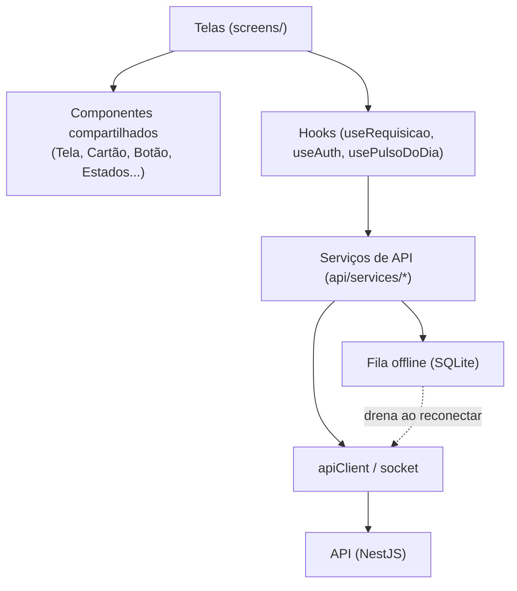
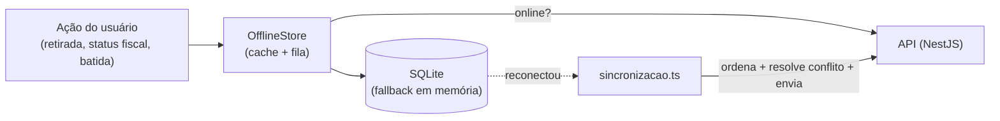

> **Estado:** ✅ Em dia · **Responsável:** Engenharia · **Última verificação:** 2026-07-19 · **Cobre:** arquitetura — mobile (Expo/React Native)

# Mobile (Expo / React Native)

Como o app do Check-out PRO está organizado: navegação, estado de sessão,
carregamento de dados, cliente de API, fila offline, push e tema. Para o mapa de
alto nível, veja a [Visão de arquitetura](visao-geral.md). O detalhe fino de cada
área está no [Atlas do mobile](../04-atlas-mobile/).

O app é **Expo / React Native + TypeScript**, roda como **APK** (loja) e como
**web**. Todo o texto exibido é em **português (pt-BR)**, e nenhuma cor literal
aparece nas telas — tudo vem do [tema](#7-tema).

## 1. Camadas do app
As telas concentram-se na experiência e delegam o resto à base transversal
(`hooks/`, `api/`, `auth/`, `offline/`, `theme/`, `components/`):

Ver [Componentes compartilhados](../04-atlas-mobile/componentes-compartilhados.md)
e [Hooks e utilidades](../04-atlas-mobile/hooks-e-utilidades.md).

## 2. Navegação
Usa `@react-navigation` combinando **pilha** (native-stack) e **abas**
(bottom-tabs). Detalhe em [Navegação](../04-atlas-mobile/navegacao.md).

- **`RootNavigator`** decide entre **login** e **app autenticado** conforme o
  `AuthContext`; monta o `NavigationContainer`, o tema, o `linking` (URLs na
  web) e os provedores de Notificações/Assistente.
- **`MainTabs`** — cinco posições na barra inferior: **Início**, **Tarefas**
  (selo de pendências do [`usePulsoDoDia`](#4-carregamento-de-dados-userequisicao)),
  **Ponto** (botão central elevado que abre direto o leitor), **Notificações**
  (selo de não lidas) e **Perfil**.
- **`AppNavigator`** — pilha das telas de módulo, empurradas por cima das abas.

### `podeAcessar` — navegação por perfil
A exibição de áreas é governada por `podeAcessar(funcionalidade)` (do
`AuthContext`), em **duas camadas de defesa**:

1. A **Home** percorre o catálogo `AREAS` e mostra apenas o que o perfil pode
   acessar (áreas `emBreve` ficam ocultas mesmo com permissão).
2. O **`AppNavigator`** só inclui a rota na pilha quando `podeAcessar(...)` é
   verdadeiro — um fiscal nem navega para telas restritas.

> A **autorização definitiva é sempre do backend**. Esse filtro no app é apenas
> UX/defesa extra; o espelho local de permissões pode divergir e por isso é uma
> dívida conhecida (ver [ADR 0002](decisoes/0002-permissoes-espelhadas.md)).

## 3. Estado de sessão (`AuthContext`)
O `AuthProvider` provê a sessão a todo o app via `useAuth`:
`{ carregando, usuario, perfil, autenticado, entrar, entrarComToken, sair, podeAcessar }`.

- **Restauração:** ao iniciar, lê o token do armazenamento seguro e busca a
  identidade (`acessosService.eu`); token inválido é limpo silenciosamente.
- **`entrar(login, senha)`** autentica, salva o token e carrega a identidade;
  `entrarComToken` cobre o **login por biometria** (Face ID / digital).
- **Expiração (401):** `registrarAoExpirarSessao` encerra a sessão automaticamente
  quando o `apiClient` recebe 401.
- **`podeAcessar`** usa as **permissões efetivas** enviadas pelo backend no
  login; se ausentes, cai no espelho local `auth/funcionalidades.ts`.

Ver [Hooks e utilidades §3.2](../04-atlas-mobile/hooks-e-utilidades.md#32-useauth--authcontext).

## 4. Carregamento de dados (`useRequisicao`)
Hook genérico para consumir os serviços de API. Expõe
`{ dados, carregando, atualizando, erro, recarregar, definir }`:

- `carregando` para a primeira carga; `atualizando` para o "pull-to-refresh".
- `erro` já vem como **mensagem pronta em pt-BR** (usa `ApiError.message`).
- `recarregar()` refaz a busca; `definir(...)` faz **atualização otimista** local.
- Refaz a busca quando as `dependencias` mudam.

Casa diretamente com o componente `Tela` (`aoAtualizar`/`atualizando`) e com o
trio `Carregando`/`MensagemErro`/`EstadoVazio`. O `usePulsoDoDia` complementa,
contando pendências por módulo (por regras, não IA) para ordenar a Home e o selo
de **Tarefas**.

## 5. Cliente de API
`api/client.ts` encapsula o `fetch` adicionando:

- **Base URL** de `EXPO_PUBLIC_API_URL` (padrão de dev `http://localhost:3000`).
- Cabeçalho **`Authorization: Bearer <token>`** lido do `tokenStorage`.
- Serialização JSON, upload `multipart/form-data` e **timeout** (60s, para
  tolerar cold start).
- Mapeamento de erros para **`ApiError`** (`status`, `corpo`, `naoAutorizado`),
  com `message` já na mensagem em pt-BR devolvida pela API.

O token é guardado pelo `tokenStorage` no `expo-secure-store` (Keychain/Keystore)
no nativo e no `AsyncStorage` na web, com interface assíncrona idêntica. Os
serviços por módulo (`api/services/*`) ficam sobre o `apiClient`, e
`api/socket.ts` abre as conexões WebSocket de notificações (`/notificacoes`) e do
painel de fiscais (`/fiscais`), enviando o token no handshake.

## 6. Fila offline (SQLite)
Subsistema em `offline/`, disponibilizado a todo o app pelo `OfflineProvider` e
acessado por `useOfflineContexto`. É o que mantém o app útil em rede instável na
loja.

Regras de arquitetura:

- **Cache de leitura + fila de ações** persistidos em SQLite, com **fallback em
  memória** quando o SQLite nativo não está disponível.
- `OfflineStore` é a fachada: `lerComCache` (tenta online, atualiza o cache, cai
  no cache em falha) e `enfileirar` de ações (`RETIRADA_FARDO`,
  `ALTERACAO_STATUS_FISCAL`, `REGISTRO_BATIDA`).
- **`fila.ts` é lógica pura:** ordena por criação e resolve conflito de status do
  fiscal por **última alteração vence** (last-write-wins).
- **`sincronizacao.ts`** drena a fila ao reconectar: resolve conflitos, envia em
  ordem, remove os enviados e **descarta batidas com rejeição definitiva** (4xx)
  para não travar a fila; falhas transitórias são preservadas.
- **Idempotência:** as batidas usam `clienteId` como chave — o reenvio da fila
  **não duplica** (o backend em [`ponto`](../03-atlas-backend/ponto.md) valida a
  idempotência).

Ver [Hooks e utilidades §7](../04-atlas-mobile/hooks-e-utilidades.md#7-fila-offline-e-sincronização).

## 7. Push
`push/push.ts` registra o token de push do Expo no backend após o login e
configura a exibição com o app aberto. Tudo é **best-effort**: em web/emulador,
sem permissão ou sem credencial, o app segue normal (o aviso ainda chega in-app
e por WebSocket). `removerPushRegistrado` limpa o token no logout. O par no
backend está em [`notificacoes`](../03-atlas-backend/notificacoes.md).

## 8. Tema
`theme/index.ts` centraliza `cores` (identidade SaaS azul + semânticas de
status), `gradientes`, `coresModulos`, `espacamento`, `raio`, `tipografia`
(fonte Inter) e `sombra`. `coresParaStatus(StatusCor)` mapeia a classificação do
backend (VERDE/AMARELO/VERMELHO) para cor + rótulo. **Convenção:** nenhuma cor
literal nas telas — sempre via tema.

## 9. Utilidades transversais
- **Formatação/datas pt-BR** (`utils/formato.ts`): moeda, número, percentual,
  data/hora, máscaras; "hoje"/dia da semana em **fuso fixo de Brasília (UTC−3)**.
- **Diálogos** (`utils/dialogos.ts`): `confirmar`/`notificar` baseados em Promise,
  exibidos pelo `DialogHost` único (nunca `Alert`/`window.confirm`).
- **Proteção de tela** (`utils/protecaoTela.ts`, `useProtecaoTela`): dificulta
  captura de tela (FLAG_SECURE no nativo; `@media print` + limpeza de clipboard
  na web) — ver também [Segurança](seguranca.md).
- **Impressão/relatório**, **rótulos de enums** e **notificações lidas** (estado
  só no cliente).

## 10. Onde aprofundar
- [Atlas do mobile](../04-atlas-mobile/) — um documento por área de tela.
- [Navegação](../04-atlas-mobile/navegacao.md) ·
  [Hooks e utilidades](../04-atlas-mobile/hooks-e-utilidades.md) ·
  [Componentes compartilhados](../04-atlas-mobile/componentes-compartilhados.md).
- [Segurança](seguranca.md) · [Fluxo de dados](fluxo-de-dados.md).
