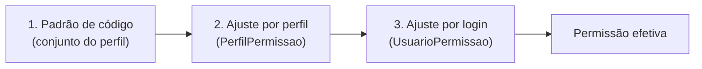

> **Estado:** ✅ Em dia · **Responsável:** Engenharia · **Última verificação:** 2026-07-19 · **Cobre:** arquitetura — segurança

# Segurança

Como o Check-out PRO protege o acesso: autenticação por JWT, revogação de
sessão, autorização por funcionalidade, a Central de Permissões em três camadas
e as demais proteções (bcrypt, segredo do JWT, CORS, rate limiting, limites de
upload e proteção de tela no app). As fontes de verdade são
[`acessos`](../03-atlas-backend/acessos.md),
[`common`](../03-atlas-backend/common.md) e
[`permissoes`](../03-atlas-backend/permissoes.md).

## 1. Autenticação (JWT)
- **Login individual e exclusivo.** Cada pessoa autentica só com o seu login e
  senha (`POST /acessos/login`, rota **pública**). O serviço compara a senha com
  o hash e assina um **JWT** com `sub`, `login`, `nome`, `perfil` e
  `tokenVersion`. Credenciais inválidas **não distinguem** login inexistente de
  senha errada (evita enumeração de usuários).
- **Sessão longa.** O token vale **30 dias** por padrão (`JWT_EXPIRES_IN`
  configurável) — o login é infrequente, o que também sustenta o rate limiting
  estrito (§7).
- **Transporte por `Bearer`.** O app envia `Authorization: Bearer <token>` em
  toda requisição; **não há cookies**, por isso o CORS não habilita
  `credentials`.
- **Guard global.** O `JwtAuthGuard` (registrado via `APP_GUARD`) exige token
  válido em **todas** as rotas, exceto as marcadas com `@Publico()`. Ele valida a
  assinatura, checa a revogação (§2) e anexa `request.usuario` já com as
  permissões efetivas. Ver [`common`](../03-atlas-backend/common.md).

## 2. Revogação de sessão (`tokenVersion`)
Cada `Usuario` tem um `tokenVersion`. O guard compara o valor do token com o do
banco: se **não coincidirem** (ou o usuário não existir mais), a sessão é
recusada com *"Sessão expirada"*. Assim, trocar senha ou ajustar permissões pode
**invalidar sessões existentes** ao **incrementar** o `tokenVersion` — as
pessoas afetadas precisam reentrar para as mudanças valerem. É como a Central de
Permissões força a aplicação imediata de um ajuste (§4).

## 3. Autorização por funcionalidade
- **Decorator + guard.** Os controllers declaram a permissão com
  `@Funcionalidade(...)`; o `PerfilGuard` lê o metadado e autoriza. Sem
  funcionalidade declarada, basta estar autenticado.
- **Semântica OR.** Com uma ou mais funcionalidades, o acesso é concedido se o
  usuário tiver **qualquer uma** delas — útil para endpoints compartilhados entre
  fluxos (ex.: o status do dia, visível na Importação **ou** no Fechamento). A
  decisão vale sobre as permissões **efetivas** do usuário
  (`exigirAlgumaAutorizacaoDoUsuario`).
- **Perfis.** `ADMINISTRADOR` enxerga tudo (inclusive funcionalidades novas, sem
  depender de lista); `GERENTE`, `SUPERVISOR`, `FISCAL` e `IMPORTADOR` (só
  `IMPORTACOES`) têm conjuntos definidos no domínio de
  [`acessos`](../03-atlas-backend/acessos.md), que é a **fonte única de verdade**.
- **Defesa em profundidade no app.** A navegação esconde o que o perfil não vê e
  nem inclui a rota na pilha (`podeAcessar`), mas a **autorização definitiva é
  sempre do backend** — o espelho local do app é apenas UX (ver
  [ADR 0002](decisoes/0002-permissoes-espelhadas.md) e [Mobile](mobile.md)).

## 4. Central de Permissões (três camadas)
A [Central de Permissões](../03-atlas-backend/permissoes.md) (uso exclusivo do
`ADMINISTRADOR`, funcionalidade `PERMISSOES_GERENCIAR`) ajusta as permissões como
**desvios** do padrão de código, num modelo de **três camadas** com precedência:

- **Precedência:** ajuste por **login** vence o ajuste por **perfil**, que vence
  o **padrão de código**. Só os **desvios** são persistidos (a base fica no
  código).
- **Protegidas e imutáveis.** Funcionalidades protegidas (exclusivas do admin)
  **nunca** são concedidas por ajuste, e o `ADMINISTRADOR` é imutável — isso
  barra escalada de privilégios.
- **Auditoria + invalidação.** Toda mudança é registrada na trilha e **invalida
  a sessão** dos afetados (bump de `tokenVersion`, §2). Alterar um **perfil**
  afeta todos os seus usuários (invalidação em massa — usar com consciência).
- **Alvos de notificação seguem as permissões.** Quem recebe um aviso é quem tem
  a funcionalidade relacionada (permissão efetiva das três camadas), via
  [`notificacoes`](../03-atlas-backend/notificacoes.md).

## 5. Senhas (bcrypt)
As senhas são guardadas apenas como **hash bcrypt** (10 rounds), centralizado em
`gerarHashSenha` de [`acessos`](../03-atlas-backend/acessos.md). A verificação no
login compara a senha em texto com o hash — a senha em claro nunca é persistida
nem logada (o interceptor de log não registra corpos).

## 6. Segredo do JWT
O segredo é resolvido por `resolverSegredoJwt`:
- **Em produção é obrigatório** (`JWT_SECRET`): se ausente, a API **falha rápido**
  no arranque (comportamento intencional — nunca um segredo fixo versionado).
- Em dev/teste, gera um segredo efêmero **memoizado** por processo (compartilhado
  entre os `JwtModule`), para não travar o ambiente local.

## 7. Rate limiting (anti-abuso)
Usa `@nestjs/throttler` como guard global:
- **Teto global alto** (2000 req/min por IP): a loja compartilha **um único IP
  público** (NAT), então um limite baixo geraria falsos 429 para o time inteiro.
- **Limite estrito no login** (`@Throttle`: **8 tentativas/min por IP**) contra
  força bruta. Como o login é raro (sessões de 30 dias), o limite baixo não
  atrapalha o uso legítimo.

## 8. CORS e cabeçalhos HTTP
No bootstrap (`main.ts`):
- **CORS por allowlist** (`CORS_ORIGINS`, separadas por vírgula); sem a variável
  (dev), a origem é refletida. Em produção, defina para restringir quem chama a
  API. No app nativo (APK) o CORS não se aplica. Ver `common/cors.ts`.
- **helmet** aplica cabeçalhos de segurança HTTP, com
  `crossOriginResourcePolicy: cross-origin` para o app web (em outro domínio)
  poder carregar as imagens estáticas.
- **`ValidationPipe` global** (`whitelist`, `forbidNonWhitelisted`, `transform`):
  os DTOs são a fronteira de entrada — campos desconhecidos são rejeitados.

## 9. Limites de upload
Os uploads têm limites conservadores em `common/upload-options.ts`, para evitar
exaustão de memória (o arquivo é carregado para processamento):
- **Texto** (`.txt` de arrecadação/vendas): **2 MiB**, 1 arquivo — os relatórios
  diários são pequenos.
- **Imagem** (fotos de checklist): **10 MiB**, 1 arquivo — fotos de celular podem
  ter alguns MB.

## 10. Proteção de tela no app
O app trata o conteúdo como **uso interno / confidencial**:
- **`useProtecaoTela`** dissuade/bloqueia captura de tela — `FLAG_SECURE` no
  nativo; `@media print` + limpeza de clipboard na web. Ver
  [Hooks e utilidades §4.4](../04-atlas-mobile/hooks-e-utilidades.md#44-demais-utilidades).
- O container base `Tela` exibe um rodapé discreto de confidencialidade.
- O **token** é guardado em armazenamento seguro (`expo-secure-store` —
  Keychain/Keystore) no nativo; na web, `AsyncStorage`. Ver [Mobile §5](mobile.md#5-cliente-de-api).

## 11. Erros sem vazamento
O filtro global `DominioExceptionFilter` traduz `ErroDominio` pelo `statusHttp`
declarado (respostas em pt-BR) e mapeia qualquer erro inesperado para **500 sem
vazar detalhes** (registrando no log com o id de correlação). Assim, mensagens
internas não escapam para o cliente. Ver [`common`](../03-atlas-backend/common.md).

## 12. Resumo das regras-chave
1. Autenticação por padrão em toda rota (salvo `@Publico()`).
2. Revogação por `tokenVersion` (troca de senha/permissões desloga).
3. Autorização **OR** por funcionalidade; backend é a autoridade final.
4. Três camadas de permissão (código → perfil → login), auditadas.
5. Senhas em bcrypt; segredo do JWT obrigatório em produção.
6. Rate limit estrito no login; teto global alto por causa do NAT.
7. CORS por allowlist, helmet e validação estrita de DTOs.
8. Limites de upload e proteção de tela no app.

## 13. Onde aprofundar
- [`acessos`](../03-atlas-backend/acessos.md) — autenticação e autorização.
- [`common`](../03-atlas-backend/common.md) — guards, filtro, CORS, segredo JWT.
- [`permissoes`](../03-atlas-backend/permissoes.md) — Central de Permissões.
- [Perfis e permissões](../01-produto/perfis-e-permissoes.md) — visão de produto.
- [ADR 0002 — Permissões espelhadas](decisoes/0002-permissoes-espelhadas.md).
