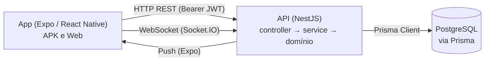
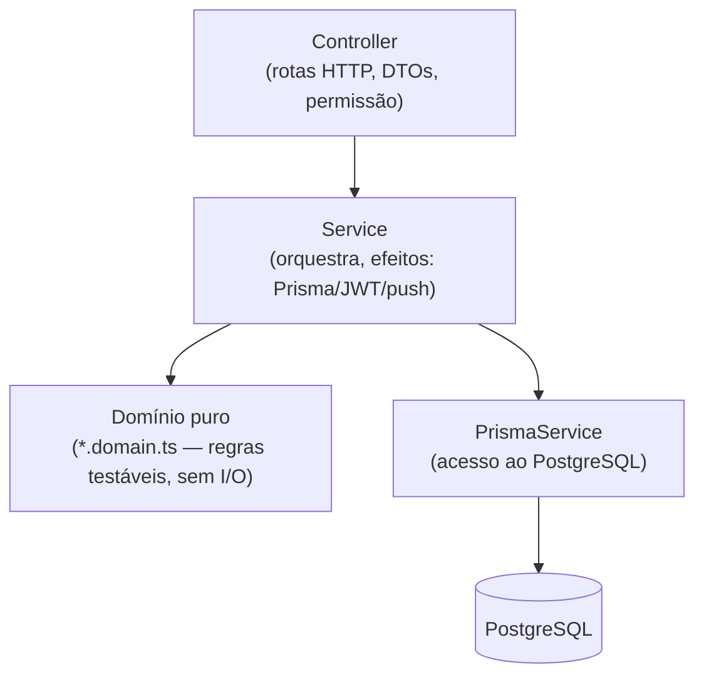

> **Estado:** ✅ Em dia · **Responsável:** Engenharia · **Última verificação:** 2026-07-19 · **Cobre:** arquitetura — visão geral

# Visão de arquitetura

## 1. Propósito
Esta página é o **mapa de alto nível** do Check-out PRO: como o projeto está
organizado (monorepo), quais são as suas partes (app, API, banco), como as
camadas se separam dentro do backend e quais **padrões** valem para todo o
código. As páginas seguintes aprofundam cada parte:
[Backend](backend.md), [Mobile](mobile.md), [Fluxo de dados](fluxo-de-dados.md)
e [Segurança](seguranca.md).

> Números do projeto (linhas, testes, rotas, tabelas) ficam **apenas** na fonte
> única [Estado e métricas](../08-gestao/estado-e-metricas.md) — não os repetimos
> aqui para evitar informação volátil e divergente.

## 2. Visão em uma imagem
O sistema tem três peças que conversam por HTTP/WebSocket, com o banco atrás da
API. O app (Expo/React Native, roda como APK ou web) nunca fala com o banco
diretamente: tudo passa pela API (NestJS), que é a única a acessar o PostgreSQL
via Prisma.

- **App ↔ API:** REST com token `Bearer` (JWT); WebSocket (Socket.IO) para
  notificações em tempo real e painel de fiscais; push via Expo.
- **API ↔ Banco:** todo acesso ao PostgreSQL passa pelo `PrismaService` global
  (ponto único de acesso).

## 3. Monorepo (npm workspaces)
O repositório é um **monorepo** com dois pacotes, gerenciados por npm workspaces
(ver [ADR 0001](decisoes/0001-monorepo-npm-workspaces.md)):

| Pacote | Tecnologia | Papel |
|---|---|---|
| `backend/` | NestJS + Prisma + PostgreSQL | API REST/WebSocket, regras de negócio, persistência. |
| `mobile/` | Expo / React Native + TypeScript | App usado na loja (APK) e versão web. |

Vantagens que orientam o dia a dia:
- **Uma clonada, uma instalação** na raiz; scripts coordenados entre os pacotes.
- **Tipos e contratos próximos:** o app espelha manualmente alguns contratos do
  backend (ex.: catálogo de permissões — ver
  [ADR 0002](decisoes/0002-permissoes-espelhadas.md)); os pacotes **não**
  compartilham código de runtime, então a fonte de verdade continua sendo o
  backend.
- **CI único** valida os dois lados (ver [Qualidade](../06-qualidade/estrategia-de-testes.md)).

## 4. Camadas do backend
O backend segue uma separação em camadas, aplicada em **todos** os módulos de
domínio:

- **Controller** — traduz a requisição HTTP: valida a entrada (DTO +
  `ValidationPipe` global), declara a permissão exigida (`@Funcionalidade`) e
  chama o service. Não contém regra de negócio.
- **Service** — orquestra o caso de uso e concentra os **efeitos colaterais**
  (Prisma, bcrypt, JWT, push, transações). Delega a decisão pura ao domínio.
- **Domínio puro (`*.domain.ts`)** — regras de negócio **sem I/O**, totalmente
  testáveis e determinísticas (ver [ADR 0003](decisoes/0003-dominio-puro-e-property-based-testing.md)).
- **Prisma/PostgreSQL** — o [`PrismaService`](../03-atlas-backend/prisma.md) é o
  ponto único de acesso ao banco, injetável globalmente.

Detalhamento em [Backend (NestJS)](backend.md).

## 5. Padrões transversais
Convenções que valem para todo o projeto:

- **Domínio puro e testável.** A lógica que decide algo mora em funções puras
  (`*.domain.ts`), sem tocar em banco/relógio/rede. Isso viabiliza testes rápidos
  e determinísticos, inclusive **baseados em propriedades** (fast-check) — ver
  [ADR 0003](decisoes/0003-dominio-puro-e-property-based-testing.md).
- **Erros de domínio com `statusHttp`.** Cada erro de negócio estende
  `ErroDominio` e declara o próprio código HTTP; o filtro global os traduz em
  respostas em português. Um erro novo nunca "cai" em 500 por esquecimento
  (fallback seguro em 400). Ver [`common`](../03-atlas-backend/common.md).
- **Segurança por padrão (guards globais).** `JwtAuthGuard` + `PerfilGuard` são
  registrados globalmente: toda rota exige JWT válido, salvo `@Publico()`, e a
  autorização é por funcionalidade (semântica OR). Detalhes em
  [Segurança](seguranca.md).
- **Datas com fuso explícito.** As datas usam meia-noite UTC como fonte única e
  conversões de Brasília (UTC−3) explícitas em `common/datas`, para o "dia" não
  virar em servidores UTC.
- **Observabilidade não-lançante.** Um id de correlação por requisição
  (`x-request-id`) e uma linha de log por requisição, que nunca derrubam a
  chamada.
- **Documentação que não desatualiza em silêncio.** Parte da referência é
  **gerada** a partir do código (`npm run docs:gen`) e um guardião no CI barra
  o merge quando algo defasa — ver [README da documentação](../README.md). Não
  edite arquivos gerados nem rode o gerador à mão sem necessidade.

## 6. Como as partes se comunicam
- **REST (HTTP):** o app consome a API com token `Bearer`; o catálogo canônico
  de rotas está em [API HTTP](../05-referencia-dados/api-http.md).
- **WebSocket (Socket.IO):** dois namespaces — `/notificacoes` (avisos por
  usuário) e `/fiscais` (painel de status em tempo real). O token JWT vai no
  handshake.
- **Push (Expo):** avisos chegam mesmo com o app fechado; é best-effort e nunca
  substitui o registro in-app.

## 7. Onde aprofundar
- [Backend (NestJS)](backend.md) — anatomia de um módulo, DI, cron, WebSocket.
- [Mobile (Expo/RN)](mobile.md) — navegação, estado, API, fila offline, push.
- [Fluxo de dados](fluxo-de-dados.md) — importação de arquivos e fluxo do ponto.
- [Segurança](seguranca.md) — autenticação, autorização e proteções.
- [Decisões de arquitetura (ADR)](decisoes/) — o **porquê** das escolhas.
