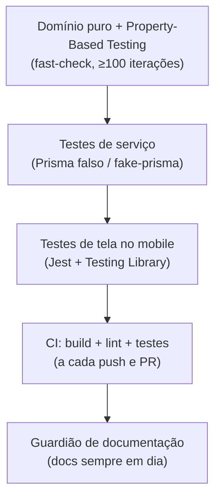

> **Estado:** ✅ Em dia · **Responsável:** Engenharia · **Última verificação:** 2026-07-19 · **Cobre:** filosofia e camadas de teste do Check-out PRO

# Estratégia de testes

Este documento explica **como o Check-out PRO garante qualidade**: a filosofia de
testes, as camadas que usamos e como o pipeline de integração contínua (CI) e o
guardião de documentação sustentam essa confiança.

> **Contagem de testes** (quantos casos, por arquivo): não é repetida aqui. A
> lista sempre atualizada está no
> [Catálogo de testes](catalogo-de-testes.md), gerado a partir do código.

---

## Filosofia

A base da nossa estratégia é a decisão registrada no
[ADR 0003 — Lógica de domínio pura + Property-Based Testing](../02-arquitetura/decisoes/0003-dominio-puro-e-property-based-testing.md):

> As regras de negócio (metas, jornada, escala, autorização, arrecadação)
> precisam ser corretas e testáveis **sem infraestrutura**.

Na prática, cada módulo isola a lógica de negócio em um arquivo `*.domain.ts`
**puro** — sem NestJS, sem Prisma, sem bcrypt e sem JWT. Isso traz três ganhos:

- **Testes rápidos e determinísticos**, que não dependem de banco nem de rede.
- Facilidade para **raciocinar sobre invariantes** (por exemplo, a unicidade de
  login, ou "o saldo de estoque nunca fica negativo").
- Confiança alta com baixo custo de manutenção.

O contrapeso, que exige disciplina: **não vazar I/O para o domínio**. Tudo o que
é banco, rede ou framework fica no `service`/`controller`, nunca no `domain`.

---

## As camadas de teste



### 1. Domínio puro + testes de propriedade (fast-check)

As funções puras de `*.domain.ts` são validadas com **testes de propriedade**
usando a biblioteca **fast-check** (com **≥100 iterações** por propriedade). Em
vez de checar um punhado de exemplos fixos, o property-based testing gera muitos
casos aleatórios e verifica se uma **invariante** (uma verdade que sempre deve
valer) se mantém. Cada propriedade é anotada no código no formato
`// Feature: ..., Property N: ...`.

Exemplos de invariantes cobertas assim no projeto: o cálculo do score do
colaborador (combinação convexa mantida em 0–100, monotonicidade, determinismo),
a classificação das batidas de ponto, as regras de escala de domingo e a garantia
de que o estoque de insumos nunca fica negativo.

### 2. Testes de serviço com Prisma falso

Os `services` orquestram regras, transações e persistência. Para testá-los sem um
banco real, usamos um **Prisma falso** (o helper `test/helpers/fake-prisma.ts`)
que simula o cliente do banco. Assim validamos o comportamento do serviço
(validações, chamadas corretas, efeitos como notificações) de forma rápida e
isolada — por exemplo, "consumir mais do que o saldo é rejeitado e o saldo
permanece inalterado", ou "o fechamento notifica exatamente uma vez".

### 3. Testes de tela no mobile

No app, usamos **Jest + Testing Library** para testar as telas (`*.test.tsx`) e a
lógica auxiliar pura (utilitários e a fila offline). O foco é o comportamento
observável: o texto certo aparece, a ação certa é disparada, e as áreas ocultas
(marcadas como "em breve") não aparecem no menu. Preferimos **verificações
concretas** a snapshots de árvore inteira, que eram frágeis e quebravam a cada
ajuste de layout.

---

## Integração contínua (CI): build + lint + testes

Toda alteração passa pela CI definida em
[`.github/workflows/ci.yml`](../../.github/workflows/ci.yml). Como o ambiente de
edição do agente tem rede restrita, **a CI é a forma confiável de validar as
mudanças** (os runners do GitHub têm internet aberta e instalam as dependências
normalmente).

A CI roda a cada push e a cada Pull Request, em dois jobs:

- **Backend (NestJS):** instala as dependências, faz o `build` (Prisma generate +
  nest build), roda o `lint` e a suíte de testes Jest.
- **App (Expo/React Native):** roda `type-check` (`tsc --noEmit`), `lint`, os
  testes Jest e valida o **build web** (`expo export --platform web`) — para
  pegar erros de build/deploy ainda no PR.

## Guardião de documentação

Além dos testes de código, o CI tem um **guardião de documentação**
([`.github/workflows/docs.yml`](../../.github/workflows/docs.yml), via
`node scripts/verificar-docs.mjs`) que **barra o merge** quando:

- a documentação de referência (rotas, tabelas, migrações, contagens) está
  **defasada** em relação ao código — sinal de que faltou rodar `npm run
  docs:gen`; ou
- um **módulo/área mudou** e o documento correspondente do Atlas não foi
  atualizado.

Escape de emergência (uso justificado): incluir `[skip-docs]` na mensagem do
último commit. A regra completa está em
[`.kiro/steering/documentacao.md`](../../.kiro/steering/documentacao.md).

---

## Como rodar a verificação localmente

```bash
# backend
cd backend
npm run prisma:generate
npm run prisma:validate
npm run build
npm test

# app
cd mobile
npm run type-check
npm run lint
npm test -- --runInBand
```

> Nota sobre formatação: alguns arquivos de domínio são marcados pelo
> `prettier --check` por deriva de versão da ferramenta; o CI os normaliza no ato
> via `eslint --fix`, então isso **não quebra** a validação. Não misture essa
> limpeza de estilo com mudanças funcionais.

---

## Documentos relacionados

- [ADR 0003 — Domínio puro e property-based testing](../02-arquitetura/decisoes/0003-dominio-puro-e-property-based-testing.md)
- [Catálogo de testes](catalogo-de-testes.md) _(gerado)_
- [Guia de QA manual](guia-qa-manual.md)
- [Estado e métricas](../08-gestao/estado-e-metricas.md) _(fonte única de números)_
